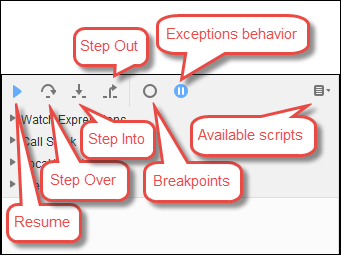
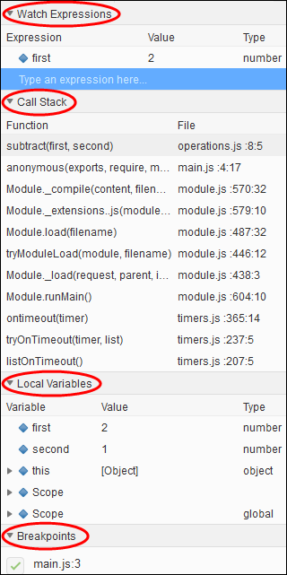

.. Copyright 2010-2019 Amazon.com, Inc. or its affiliates. All Rights Reserved.

   This work is licensed under a Creative Commons Attribution-NonCommercial-ShareAlike 4.0
   International License (the "License"). You may not use this file except in compliance with the
   License. A copy of the License is located at http://creativecommons.org/licenses/by-nc-sa/4.0/.

   This file is distributed on an "AS IS" BASIS, WITHOUT WARRANTIES OR CONDITIONS OF ANY KIND,
   either express or implied. See the License for the specific language governing permissions and
   limitations under the License.

.. _build-run-debug:

######################################################################
Working with Builders, Runners, and Debuggers in the |AC9IDElongtitle|
######################################################################

.. meta::
    :description:
        Describes how to work with builders, runners, and debuggers in the AWS Cloud9 IDE.

A :dfn:`builder` instructs the |AC9IDE| how to build a project's files. A :dfn:`runner` instructs the
|AC9IDE| how to run files of a specific type. A runner can use a :dfn:`debugger` to help find any problems in the
source code of the files.

You can use the |AC9IDE| to build, run, and debug your code in the following ways:

* Use a builder to build your project's files. See :ref:`build-run-debug-build`.
* Use a runner to run (and optionally, to debug) your code. See :ref:`build-run-debug-supported` and
  :ref:`build-run-debug-run`.
* Change a built-in runner to run (and optionally, to debug) your code in a different way from how it was originally defined.
  See :ref:`build-run-debug-change-runner`.
* Use a runner to run (and optionally, to debug) your code with a custom combination of file name, command line options, debug mode, current working directory,
  and environment variables. See :ref:`build-run-debug-create-run-config`.
* Create your own builder or runner. See :ref:`build-run-debug-create-builder-runner`.

.. _build-run-debug-supported:

Built-In Build, Run, and Debug Support
======================================

The |AC9IDE| provides built-in support for building, running, and debugging code for several languages. For a complete list, see :ref:`Language Support <language-support>`.

Built-in build support is available on the menu bar with the :menuselection:`Run, Build System` and :menuselection:`Run, Build` menu commands.
To add support for a programming language or tool that isn't listed, see :ref:`build-run-debug-create-builder-runner`.

Built-in run support is available with the :guilabel:`Run` button, and on the menu bar with the :menuselection:`Run, Run With` and
:menuselection:`Run, Run Configurations` menu commands. To add support for a programming language or tool
that isn't listed, see
:ref:`build-run-debug-create-builder-runner` and :ref:`build-run-debug-create-run-config`.

Built-in debug support is available through the :guilabel:`Debugger` window. To display the :guilabel:`Debugger` window, choose the :guilabel:`Debugger` button.
If the :guilabel:`Debugger` button is not visible, choose :menuselection:`Window, Debugger` on the menu bar.

.. _build-run-debug-build:

Build Your Project's Files
==========================

#. Open a file that corresponds to the code you want to build.
#. On the menu bar, choose :guilabel:`Run, Build System`, and then choose the name of the builder to use,
   if it isn't already chosen.
   If the builder you want to use isn't listed, stop this procedure, complete the steps in :ref:`build-run-debug-create-builder-runner`,
   and then return to this procedure.
#. Choose :guilabel:`Run, Build`.

.. _build-run-debug-run:

Run Your Code
=============

#. Open a file that corresponds to the code you want to run, if the file isn't already open and selected.
#. On the menu bar, choose one of the following:

   * To run the code with the closest matching built-in runner, choose :guilabel:`Run, Run`. If |AC9|
     cannot find one, this command is disabled.
   * To run the code with the run configuration that |AC9| last used, choose :guilabel:`Run, Run Last`.
   * To run the code with a specific runner, choose :guilabel:`Run, Run With`, and then choose the name
     of the runner. If the runner you want to use isn't listed,
     stop this procedure, complete the steps in :ref:`build-run-debug-create-builder-runner`, and then return to this procedure.
   * To run the code with a specific runner with a custom combination of file name, command line options, debug mode, current working directory, and environment
     variables, choose :guilabel:`Run, Run Configurations`, and then choose the run configuration's name.
     In the run configuration tab that is displayed, choose
     :guilabel:`Runner: Auto`, choose the runner you want to use, and then choose :guilabel:`Run`. If
     the runner you want to use isn't listed, stop this procedure,
     complete the steps in :ref:`build-run-debug-create-builder-runner`, and then return to this procedure.

.. _build-run-debug-debug:

Debug Your Code
===============

#. On the run configuration tab for your code, choose :guilabel:`Run in Debug Mode`. The bug icon turns to green on a white background. For more information,
   see :ref:`build-run-debug-run` and :ref:`build-run-debug-create-run-config`.
#. Set any breakpoints in your code you want to pause at during the run, as follows:

   #. Open each file that you want to set a breakpoint in.
   #. At each point in a file where you want to set a breakpoint, choose the blank area in the gutter
      to the left of the line number. A red circle appears.

      To remove a breakpoint, choose the existing breakpoint in the gutter.

      To disable a breakpoint instead of removing it, in the :guilabel:`Debugger` window, in :guilabel:`Breakpoints`, clear the box that corresponds
      to the breakpoint you want to disable. To enable the breakpoint again, select the box you cleared.

      To disable all breakpoints at once, in the :guilabel:`Debugger` window, choose :guilabel:`Deactivate All Breakpoints`. To enable all breakpoints again,
      choose :guilabel:`Activate All Breakpoints`.

      If the :guilabel:`Debugger` window isn't visible, choose the :guilabel:`Debugger` button. If the
      :guilabel:`Debugger` button isn't visible,
      on the menu bar choose :guilabel:`Window`, :guilabel:`Debugger`.

#. Set any watch expressions for which you want to get the value at the point where a run pauses, as follows:

   #. In the :guilabel:`Debugger` window, in :guilabel:`Watch Expressions`, choose :guilabel:`Type an expression here`.
   #. Type the expression you want to watch, and then press :kbd:`Enter`.

      To change an existing watch expression, right-click the watch expression, and then choose :guilabel:`Edit Watch Expression`. Type the change, and then press :kbd:`Enter`.

      To remove an existing watch expression, right-click the watch expression, and then choose :guilabel:`Remove Watch Expression`.

#. Run your code as described in :ref:`build-run-debug-run`.

Whenever a run pauses, you can do the following in the :guilabel:`Debugger` window, as shown.

* **Run your code to the next breakpoint** (or to the next logical stopping point if there are no more
  breakpoints): Choose :guilabel:`Resume`.
* **Skip over running statement by statement through the next method or function call**: Choose
  :guilabel:`Step Over`.
* **Run your code to the next statement and then pause again**: Choose :guilabel:`Step Into`.
* **Stop running statement by statement in the current method or function call**: Choose :guilabel:`Step
  Out`.
* **Disable all existing breakpoints**: Choose :guilabel:`Deactivate All Breakpoints`. **Re-enable
  all breakpoints**: Choose :guilabel:`Activate All Breakpoints`.
* **Don't pause whenever the code throws an exception**: Keep choosing the exceptions behavior
  button until the tooltip reads :guilabel:`Don't pause on exceptions` (gray).
* **Pause whenever the code throws an exception**: Keep choosing the exceptions behavior button
  until the tooltip reads :guilabel:`Pause on all exceptions` (red).
* **Pause only when the code throws an uncaught exception**: Keep choosing the exceptions behavior
  button until the tooltip reads :guilabel:`Pause on uncaught exceptions` (blue).
* **Open an available script**: Choose :guilabel:`Available internal and external scripts`, and
  then choose the script.
* **View the list of current watch expressions**: See the :guilabel:`Watch Expressions` area.
* **View the execution path that brought the code to the current breakpoint**: See the :guilabel:`Call
  Stack` area.
* **View the list of local variables**: See the :guilabel:`Local Variables` area.
* **Disable individual breakpoints**: In :guilabel:`Breakpoints`, clear the boxes that correspond
  to the breakpoints you want to disable. To enable the breakpoints again, select the boxes you cleared earlier.

Whenever a run pauses, you can also pause your mouse pointer on any displayed piece of code (for example,
a variable) to show any available information about it in a tooltip.

.. _build-run-debug-change-runner:

Change a Built-In Runner
========================

#. On the menu bar, choose :guilabel:`Run, Run With`, and then choose the built-in runner you want to change.
#. Stop the runner from trying to run your code by choosing, :guilabel:`Stop` on the run configuration tab that displays.
#. Choose :guilabel:`Runner: My Runner`, where :guilabel:`My Runner` is the name of the runner you want to change, and then choose :guilabel:`Edit Runner`.
#. On the :guilabel:`My Runner.run` tab that is displayed, change the runner's current definition. See :ref:`build-run-debug-define-builder-runner`.
#. Choose :guilabel:`File, Save As`. Save the file with the same name (:guilabel:`My Runner.run`) in the :file:`my-environment/.c9/runners` directory, where :file:`my-environment` is
   the name of your |envfirst|.

.. note:: Any changes you make to a built-in runner apply only to the |env| you made those changes in. To apply your changes to a separate |env|,
   open the other |env|, and then follow the preceding steps to open, edit, and save those same changes to that built-in runner.

.. _build-run-debug-create-run-config:

Create a Run Configuration
==========================

On the menu bar, choose :guilabel:`Run, Run Configurations, New Run Configuration`. On the run configuration
tab that is displayed, do the following:

#. In the box next to :guilabel:`Run` and :guilabel:`Restart`, type the name that will display on the :guilabel:`Run, Run Configurations` menu for this run configuration.
#. In the :guilabel:`Command` box, type any custom command line options you want to use.
#. To have this run configuration use the runner's predefined debugging settings, choose :guilabel:`Run in Debug Mode`. The bug icon will turn to green on a white background.
#. To have this run configuration use a specific working directory, choose :guilabel:`CWD`, choose the directory to use, and then choose :guilabel:`Select`.
#. To have this run configuration use specific environment variables, choose :guilabel:`ENV`, and then type the name and value of each environment variable.

To use this run configuration, open the file the corresponds to the code you want to run. Choose :guilabel:`Run, Run Configurations` on the menu bar,
and then choose this run configuration's name. In the run configuration tab that displays, choose :guilabel:`Runner: Auto`, choose the runner you want to use,
and then choose :guilabel:`Run`.

.. note:: Any run configuration you create applies only to the |env| you created that run configuration in. To add that run configuration to a separate |env|,
   open the other |env|, and then follow the preceding steps to create the same run configuration in that |env|.

.. _build-run-debug-create-builder-runner:

Create a Builder or Runner
==========================

#. To create a builder, on the menu bar, choose :guilabel:`Run, Build System, New Build System`. To create a runner, on the menu bar,
   choose :guilabel:`Run, Run With, New Runner`.
#. On the builder tab (labeled :guilabel:`My Builder.build`) or runner tab (labeled :guilabel:`My Runner.run`)
   that is displayed, define the builder or runner.
   See :ref:`build-run-debug-define-builder-runner`.
#. After you define the builder or runner, choose :guilabel:`File, Save As`. For a builder, save the file with the :file:`.build` extension in the
   :file:`my-environment/.c9/builders` directory, where :file:`my-environment` is the name of your |env|. For a runner, save the file with the
   :file:`.run` file extension in the :file:`my-environment/.c9/runnders` directory, where :file:`my-environment`
   is the name of your |env|.
   The file name you specify will be the name that is displayed on the :guilabel:`Run, Build System` menu (for a builder) or the
   :guilabel:`Run, Run With` menu (for a runner). Therefore, unless you specify a different file name,
   by default the display name will be :guilabel:`My Builder` (for a builder) or :guilabel:`My Runner` (for a runner).

To use this builder or runner, see :ref:`build-run-debug-build` or :ref:`build-run-debug-run`.

.. note:: Any builder or runner you create applies only to the |env| you created that builder or runner in. To add that run builder or runner to a separate |env|,
   open the other |env|, and then follow the preceding steps to create the same builder or runner in that |env|.

.. _build-run-debug-define-builder-runner:

Define a Builder or Runner
==========================

This procedure assumes you have already begun to create a builder or runner by choosing :guilabel:`Run, Build System, New Build System` (for a builder) or
:guilabel:`Run, Run With, New Runner` (for a runner).

On the builder or runner tab that is displayed, use JSON to define the runner or builder. Start with the following code as a template.

For a builder, start with this code.

.. code-block:: json

   {
     "cmd": [],
     "info": "",
     "env": {},
     "selector": ""
   }

For a runner, start with this code.

.. code-block:: json

   {
     "cmd": [],
     "script": "",
     "working_dir": "",
     "info": "",
     "env": {},
     "selector": "",
     "debugger": "",
     "debugport": ""
   }

In the preceding code:

* :code:`cmd`: Represents a comma-separated list of strings for |AC9| to run as a single command.

  When |AC9| runs this command, each string in the list will be separated by a single space.
  For example, |AC9| will run :code:`"cmd": [ "ls", "$file", "$args"]` as :code:`ls $file $args`, where |AC9| will replace :code:`$file` with the full path to the
  current file and :code:`$args` with any arguments entered after the file name. For more information, see the list of supported variables later in this section.
* :code:`script`: Represents a bash script (which can also be specified as an array of lines as
  needed for readability) that the runner executes in the terminal.
* :code:`working_dir`: Represents the directory that the runner will run from.
* :code:`info`: Represents any string of text you want to display to the user at the beginning
  of the run. This string can contain variables, for example
  :code:`Running $project_path$file_name...`, where |AC9| will replace :code:`$project_path` with the directory path of the current file and
  :code:`$file_name` with the name portion of the current file. See the list of supported variables later in this section.
* :code:`env`: Represents any array of command line arguments for |AC9| to use, for example:

  .. code-block:: text

     "env": {
       "LANG": "en_US.UTF-8",
       "SHLVL": "1"
     }

* :code:`selector`: Represents any regular expression that you want |AC9| to use to identify the
  file names that apply to this runner.
  For example, you could specify :code:`source.py` for Python files.
* :code:`debugger`: Represents the name of any available debugger you want |AC9| to use that is
  compatible with this runner. For example, you could specify
  :code:`v8` for the V8 debugger.
* :code:`debugport`: Represents the port number you want |AC9| to use during debugging. For example,
  you could specify :code:`15454` for the port number to use.

The following table shows the variables you can use.

.. list-table::
   :widths: 1 2
   :header-rows: 1

   * - **Variable**
     - **Description**
   * - :code:`$file_path`
     - The directory of the current file, for example, :code:`/home/ec2-user/environment`.
   * - :code:`$file`
     - The full path to the current file, for example, :code:`/home/ec2-user/environment/hello.py`.
   * - :code:`$args`
     - Any arguments entered after the file name, for example, :code:`"5" "9"`.
   * - :code:`$file_name`
     - The name portion of the current file, for example, :code:`hello.py`.
   * - :code:`$file_extension`
     - The extension of the current file, for example, :code:`py`.
   * - :code:`$file_base_name`
     - The name of the current file without the file extension, for example, :code:`hello`.
   * - :code:`$packages`
     - The full path to the packages folder.
   * - :code:`$project`
     - The full path to the current project folder.
   * - :code:`$project_path`
     - The directory of the current project file, for example, :code:`/home/ec2-user/environment/`.
   * - :code:`$project_name`
     - The name of the current project file without the file extension, for example, :code:`my-demo-environment`.
   * - :code:`$project_extension`
     - The extension of the current project file.
   * - :code:`$project_base_name`
     - The name of the current project file without the extension.
   * - :code:`$hostname`
     - The hostname of the |env|, for example, :code:`192.0.2.0`.
   * - :code:`$hostname_path`
     - The hostname of the |env| with the relative path to the project file, for example, :code:`https://192.0.2.0/hello.js`.
   * - :code:`$url`
     - The full URL to access the |env|, for example, :code:`https://192.0.2.0.`.
   * - :code:`$port`
     - The port assigned to the |env|, for example, :code:`8080`.
   * - :code:`$ip`
     - The IP address to run a process against the |env|, for example, :code:`0.0.0.0`.

As an example, the following builder file named :file:`G++.build` defines a builder for GCC that runs
the :command:`g++` command with the
:code:`-o` option to compile the current file (for example, :file:`hello.cpp`) into an object module.
Then it links the object module into a program
with the same name as the current file (for example, :file:`hello`). Here the equivalent command is :code:`g++
-o hello hello.cpp`.

.. code-block:: json

   {
     "cmd": [ "g++", "-o", "$file_base_name", "$file_name" ],
     "info": "Compiling $file_name and linking to $file_base_name...",
     "selector": "source.cpp"
   }

As another example, the following runner file named :file:`Python.run` defines a runner that uses Python to run the current file with
any arguments that were provided. For example, if the current file is named :file:`hello.py` and the arguments :code:`5` and :code:`9` were provided, the
equivalent command is :code:`python hello.py 5 9`.

.. code-block:: json

   {
     "cmd": [ "python", "$file_name", "$args" ],
     "info": "Running $file_name...",
     "selector": "source.py"
   }

Finally, the following runner file named :file:`Print Run Variables.run` defines a runner that simply outputs the value of each available variable and then stops.

.. code-block:: json

   {
     "info": "file_path = $file_path, file = $file, args = $args, file_name = $file_name, file_extension = $file_extension, file_base_name = $file_base_name, packages = $packages, project = $project, project_path = $project_path, project_name = $project_name, project_extension = $project_extension, project_base_name = $project_base_name, hostname = $hostname, hostname_path = $hostname_path, url = $url, port = $port, ip = $ip"
   }
