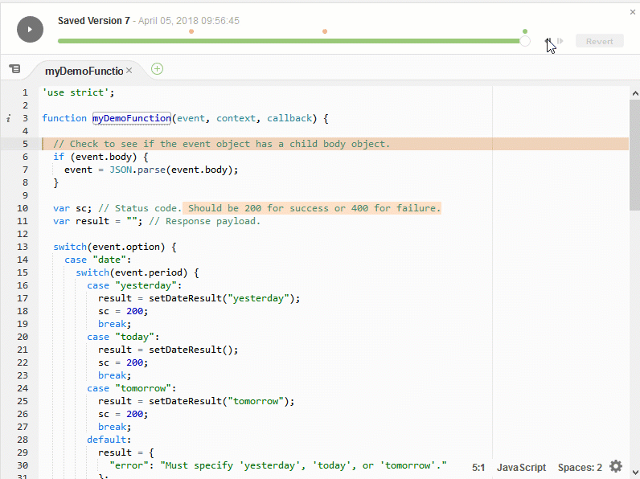
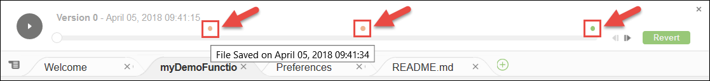

.. Copyright 2010-2018 Amazon.com, Inc. or its affiliates. All Rights Reserved.

   This work is licensed under a Creative Commons Attribution-NonCommercial-ShareAlike 4.0
   International License (the "License"). You may not use this file except in compliance with the
   License. A copy of the License is located at http://creativecommons.org/licenses/by-nc-sa/4.0/.

   This file is distributed on an "AS IS" BASIS, WITHOUT WARRANTIES OR CONDITIONS OF ANY KIND,
   either express or implied. See the License for the specific language governing permissions and
   limitations under the License.

.. _file-revisions:

####################################################
Working with File Revisions in the |AC9IDElongtitle|
####################################################

.. meta::
    :description:
        Describes how to work with the File Revisions History pane in the AWS Cloud9 IDE.

You can use the :guilabel:`File Revision History` pane in the |AC9IDE| to view and manage changes to a file in an |envfirstlongec2|. 
The :guilabel:`File Revision History` pane is not available for files in an |envfirstlongssh|.

   
To show the :guilabel:`File Revision History` pane for a file, open the file in the editor. Then, on the menu bar, choose :guilabel:`File, Show File Revision History`. 

The :guilabel:`File Revision History` pane begins tracking a file's revision history in the |IDE| after you first open the file in the editor in an |env|, and only for that |env|. 
The :guilabel:`File Revision History` pane tracks a file's revisions only from the editor itself. It does not track a file's revisions made in any other way 
(for example by the terminal, Git, or other file revision tools). 

You cannot edit a file while the :guilabel:`File Revision History` pane is displayed. To hide the pane, choose :guilabel:`File, Show Revision History` again, or choose the 
:guilabel:`X` (:guilabel:`Close timeslider`) in the corner of the pane.

To jump to a version of the file that is associated with a file save action, choose a :guilabel:`File Saved on` dot above the revision slider. 

To go forward or backward one version from the currently selected version of the file on the revision slider, choose one of the step arrows 
(:guilabel:`Step revision forward` or :guilabel:`Step revision backward`).

To go forward automatically one version of the file at a time from the beginning to end of the revision history, choose the play button (:guilabel:`Playback file history`). 

To make the currently selected version of the file the latest version in the revision history, choose :guilabel:`Revert`.