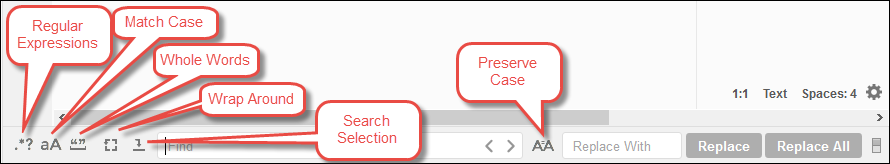
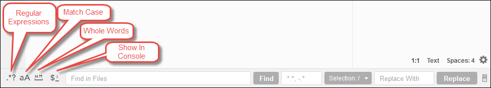

.. Copyright 2010-2019 Amazon.com, Inc. or its affiliates. All Rights Reserved.

   This work is licensed under a Creative Commons Attribution-NonCommercial-ShareAlike 4.0
   International License (the "License"). You may not use this file except in compliance with the
   License. A copy of the License is located at http://creativecommons.org/licenses/by-nc-sa/4.0/.

   This file is distributed on an "AS IS" BASIS, WITHOUT WARRANTIES OR CONDITIONS OF ANY KIND,
   either express or implied. See the License for the specific language governing permissions and
   limitations under the License.

.. _find-replace-text:

###################################################
Finding and Replacing Text in the |AC9IDElongtitle|
###################################################

.. meta::
    :description:
        Describes how to find and replace text in files in the AWS Cloud9 IDE.

You can use the find and replace bar in the |AC9IDE| to find and replace text in a single file or multiple
files.

* :ref:`find-replace-text-find-single`
* :ref:`find-replace-text-replace-single`
* :ref:`find-replace-text-find-multiple`
* :ref:`find-replace-text-replace-multiple`
* :ref:`find-replace-text-replace-options`

.. _find-replace-text-find-single:

Find Text in a Single File
==========================

#. Open the file you want to find text in. If the file is already open, choose the file's tab to make the file active.
#. On the menu bar, choose :guilabel:`Find, Find`.
#. In the find and replace bar, for :guilabel:`Find`, type the text you want to find.
#. To specify additional find options, see :ref:`find-replace-text-replace-options`.
#. If there are any matches, :guilabel:`0 of 0` in the :guilabel:`Find` box changes to non-zero numbers. If there are any matches, the editor
   goes to the first match. If there is more than one match, to go to the next match, choose the right
   arrow in the :guilabel:`Find` box or choose :guilabel:`Find, Find Next` on the menu bar.
   To go to the previous match, choose the left arrow in the :guilabel:`Find` box or choose :guilabel:`Find,
   Find Previous` on the menu bar.

.. _find-replace-text-replace-single:

Replace Text in a Single File
=============================

#. Open the file you want to replace text in. If the file is already open, choose the file's tab to make the file active.
#. On the menu bar, choose :guilabel:`Find, Replace`.
#. In the find and replace bar, for :guilabel:`Find`, type the text you want to find.
#. For :guilabel:`Replace With`, type the text you want to replace the text in :guilabel:`Find` with.
#. To specify additional find and replace options, see :ref:`find-replace-text-replace-options`.
#. If there are any matches, :guilabel:`0 of 0` in the :guilabel:`Find` box changes to non-zero numbers. If there are any matches, the editor
   goes to the first match. If there is more than one match, to go to the next match, choose the right
   arrow in the :guilabel:`Find` box or choose :guilabel:`Find, Find Next` on the menu bar.
   To go to the previous match, choose the left arrow in the :guilabel:`Find` box or choose :guilabel:`Find,
   Find Previous` on the menu bar.
#. To replace the current match with the text in :guilabel:`Replace With` and then go to the next match, choose :guilabel:`Replace`. To replace all matches
   with the text in :guilabel:`Replace With`, choose :guilabel:`Replace All`.

.. _find-replace-text-find-multiple:

Find Text in Multiple Files
===========================

#. On the menu bar, choose :guilabel:`Find, Find in Files`.
#. In the find and replace bar, for :guilabel:`Find`, type the text you want to find.
#. To specify additional find options, see :ref:`find-replace-text-replace-options`.
#. In the box to the right of the :guilabel:`Find` button (the box with :code:`*.*, -.*`),
   type any set of files to include or exclude in the find. For example:

   * Blank, :code:`*`, or :code:`*.*`: Find all files.
   * :code:`my-file.txt`: Find only the file named :code:`my-file.txt`.
   * :code:`my*`: Find only files with file names starting with :code:`my`.
   * :code:`my*.txt`: Find only files with file names starting with :code:`my` and that have the
     file extension :code:`.txt`.
   * :code:`my*.htm*`: Find all files with file names starting with :code:`my` and a file  extension
     starting with :code:`.htm`.
   * :code:`my*.htm, my*.html`: Find all files with file names starting with :code:`my` and the
     file extension :code:`.htm` or :code:`.html`.
   * :code:`-my-file.txt`: Do not search the file named :code:`my-file.txt`.
   * :code:`-my*`: Do not search any files starting with :code:`my`.
   * :code:`-my*.htm*`: Do not search any files with file names starting with :code:`my` and a file extension starting with :code:`.htm`.
   * :code:`my*.htm*, -my*.html`: Search all files with file names starting with :code:`my` and a file extension starting with :code:`.htm`. However, do not search any
     files with file names starting with :code:`my` and a file extension of :code:`.html`.

#. In the drop-down list next to the preceding box, choose one of the following to further restrict the
   find to only specific locations:

   * :guilabel:`Environment`: Find only files in the :guilabel:`Environment` window.
   * :guilabel:`Project (excludes .gitignore'd)`: Find any file in the |env|, except for files
     or file types listed in the :file:`.gitignore` file in the |env|, if a
     :file:`.gitignore` file exists.
   * :guilabel:`Selection:`: Find only files that are currently selected in the :guilabel:`Environment`
     window.

     .. note:: To further restrict the find to only a single folder, choose a folder in the :guilabel:`Environment` window and then choose :guilabel:`Selection`.
        Alternatively, you can right-click the folder in the :guilabel:`Environment` window, and then choose :guilabel:`Search In This Folder` on the context menu.

   * :guilabel:`Favorites`: Find only files in the :guilabel:`Favorites` list in the :guilabel:`Environment`
     window.
   * :guilabel:`Active File`: Find only the active file.
   * :guilabel:`Open Files`: Find only files in the :guilabel:`Open Files` list in the :guilabel:`Environment`
     window.

#. Choose :guilabel:`Find`.
#. To go to a file containing matches, double-click the file name on the :guilabel:`Search Results` tab.
   To go to a specific match, double-click the match in the :guilabel:`Search Results` tab.

.. _find-replace-text-replace-multiple:

Replace Text in Multiple Files
==============================

#. On the menu bar, choose :guilabel:`Find, Find in Files`.
#. In the find and replace bar, for :guilabel:`Find`, type the text you want to find.
#. To specify additional find options, see :ref:`find-replace-text-replace-options`.
#. In the box to the right of the :guilabel:`Find` button (the box with :code:`*.*, -.*`), type any set of files to include or exclude in the find. For example:

   * Blank, :code:`*`, or :code:`*.*`: All files.
   * :code:`my-file.txt`: Only the file named :code:`my-file.txt`.
   * :code:`my*`: Only files with file names staring with :code:`my`.
   * :code:`my*.txt`: Only files with file names starting with :code:`my` and that have the file extension :code:`.txt`.
   * :code:`my*.htm*`: All files with file names starting with :code:`my` and a file extension starting with :code:`.htm`.
   * :code:`my*.htm, my*.html`: All files with file names starting with :code:`my` and the file extension :code:`.htm` or :code:`.html`.
   * :code:`-my-file.txt`: Do not search the file named :code:`my-file.txt`.
   * :code:`-my*`: Do not search any files starting with :code:`my`.
   * :code:`-my*.htm*`: Do not search any files with file names starting with :code:`my` and a file extension starting with :code:`.htm`.
   * :code:`my*.htm*, -my*.html`: Search all files with file names starting with :code:`my` and a file extension starting with :code:`.htm`. However, do not search any
     files with file names starting with :code:`my` and a file extension of :code:`.html`.

#. In the drop-down list next to the preceding box, choose one of the following to further restrict the
   find to only specific locations:

   * :guilabel:`Environment`: Only files in the :guilabel:`Environment` window.
   * :guilabel:`Project (excludes .gitignore'd)`: Any file in the |env|, except for files or file
     types listed in the :file:`.gitignore` file in the |env|, if a
     :file:`.gitignore` file exists.
   * :guilabel:`Selection: /`: Only files that are currently selected.
   * :guilabel:`Favorites`: Only files in the :guilabel:`Favorites` list in the :guilabel:`Environment` window.
   * :guilabel:`Active File`: Only the active file.
   * :guilabel:`Open Files`: Only files in the :guilabel:`Open Files` list in the :guilabel:`Environment` window.

#. For :guilabel:`Replace With`, type the text you want to replace :guilabel:`Find` with.
#. Choose :guilabel:`Replace`.

   .. note:: The replace operation happens immediately across all files in scope. This operation cannot
      be easily undone. If you want to see what will be changed before
      you start the replace operation, choose :guilabel:`Find` instead.

#. To go to a file containing replacements, double-click the file name in the :guilabel:`Search Results` tab. To go to a specific replacement,
   double-click the replacement in the :guilabel:`Search Results` pane.

.. _find-replace-text-replace-options:

Find and Replace Options
========================

Choose any of the following buttons on the find and replace bar to modify find and replace operations.

* :guilabel:`Regular Expressions`: Find text matching the specified regular expression in :guilabel:`Find` or :guilabel:`Find in Files`. See
  `Writing a regular expression pattern <https://developer.mozilla.org/en-US/docs/Web/JavaScript/Guide/Regular_Expressions#Writing_a_regular_expression_pattern>`_ in the
  *JavaScript Regular Expressions* topic on the Mozilla Developer Network.
* :guilabel:`Match Case`: Find text matching the specified casing in :guilabel:`Find` or :guilabel:`Find in Files`.
* :guilabel:`Whole Words`: Use standard word character rules to find text in :guilabel:`Find` or :guilabel:`Find in Files`.
* :guilabel:`Wrap Around`: For a single file only, do not stop at the end or beginning of the file when going to the next or previous match.
* :guilabel:`Search Selection`: For a single file only, find only in the selection.
* :guilabel:`Show in Console`: For multiple files, show the :guilabel:`Search Results` tab in the :guilabel:`Console` instead of the active pane.
* :guilabel:`Preserve Case`: For a single file only, preserve casing as applicable when replacing text.
