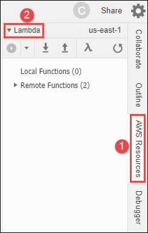
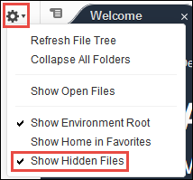
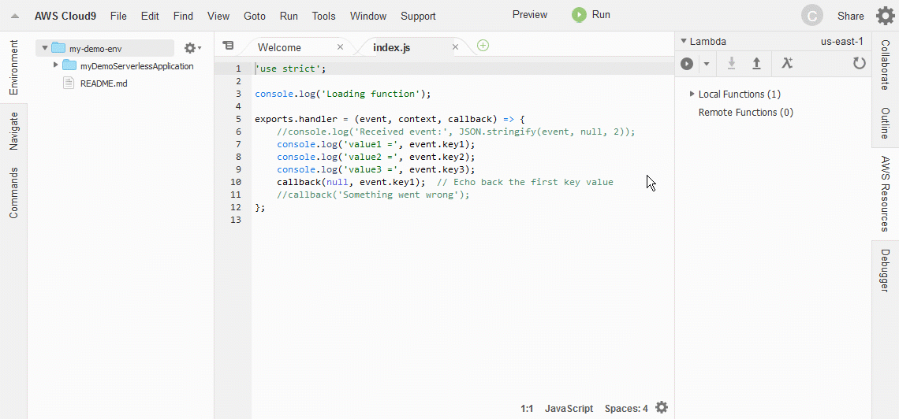
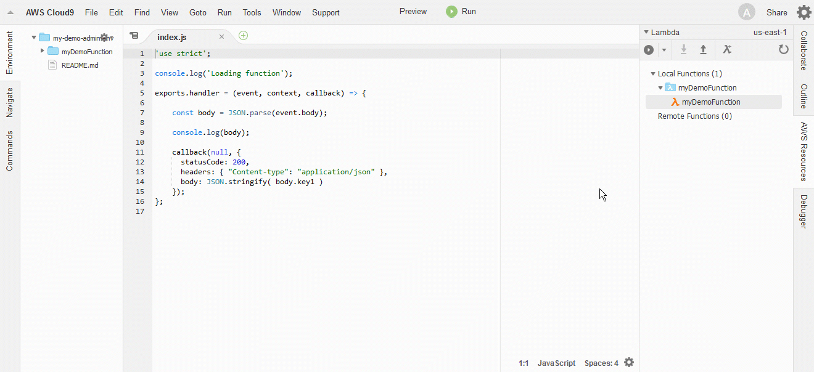
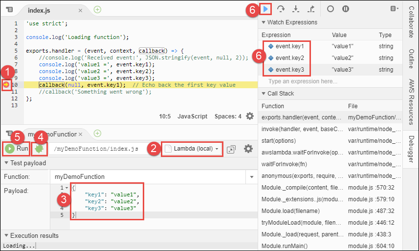
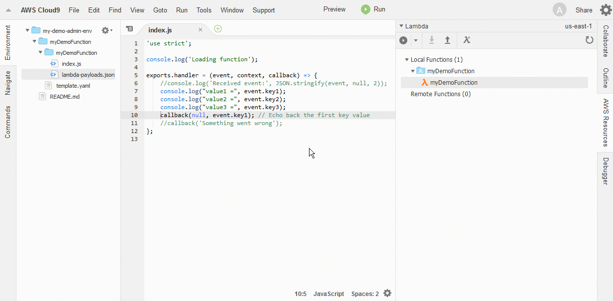

.. Copyright 2010-2018 Amazon.com, Inc. or its affiliates. All Rights Reserved.

   This work is licensed under a Creative Commons Attribution-NonCommercial-ShareAlike 4.0
   International License (the "License"). You may not use this file except in compliance with the
   License. A copy of the License is located at http://creativecommons.org/licenses/by-nc-sa/4.0/.

   This file is distributed on an "AS IS" BASIS, WITHOUT WARRANTIES OR CONDITIONS OF ANY KIND,
   either express or implied. See the License for the specific language governing permissions and
   limitations under the License.

.. _lambda-functions:

#########################################################
Working with |LAMlong| Functions in the |AC9IDElongtitle|
#########################################################

.. meta::
    :description:
        Describes how to work with AWS Lambda functions in the AWS Cloud9 IDE.

You can use the |AC9IDE| to work with |LAMlong| functions and their related |ABPlong| APIs in an |envfirst|. For example, you can:

* Create a new function from within your |env|, uploading the local version of the function to |LAM|, and optionally creating additional AWS resources to support the new function at the same time.
* Run and debug a function and its related API in your |env|, running the function and API completely within the |env|.
* Run the remote version of a function and its related API within your |env|, running the remote version completely within |LAM| and |ABP|.
* Import an existing function in |LAM| into your |env|, so that you can run and debug the function and its related API, edit the code, or both.
* Upload changes you make to the local version of the function code to the remote version in |LAM|.

This topic assumes you already know about |LAM|. For more information, see the |LAM-dg|_.

.. note:: Completing these procedures might result in charges to your AWS account. These include possible charges for services such as |LAM|, |ABP|, and AWS services supported by the
   AWS Serverless Application Model (SAM). For more information, see `AWS Lambda Pricing <https://aws.amazon.com/lambda/pricing/>`_, `Amazon API Gateway Pricing <https://aws.amazon.com/api-gateway/pricing/>`_, and
   `Cloud Services Pricing <https://aws.amazon.com/pricing/services/>`_.

* :ref:`lambda-functions-prepare`
* :ref:`lambda-functions-create`
* :ref:`lambda-functions-create-repo`
* :ref:`lambda-functions-import`
* :ref:`lambda-functions-invoke`
* :ref:`lambda-functions-api`
* :ref:`lambda-functions-vs-api-gateway`
* :ref:`lambda-functions-adding-packages`
* :ref:`lambda-functions-debug`
* :ref:`lambda-functions-change-code`
* :ref:`lambda-functions-upload-code`
* :ref:`lambda-functions-convert-to-sam`
* :ref:`lambda-functions-update-settings`
* :ref:`lambda-functions-delete`

.. _lambda-functions-prepare:

Prepare to Work with |LAM| Functions
====================================

Before you can work with |LAM| functions in the |AC9IDE|, you must complete the following steps:

* :ref:`lambda-functions-prepare-user`
* :ref:`lambda-functions-prepare-access`
* :ref:`lambda-functions-prepare-role`
* :ref:`lambda-functions-prepare-region`
* :ref:`lambda-functions-prepare-open`

.. _lambda-functions-prepare-user:

Step 1: Set Up Your |IAM| Group with Required Access Permissions
-----------------------------------------------------------------

If your AWS access credentials are associated with an |IAM| administrator user in your AWS account, and you want to use that user to work with |LAM| functions, skip ahead to :ref:`lambda-functions-prepare-access`.

Otherwise, complete the following instructions to use the |IAM| console to attach the AWS managed policies named :code:`AWSLambdaFullAccess`, :code:`AmazonAPIGatewayAdministrator`, 
:code:`AmazonAPIGatewayInvokeFullAccess`, and an additional inline policy, to an |IAM| group to which your user belongs.

#. Sign in to the AWS Management Console, if you're not already signed in.

   For this step, we recommend you sign in using credentials for an |IAM| administrator in your AWS account. If you can't
   do this, check with your AWS account administrator.

#. Open the |IAM| console. To do this, in the console's navigation bar, choose :guilabel:`Services`. Then choose :guilabel:`IAM`.
#. Choose :guilabel:`Groups`.
#. Choose the group's name.
#. On the :guilabel:`Permissions` tab, for :guilabel:`Managed Policies`, choose :guilabel:`Attach Policy`.
#. In the list of policy names, choose the boxes next to :guilabel:`AWSLambdaFullAccess`, :guilabel:`AmazonAPIGatewayAdministrator`,
   and :guilabel:`AmazonAPIGatewayInvokeFullAccess`.
   (If you don't see any of these policy names in the list, type the policy name in
   the :guilabel:`Search` box to display it.)
#. Choose :guilabel:`Attach Policy`.
#. Save the following |CFN| template file to your local computer: https://docs.aws.amazon.com/cloud9/Cloud9LambdaAccessGroup.yaml
#. Open the |CFN| console. To do this, in the console's navigation bar, choose :guilabel:`Services`. Then choose :guilabel:`CloudFormation`.
#. Choose :guilabel:`Create Stack`.
#. On the :guilabel:`Select Template` page, for :guilabel:`Choose a template`, choose :guilabel:`Upload a template to Amazon S3`. Choose :guilabel:`Browse`, and then 
   choose the |CFN| template file that you just saved to your local computer.
#. Choose :guilabel:`Next`.
#. On the :guilabel:`Specify Details` page, for :guilabel:`Stack name`, type a name for the stack (for example :code:`AWSCloud9LambdaAccessStack`.
   If you type a different name, replace it throughout this procedure).
#. For :guilabel:`Parameters`, for :guilabel:`GroupName`, type the name of the existing group in your AWS account you want to attach the access policy to.
#. Choose :guilabel:`Next`.
#. On the :guilabel:`Options` page, choose :guilabel:`Next`. (Do not change any of the default settings on the :guilabel:`Options` page.)
#. On the :guilabel:`Review` page, choose :guilabel:`I acknowledge that AWS CloudFormation might create IAM resources`.
#. Choose :guilabel:`Create`.

Wait until the :guilabel:`AWSCloud9LambdaAccessStack` stack shows :guilabel:`CREATE_COMPLETE`. This might take a few moments. Please be patient.

.. note:: The access policy that |CFN| attaches to the group is named :code:`AWSCloud9LambdaGroupAccess` and has the following definition, where :samp:`{ACCOUNT_ID}` is your
   AWS account ID.

   .. code-block:: json

      {
        "Version": "2012-10-17",
        "Statement": [
          {
            "Action": [
              "cloudformation:CreateChangeSet",
              "cloudformation:CreateStack",
              "cloudformation:DescribeChangeSet",
              "cloudformation:DescribeStackEvents",
              "cloudformation:DescribeStacks",
              "cloudformation:ExecuteChangeSet",
              "cloudformation:ListStackResources",
              "cloudformation:UpdateStack",
              "iam:AttachRolePolicy",
              "iam:DetachRolePolicy",
              "iam:GetRole",
              "iam:GetUser",
              "iam:PassRole"
            ],
            "Resource": "*",
            "Effect": "Allow"
          },
          {
            "Action": [
              "iam:CreateRole",
              "iam:DeleteRole"
            ],
            "Resource": "arn:aws:iam::ACCOUNT_ID:role/cloud9-*",
            "Effect": "Allow"
          }
        ]
      }

.. _lambda-functions-prepare-access:

Step 2: Set Up Your |envtitle| with Your AWS Access Credentials
---------------------------------------------------------------

The |AC9IDE| uses the |clilong| (|cli|) in your |envfirst| to interact with |LAM| and other supporting AWS services. Therefore, the |cli| in your |env|
needs access to your AWS access credentials.

Do one of the following to set up the |cli| in your |env|:

* If you have an |envec2|, |AC9tempcreds| are already set up in your |env| for the |cli| to use, and you can skip ahead to :ref:`lambda-functions-prepare-role`. |AC9tempcreds| have permission to
  interact with most AWS services from your |env| (provided the AWS entity that is using the |env| also has those permissions). For more information, see
  :ref:`auth-and-access-control-temporary-managed-credentials`.
* If you have an |envec2| but |AC9tempcreds| don't meet your needs, you can attach an |IAM| instance profile
  to the |EC2| instance that connects to your |env|. Or you can
  store your permanent AWS access credentials within the |env|. For instructions, see :ref:`credentials-temporary` or :ref:`credentials-permanent-create`.
* If you have an |envssh|, you can store your permanent AWS access credentials within the |env|.
  For instructions, see :ref:`credentials-permanent-create`.

.. _lambda-functions-prepare-role:

Step 3: Create an Execution Role for Your |LAM| Functions
---------------------------------------------------------

If you want your |LAM| functions to do things using AWS resources, you must specify
an |IAM| role (execution role) that contains the necessary access permissions for your functions to use.

When you create a |LAM| function, |AC9| can create an execution role for you. This execution role contains the permissions as described in
:lambda-dev-guide:`Basic Lambda Permissions <policy-templates.html#basic-execution>` in the |LAM-dg|.

If this execution role doesn't meet your needs, you must create an execution role on your own before you
create your |LAM| function. For more information, see the following:

* :LAM-dg:`AWS Lambda Permissions Model <intro-permission-model>` in the |LAM-dg|
* :IAM-ug:`Creating a Role to Delegate Permissions to an AWS Service <id_roles_create_for-service>` in the |IAM-ug|

.. _lambda-functions-prepare-region:

Step 4: Set Your |envtitle| to the Correct AWS Region
-----------------------------------------------------

You must set your |envfirst| to use the AWS Region where you want to create new |LAM| functions in your AWS account, or where you want to import existing |LAM| functions
from your AWS account into your |envfirst|.

To do this:

#. In the |AC9IDE|, on the menu bar, choose :guilabel:`AWS Cloud9, Preferences`.
#. In the navigation pane of the :guilabel:`Preferences` tab, choose :guilabel:`AWS Settings`.
#. For :guilabel:`AWS Region`, select the AWS Region you want to use.

.. _lambda-functions-prepare-open:

Step 5: Open the Lambda Section of the AWS Resources Window
-----------------------------------------------------------

Now you're ready to begin using the |AC9IDE| to work with |LAM| functions. To do this, expand the
:guilabel:`Lambda` section of the
:guilabel:`AWS Resources` window, if it isn't already expanded.

If the :guilabel:`AWS Resources` window isn't visible, choose the :guilabel:`AWS Resources` button.

If you don't see the :guilabel:`AWS Resources` button, choose :guilabel:`Window, AWS Resources`
on the
menu bar to show it.

.. _lambda-functions-create:

Create a |LAM| Function With the Create Serverless Application Wizard
=====================================================================

You can use the |AC9IDE| to create a new |LAM| function. If you already have a |LAM| function in your
AWS account for the AWS Region you set earlier, skip ahead to :ref:`lambda-functions-import`.

.. note:: This procedure describes how to use the :guilabel:`Create serverless application` wizard to create a single |LAM| function based on
   function blueprints that are owned by AWS. To create multiple |LAM| functions at the same time, |LAM| functions along with supporting components at the same time,
   or |LAM| functions that are owned by entities other than AWS,
   skip ahead to :ref:`lambda-functions-create-repo`.

#. In the :guilabel:`Lambda` section of the :guilabel:`AWS Resources` window, choose where you want to create the function:

   * To create a single function by itself, choose the :guilabel:`Local Functions` heading.
   * To create a function and then add it to an existing group of one or more functions and related AWS
     resources (referred to as a :dfn:`serverless application`), in the
     :guilabel:`Local Functions` list, choose the serverless application for the group (represented by the |LAM| icon inside of a folder).

#. Do one of the following:

   * Choose :guilabel:`Create a new Lambda function` (the button with the |LAM| icon).
   * Right-click the :guilabel:`Local Functions` heading or the serverless application folder you chose earlier, and then choose :guilabel:`Create Here`.

   .. image:: images/console-lambda-create.png
      :alt: Creating a new Lambda function using the Lambda section of the AWS Resources window

#. In the :guilabel:`Create serverless application` dialog box, specify the following settings for the function:

   * :guilabel:`Function Name`: A name for the function.
   * :guilabel:`Application Name`: The name of the new serverless application to be associated with the new function.

     .. important:: Both of these names must contain only alphanumeric characters and hyphens. Each name must start with an alphabetic character, and each name must not exceed 128 characters.

#. Choose :guilabel:`Next`.
#. Choose the function blueprint you want to start with. (Currently, only
   Node.js and Python function blueprints are available.)

   To show blueprints for a specific runtime,
   for :guilabel:`Select Runtime`, choose the runtime. For example, to use the :code:`hello-world` function blueprint for Node.js 6.10, choose :guilabel:`Node.js 6.10`
   for :guilabel:`Select Runtime`, and then choose the :guilabel:`hello-world` blueprint for :guilabel:`Select Blueprint`.

#. Choose :guilabel:`Next`.
#. Do one of the following:

   * To skip having an AWS service automatically trigger this function, leave :guilabel:`Function Trigger` set to :guilabel:`none`, choose :guilabel:`Next`, and then skip ahead to step 9 in this procedure.
   * To have an AWS resource in your account automatically trigger your function, for :guilabel:`Function Trigger`, select the name of the AWS service that will contain the resource.
     (Currently, only :guilabel:`API Gateway` is available.)

#. If you chose :guilabel:`API Gateway` for :guilabel:`Function Trigger`, specify the following for :guilabel:`Trigger Settings`:

   * For :guilabel:`Resource Path`, type the URL portion of the API to use to invoke the function. For
     example, type :code:`/` to specify the resource root.
   * For :guilabel:`Security`, choose the security mechanism for the API endpoint:

     * :guilabel:`AWS_IAM`: Require that callers provide |IAM| access credentials to be authenticated.
       See
       :ABP-dg:`Control Access to API Gateway with IAM Permissions <permissions>` in the |ABP-dg|.
     * :guilabel:`NONE`: Enable open access.
     * :guilabel:`NONE_KEY`: Require that callers provide an API key to be authenticated. See
       :ABP-dg:`Set Up API Keys Using the API Gateway Console <api-gateway-setup-api-key-with-console>` in the |ABP-dg|.

#. Choose :guilabel:`Next`.
#. For :guilabel:`Memory (MB)`, choose the amount of memory, in megabytes, that this function will use.
#. Do one of the following:

   * To have |AC9| create a new, basic |IAM| role (execution role) for this function to use, for :guilabel:`Role`, choose :guilabel:`Automatically generate role`. Then choose :guilabel:`Next`.
   * To have |LAM| use an existing |IAM| role (execution role) in your AWS account, for :guilabel:`Role`, choose :guilabel:`Choose an existing role`. For :guilabel:`Existing Role`, choose the name of the role,
     and then choose :guilabel:`Next`.

#. Choose :guilabel:`Next`.
#. Choose :guilabel:`Finish`.

Compare your results to the following:

.. image:: images/ide-lambda-create.gif
   :alt: Creating a Lambda function

In the :guilabel:`Lambda` section of the :guilabel:`AWS Resources` window, |AC9| does the following:

* If you chose to create a single function by itself:

  #. |AC9| creates a serverless application with the name that you specified earlier. Then it adds a serverless
     application (represented by a |LAM| icon inside of a folder) to the
     :guilabel:`Local Functions` list. Then it adds the |LAM| function (represented by a |LAM| icon by
     itself), to this serverless application.
  #. |AC9| creates a remote version of the function in |LAM| and adds it to the :guilabel:`Remote Functions` list. |AC9| gives the remote version
     a different name. For example, if you named the serverless application :code:`myDemoServerlessApplication` and the function :code:`myDemoFunction`, the remote version
     name of your function would be
     :code:`cloud9-myDemoServerlessApplication-myDemoFunction-RANDOM_ID`,
     where :code:`RANDOM_ID` is a randomly determined ID.

     .. image:: images/console-lambda-ide.png
        :alt: Both the local and remote functions refer to the same function

  #. If you chose to have |ABP| automatically trigger the function, |AC9| creates an API in |ABP| with a name that corresponds to the function. For example, if you named the function :code:`myDemoFunction`,
     the API name would be :code:`cloud9-myDemoFunction`. |AC9| uses the value you specified
     in :guilabel:`Resource Path` to map the function to the API using the :code:`ANY` method.

* If you chose to create a single function and then add it to an existing serverless application:

  #. |AC9| adds the |LAM| function (represented by a |LAM| icon by itself), to the existing serverless application (represented by a |LAM| icon inside of a folder).
  #. |AC9| creates a remote version of the function in |LAM| and adds it to the :guilabel:`Remote Functions` list. |AC9| gives the remote version
     a different name. For example, if you named the function :code:`myDemoFunction` and added it to a
     serverless application named :code:`myDemoServerlessApplication`, the remote version name would
     be
     :code:`cloud9-myDemoServerlessApplication-myDemoFunction-RANDOM_ID`,
     where :code:`RANDOM_ID` is a randomly determined ID.
  #. If you chose to have |ABP| automatically trigger your function, |AC9| creates an API in |ABP| with
     a name that corresponds to the related serverless application, if it doesn't already exist.
     For example, if the serverless application is named :code:`myDemoServerlessApplication`, the API name would be
     :code:`cloud9-myDemoServerlessApplication`. |AC9| uses the value you specified in :guilabel:`Resource Path`
     to map the function to the API using the :code:`ANY` method.

In the :guilabel:`Environment` window, |AC9| does the following:

* If you chose to create a single function by itself, |AC9| creates a folder with the same name as the
  serverless application and puts this folder in the root of the |envfirst|. |AC9| then adds the following files to the folder:

  * :file:`.application.json`: A hidden file used by |AC9| that contains JSON-formatted settings specific to
    the serverless application.
  * :file:`.gitignore`: A hidden file that contains a list of files Git ignores, if you want to
    use Git to manage your source code for this function.
  * :file:`template.yaml`: An AWS SAM template file that contains information about the |LAM|
    function and any other related supported AWS resources. Whenever you update
    the local version of your function and then upload it to |LAM|, |AC9| calls AWS SAM to use this template file to do the upload.
    For more information, see :lambda-dev-guide:`Using the AWS Serverless Application Model (AWS SAM) <deploying-lambda-apps.html#serverless_app>` in the |LAM-dg|.

    .. note:: You can edit this file to create additional supporting AWS resources for your function. For more information, see the
       `AWS Serverless Application Model (AWS SAM) <https://github.com/awslabs/serverless-application-model>`_ repository on GitHub.

  * A subfolder with the same name as the function, containing a code file representing the function logic.
  * If the function uses Python, additional subfolders and files are added to the preceding subfolder to enable Python debugging:

    * :file:`.debug`: A subfolder that contains Python modules and files for debugging purposes.
    * :file:`venv`: A standard Python virtualenv folder. This includes a module named ikpdb, which |AC9| uses to debug Python applications.
    * :file:`__init__.py`: A standard Python package initialization file.
    * :file:`requirements.txt`: A standard file for installing Python modules.
    * |AC9| also adds a :code:`CodeUri` property to the :file:`template.yaml` file and sets this property to reference the :code:`.debug/` folder.

* If you chose to create a single function and then add it to an existing serverless application, |AC9| does the following to the folder that represents the serverless application:

  * Updates the :file:`template.yaml` file previously described to include information about the |LAM| function and any other related supported AWS resources.
  * A subfolder with the same name as the function, containing a code file representing the function logic.
  * If the function uses Python, additional subfolders and files are added to the preceding subfolder to enable Python debugging:

    * :file:`.debug`: A subfolder that contains Python modules and files for debugging purposes.
    * :file:`venv`: A standard Python virtualenv folder. This includes a module named ikpdb, which |AC9| uses to debug Python applications.
    * :file:`__init__.py`: A standard Python package initialization file.
    * :file:`requirements.txt`: A standard file for installing Python modules.
    * |AC9| also adds a :code:`CodeUri` property to the :file:`template.yaml` file and sets this property to reference the :code:`.debug/` folder.

The :file:`.application.json` and :file:`.gitignore` files (and the :file:`.debug` folder for Python) are hidden. To show hidden files or hide
them if they're shown, in the :guilabel:`Environment` window,
choose the gear icon, and then choose :guilabel:`Show Hidden Files`.

To invoke the function, see :ref:`lambda-functions-invoke`. If the function has a related API in |ABP|, to invoke the API, see :ref:`lambda-functions-api`.

.. _lambda-functions-create-repo:

Create and Deploy |LAM| Functions with the AWS Serverless Application Repository
================================================================================

You can use the |AC9IDE| and the `AWS Serverless Application Repository`__ to create multiple |LAM| functions at the same time,
|LAM| functions along with supporting components at the same time, or |LAM| functions that are owned by entities other than AWS. If you already have |LAM| functions in your
AWS account for the AWS Region you set earlier, skip ahead to :ref:`lambda-functions-import`.

__ https://aws.amazon.com/serverless/serverlessrepo/

#. In a separate web browser tab, open the `AWS Serverless Application Repository`__.

   __ https://serverlessrepo.aws.amazon.com

#. Find the serverless application you want to create, and then choose the title of the serverless application that you want inside of its card.
   (If the card isn't visible, begin typing information about the serverless application that you want in the :guilabel:`Search applications by name, description, or labels` box to show it.)
#. On the :guilabel:`Application details` page that appears, if a URL for a Git-based repository is displayed, copy that URL (for example, :code:`https://github.com/USER_NAME/REPOSITORY_NAME`).

   .. note:: If a URL isn't displayed, try choosing the
      :guilabel:`Deploy` button on the :guilabel:`Application details` page, and then look for a :guilabel:`Source code URL` value.

#. Back in the |AC9IDE|, open a terminal, if one isn't already open. (To open a terminal, on the menu bar, choose :guilabel:`Window, New Terminal`.)
#. In the terminal, change to the directory in your environment where you want to copy the serverless application's starter files (for example, by running the command :code:`cd ~/environment`).
#. Run the command :code:`git clone`, followed by the Git URL you copied earlier (for example, :code:`git clone https://github.com/USER_NAME/REPOSITORY_NAME`).
   The |IDE| then adds the serverless application's functions to the :guilabel:`Lambda` section of the :guilabel:`AWS Resources` window.

   .. note:: Running the :code:`git clone` command with some of the URLs in the :guilabel:`Application details` pages or :guilabel:`Source code URL` values might not work as expected
      or might produce unexpected results.
      Alternatively, you can manually download the files you want from the desired repository to your local workstation. Then manually upload those files to the |IDE| by running
      :guilabel:`File, Upload Local Files` on the menu bar.

      When you clone the GitHub repository, the |IDE| uses the AWS Serverless Application Model (AWS SAM) template file in the repository to determine which of the serverless
      application's functions to display in the :guilabel:`Lambda` section of the :guilabel:`AWS Resources` window. The AWS SAM template file must follow the
      `AWS Serverless Application Model (AWS SAM) <https://github.com/awslabs/serverless-application-model>`_
      file format. If the repository doesn't contain an AWS SAM template file, or if the file doesn't follow the AWS SAM file format, the |IDE| won't display those functions.
      You also won't be able to run, debug, or deploy those functions or any of their associated |ABP| resources from the :guilabel:`Lambda` section of the :guilabel:`AWS Resources` window.

#. You might need to complete some setup before you can run, debug, or deploy the serverless application from the |IDE| as expected. For setup instructions, see the
   :guilabel:`Application details` page that you opened earlier. Or look for any setup instructions within the serverless application's files that you cloned to your |IDE|.

To invoke the functions, see :ref:`lambda-functions-invoke`. If the functions have related APIs in |ABP|, to invoke the APIs, see :ref:`lambda-functions-api`. When you invoke a
function or API this way for the first time, |AC9| adds a hidden :file:`.application.json` file to the serverless application's component files. This file is used by |AC9| and 
contains JSON-formatted settings that are specific to
the serverless application.

If the serverless application requires parameters to be specified during deployment, you can deploy it from the |IDE| only by using the terminal.
To see if parameters are required, on the :guilabel:`Application details` page you opened earlier,
choose the :guilabel:`Deploy` button, and then see the :guilabel:`Configure application parameters` card for any parameters.
If there are any parameters, deploy the serverless application from the terminal in the |IDE| by running the |CFNlong| :code:`deploy` command, for example:

.. code-block:: sh

   aws cloudformation deploy --template-file TEMPLATE_FILE_PATH --parameter-overrides "PARAMETER_KEY_1=PARAMETER_VALUE_1" "PARAMETER_KEY_N=PARAMETER_VALUE_N" --region REGION_ID

In the preceding command:

* :code:`TEMPLATE_FILE_PATH` represents the path to the AWS SAM template file.
* :code:`PARAMETER_KEY_1` represents the name of the first parameter.
* :code:`PARAMETER_VALUE_1` represents the value of the first parameter.
* :code:`PARAMETER_KEY_N` represents the name of an additional parameter, and so on.
* :code:`PARAMETER_VALUE_N` represents the value of an additional parameter, and so on.
* :code:`REGION_ID` represents the ID of the AWS Region where you want to deploy the serverless application (for example, :code:`us-east-2`).
* Additional options might need to be specified, depending on the serverless application's requirements. For more information, see the :guilabel:`Application details` page that you opened earlier,
  or look for any setup instructions within the serverless application's files that you cloned to your |IDE|.

If you try to use the :guilabel:`Lambda` section of the :guilabel:`AWS Resources` window to deploy a serverless application that requires parameters, a message is displayed that required parameters are missing,
and the serverless application is not deployed.

.. _lambda-functions-import:

Import a |LAM| Function
=======================

If you have an existing |LAM| function in your AWS account but not in your |envfirst|, you must
import it before you can work with it in your |env|.

.. note:: If the |LAM| function is part of an existing |ACSlong| project, and the |env| was created from within the project in the |ACSlong| console,
   the function is already imported, so you do not need to import it again.

   To confirm this behavior, look in the :guilabel:`Local Functions` list in the :guilabel:`Lambda` section of the :guilabel:`AWS Resources` window
   for a serverless application (represented by a |LAM| icon inside of a folder) with the same name as the |ACSlong| project, containing a |LAM| function
   (represented by a |LAM| icon by itself) with the function's base name. Look also in the :guilabel:`Remote Functions` list
   for a |LAM| function with a name in the format :code:`awscodestar-PROJECT_NAME-lambda-BASE_FUNCTION_NAME-RANDOM_ID`,
   where :code:`PROJECT_NAME` is the |ACSlong| project name, :code:`BASE_FUNCTION_NAME` is the function's base name, and :code:`RANDOM_ID` is a randomly determined ID.

   .. image:: images/console-lambda-codestar.png
      :alt: Both the local and remote functions refer to the same function

   Since the function is already imported, we do not recommend that you import the remote version of the function in the |ACSlong| project.
   Otherwise, you will have two versions of the same function code in your :guilabel:`Environment` window but with different folder names, which could be confusing.

To import a |LAM| function, do the following:

#. In the :guilabel:`Environment` window, choose where you want to import the function.
#. In the :guilabel:`Lambda` section of the :guilabel:`AWS Resources` window, choose the function's name in the :guilabel:`Remote Functions` list.

   .. note:: If you don't see your function in the :guilabel:`Remote Functions` list, choose the :guilabel:`Refresh functions List` button (the button with the
      circular arrow icon).

#. Do one of the following:

   * Double-click the function you just chose.
   * On the menu bar in the :guilabel:`Lambda` section, choose the :guilabel:`Import the selected Lambda function` button (the button with the arrow that faces down).
   * Right-click the function you just chose, and then choose :guilabel:`Import`.

   .. image:: images/console-lambda-import.png
      :alt: Importing a Lambda function to use in an AWS Cloud9 development environment

   .. note:: You cannot import a |LAM| function into a folder that represents either a serverless application or a |LAM| function. If you try to do this, |AC9| will display a message that it will import
      the |LAM| function into the environment's root location instead. To let |AC9| do this, choose :guilabel:`Import`. Otherwise, choose :guilabel:`Cancel`, choose a different folder to import the function
      (or create a new empty folder to import the function into), and then restart this procedure from the beginning.

#. When prompted to finish importing the function, choose :guilabel:`OK`.

|AC9| imports your function into a new folder in the root of your |env|. (|AC9| also adds the function to the :guilabel:`Local Functions` list in the :guilabel:`Lambda` section of the :guilabel:`AWS Resources` window.)
This folder has the same name as the function. |AC9| adds the following files to this folder:

* :file:`.application.json`: A hidden file used by |AC9| that contains JSON-formatted settings specific to the
  function.
* :file:`.gitignore`: A hidden file that contains a list of files Git ignores, if you want to use
  Git to manage your source code for this function.
* :file:`template.yaml`: A file for |AC9| internal use.

  .. note:: Although the :file:`template.yaml` file is expressed in AWS SAM format, it isn't used
     by AWS SAM. Therefore, you cannot edit this file to create additional supporting AWS resources for
     your function. Do not modify this file.

* One or more code files containing the function logic.

The :file:`.application.json` and :file:`.gitignore` files are hidden. To display or hide hidden files, in the :guilabel:`Environment` window,
choose the gear icon, and then choose :guilabel:`Show Hidden Files`.

To invoke the function, see :ref:`lambda-functions-invoke`.

.. _lambda-functions-invoke:

Invoke a |LAM| Function
=======================

To invoke an existing |LAM| function, you must first import the remote version of the function into your
|envfirst|, if the function isn't already there. To do this, see :ref:`lambda-functions-import`.

#. In the :guilabel:`Lambda` section of the :guilabel:`AWS Resources` window, expand the :guilabel:`Local
   Functions` list, if it isn't already expanded.
#. Expand the serverless application folder that contains the function that you want to invoke.
#. Choose the function that you want to invoke, right-click it, and then choose
   :guilabel:`Run`.

#. Do one of the following:

   * To run the local version of the function within your |env|, choose :guilabel:`Run Local`.
   * To run the remote version of the function within |LAM|, choose :guilabel:`Run Remote`.

   .. image:: images/console-lambda-run-lambda-menu.png
      :alt: Choose to run the local or remote version of your function

   .. note:: If nothing appears to happen, an invoke tab might already be open for the function. If so,
      choose :guilabel:`Lambda (local)` or :guilabel:`Lambda (remote)` in the open invoke tab.

#. In the :guilabel:`Test payload` pane of the invoke tab that is displayed, confirm any custom input
   data you want your function to use when you test it.
   For information about the input data format, see :LAM-dg:`Step 2.2: Invoke the Lambda Function Manually and Verify Results, Logs, and Metrics <get-started-invoke-manually>` in the |LAM-dg|.
#. In the invoke tab, choose the :guilabel:`Run` button.

   .. image:: images/console-lambda-run-lambda.png
      :alt: Choose to run the function locally within your environment or remotely within Lambda

   .. note:: After you run the function for the first time, a :file:`lambda-payloads.json`: file is added to the function's related serverless application folder in the :guilabel:`Environment` window. This file
      contains the contents of the custom input data.

      If you invoke an existing |LAM| function and then try to invoke the same function code for its related API in |ABP| with the same custom input data, you might get an error or the code might not run as expected.
      For more information, see :ref:`lambda-functions-vs-api-gateway`.

The invoke tab contains two panes:

* The :guilabel:`Test payload` pane displays any custom input data that was supplied for the function.
* The :guilabel:`Execution results` pane displays any output from the function and some information from
  the related |CWLlong| for the function.

Compare your results to the following:

For more information, see :LAM-dg:`Step 2.2: Invoke the Lambda Function Manually and Verify Results, Logs, and Metrics <get-started-invoke-manually>` in the |LAM-dg|.

To upload the local version of any changed function code to the related remote version in |LAM|, see :ref:`lambda-functions-upload-code`.

.. _lambda-functions-api:

Invoke an |ABP| API for a Related |LAM| Function
================================================

To invoke an API in |ABP| that is related to an existing |LAM| function, you must first import the remote
version of the function into your |envfirst|, if the function isn't already there. To do this, see :ref:`lambda-functions-import`.

.. note:: You cannot debug the remote version of the |ABP| API in your |env|. You can only invoke it. To debug the local version, see :ref:`lambda-functions-debug`.

#. In the :guilabel:`Lambda` section of the :guilabel:`AWS Resources` window, expand the :guilabel:`Local
   Functions` list, if it isn't already expanded.
#. Expand the serverless application folder that contains the function whose API you want to invoke.
#. Choose the function, right-click it, and then choose :guilabel:`Run`.

#. Do one of the following:

   * To run the local version of the API within your |env|, choose :guilabel:`Run API Gateway Local`.
   * To run the remote version of the function within |LAM|, choose :guilabel:`Run API Gateway Remote`.

   .. note:: If nothing appears to happen, an invoke tab might already be open for the function. If  so, choose :guilabel:`API Gateway (local)` or :guilabel:`API Gateway (remote)` in the open  invoke tab.

#. In the :guilabel:`Test payload` pane of the invoke tab that is displayed, confirm the :guilabel:`Function`,
   :guilabel:`Path`, :guilabel:`Method`, :guilabel:`Query String`, and :guilabel:`Body` you want the API
   to use when you test it.

   .. note:: Some APIs might not support settings such as :guilabel:`Body`. For more information, consult
      the owner of the API.

#. On the invoke tab, choose the :guilabel:`Run` button.

   .. image:: images/console-lambda-run-api.png
      :alt: Choose run on the invoke tab

   .. note:: If the API isn't connected to the function, a message appears that says an |ABP|
      trigger can't be found in the function's AWS SAM file. To use this
      AWS SAM file to connect an API in |ABP| to the function, see the
      `AWS Serverless Application Model (AWS SAM) <https://github.com/awslabs/serverless-application-model>`_
      repository on GitHub.

      If you invoke an API in |ABP| and then try to invoke the same code for its related function in |LAM| with the same custom input data, you might get an error or the code might not run as expected.
      For more information, see :ref:`lambda-functions-vs-api-gateway`.

The invoke tab contains two panes:

* The :guilabel:`Test payload` pane displays settings and any custom input data that was supplied for the API.
* The :guilabel:`Execution results` pane displays information such as the body, headers, and logs of the API response.

Compare your results to the following:

.. _lambda-functions-vs-api-gateway:

Response Differences When Invoking a |LAM| Function from |ABP|
==============================================================

When you invoke a |LAM| function from an API in |ABP| and then try to parse the response, you might get an error or the code might not run as expected. This is because
|LAM| and |ABP| use slightly different response formats. Specifically, |ABP| wraps its response in a parent :code:`body` object. To address this issue, you can add code to a function
that checks to see if a parent :code:`body` exists in the response. If it does, you can then extract the data from that :code:`body` object.

For example, given the following Node.js function code:

.. code-block:: javascript

   'use strict';

   exports.handler = function(event, context, callback) {

     if (event.body) {
       event = JSON.parse(event.body);
     }

     const message = "Your favorite fruit is " + event.fruit + ". " +
       "Your favorite vegetable is " + event.vegetable + ".";

     const response = {
       statusCode: 200,
       headers: { "Content-type": "application/json" },
       body: JSON.stringify( { "message": message } )
     };

     callback(null, response);
   };

And given the following equivalent Python function code:

.. code-block:: python

   import json

   def lambda_handler(event, context):

     if 'body' in event:
       event = json.loads(event["body"])

     message = ("Your favorite fruit is " + event["fruit"] + ". " +
       "Your favorite vegetable is " + event["vegetable"] + ".")

     response = {
       "statusCode": "200",
       "headers": { "Content-type": "application/json" },
       "body": json.dumps({"message": message})
     }

     return response

To invoke the preceding code, you use the following input payload (for |LAM|) or input body (for |ABP|):

.. code-block:: json

   {
     "fruit": "apple",
     "vegetable": "carrot"
   }

Which returns the following response for |LAM|:

.. code-block:: json

   {
     "statusCode": 200,
     "headers": {
       "Content-type": "application/json"
     },
     "body": "{\"message\":\"Your favorite fruit is apple. Your favorite vegetable is carrot.\"}"
   }

And returns the following response for |ABP| (assuming a :guilabel:`Path` of :guilabel:`/` and a :guilabel:`Method` of :guilabel:`POST`):

.. code-block:: json

   {
     "message": "Your favorite fruit is apple. Your favorite vegetable is carrot."
   }

If you do not include the :code:`if (event.body)` check for Node.js or the :code:`if 'body' in event` check for Python, then calling this function from |ABP|
might return an error or the API might not run as expected.

.. _lambda-functions-adding-packages:

Add Dependent Code to a |LAM| Function
===========================================

For Node.js, we support using Node Package Manager (npm) to add dependent packages to |LAM| functions in your |env|. For Python, we support pip. For general information about npm and pip, see
the `npm <https://www.npmjs.com/>`_ and `pip <https://pip.pypa.io>`_ websites.

To depend on an npm package from a Node.js |LAM| function, use for example the Node.js :code:`require` statement. Then use npm to install the related npm package in the |env| within the
same directory as the function code. When you deploy the |LAM| function as described in :ref:`lambda-functions-upload-code`, |AC9| deploys both the function and its related packages to |LAM|.

To demonstrate, the following example Node.js |LAM| function code depends on the :code:`lodash` package to sort the specified JSON input payload.

.. code-block:: javascript

   'use strict';

   /*
   Assume the following payload is input:

   [
     {
       "firstName": "Shirley",
       "lastName": "Rodriguez"
     },
     {
       "firstName": "Jane",
       "lastName": "Doe"
     },
     {
       "firstName": "Arnav",
       "lastName": "Desai"
     }
   ]

   The expected response is:

   {
     "statusCode": 200,
     "headers": {
       "Content-type": "application/json"
     },
     "body": {
       "result": [
         {
           "firstName": "Arnav",
           "lastName": "Desai"
         },
         {
           "firstName": "Jane",
           "lastName": "Doe"
         },
         {
           "firstName": "Shirley",
           "lastName": "Rodriguez"
         }
       ]
     }
   }
   */

   exports.handler = (event, context, callback) => {

     var lodash = require('lodash');
     var result = lodash.orderBy(event, ['firstName'], ['asc']);

     const response = {
       statusCode: 200,
       headers: { "Content-type": "application/json" },
       body: JSON.stringify( { "result": result } )
     };

     callback(null, response);
   };

To install the :code:`lodash` package in the |env|, use a terminal session in the |IDE| to change to the directory containing the function code.
Then run the following two commands, in the following order. The first command creates and configure a :file:`package.json` file in that directory to make sure when you
deploy the function to |LAM|, the :code:`lodash` package is also deployed.
The second command installs the :code:`lodash` package in the same directory in the |env|
as the function code and then updates the :file:`package.json` file in that directory accordingly.

.. code-block:: sh

   npm init
   npm install lodash --save

For help with the :code:`npm init` command and the :file:`package.json` file, see
`Working with package.json <https://docs.npmjs.com/getting-started/using-a-package.json>`_ on the npm website.

From the |IDE|, invoke the local version of the |LAM| function, as described in :ref:`lambda-functions-invoke`.
Deploy the function as described in :ref:`lambda-functions-upload-code`, and then invoke the remote version of the function.
The local and remote versions of the function should work as expected.

To depend on a pip package from a Python |LAM| function, use for example the Python :code:`import` statement. Then use pip to install the related pip package in the environment **one directory above** the
directory that contains the function code. When you deploy the |LAM| function as described in :ref:`lambda-functions-upload-code`, |AC9| deploys both the function and its related packages to |LAM|.

To demonstrate, the following example Python |LAM| function code depends on the :code:`requests` package to make an HTTP request and then return information about the related HTTP response.

.. code-block:: python

   '''
   Assume the following payload is input:

   {
     "url": "https://aws.amazon.com"
   }

   The expected response is similar to the following:

   {
     "statusCode": "200",
     "headers": {
       "Content-type": "application/json"
     },
     "body": {
       "statusCode": 200,
       "date": "Fri, 19 Jan 2018 17:57:48 GMT",
       "lastModified": "Thu, 18 Jan 2018 18:08:23 GMT"
     }
   }
   '''

   import requests
   import json

   def lambda_handler(event, context):

     result = requests.get(event["url"])

     response = {
       "statusCode": "200",
       "headers": { "Content-type": "application/json" },
       "body": json.dumps( { "statusCode": result.status_code,
         "date": result.headers["Date"],
         "lastModified": result.headers["Last-Modified"] } )
     }

    return response

To install the :code:`requests` package in the |env|, use a terminal session in the |IDE| to change to the directory containing the function code.
Then run the following command. This command installs the :code:`requests` package in the directory in the |env| that is **one directory above**
the function code.

.. code-block:: sh

   pip install requests --target ../

From the |IDE|, invoke the local version of the |LAM| function, as described in :ref:`lambda-functions-invoke`.
Deploy the function as described in :ref:`lambda-functions-upload-code`, and then invoke the remote version of the function.
The local and remote versions of the function should work as expected.

For a Python |LAM| function, to depend on code in a separate Python code file that is in the same directory as the function, use the :code:`from` and :code:`import` statements.
When you deploy the |LAM| function as described in :ref:`lambda-functions-upload-code`, |AC9| deploys to |LAM| both the function and the separate Python code files in the same directory as the function.

To demonstrate, take for example the following directory structure in the |AC9IDE| for a Python |LAM| function:

.. code-block:: text

   myDemoServerlessApplication
     `- myDemoFunction
          |- lambda-payloads.json
          |- lambda_function.py
          `- myClasses.py

If the :file:`myClasses.py` file contains the definition of a class named :code:`MyClass1`, for example:

.. code-block:: python

   class MyClass1:
     # Class definition...

To reference the :code:`MyClass1` class from the :file:`lambda_function.py` file, add the following statement to the file:

.. code-block:: python

   from myDemoFunction.myClasses import MyClass1

.. _lambda-functions-debug:

Debug the Local Version of a |LAM| Function or Its Related |ABP| API
====================================================================

You can debug local |LAM| function code or its related |ABP| API in your |env| using common debugging aids such as breakpoints, stepping through code, and setting watch expressions.

.. note:: You cannot debug the remote version of a |LAM| function or its related |ABP| API in your |env|. You can only invoke it.

To debug the local version of an existing |LAM| function or its related |ABP| API, you must first import the remote version of
the function into your |envfirst|, if the function isn't already there. See :ref:`lambda-functions-import`.

.. important:: If you import the remote version of a Python function into your |env|, you must choose one of the following options before you can debug it:

   **Option 1: If the Python function doesn't use venv, use pip to install IKPdb into the same directory as the function's template.yaml file.**

   Use a terminal session in the |IDE| to change to the directory containing the function's :file:`template.yaml` file. Then run one of the following commands. This
   command installs the Python debugger IKPdb in the same directory as the function's :file:`template.yaml` file:

   .. code-block:: sh

      pip install ikpdb --target .      # For a function that uses Python 2.7.
      pip-3.6 install ikp3db --target . # For a function that uses Python 3.6.

   **Option 2: If the Python function uses venv, use pip in venv to install IKPdb into the function's venv directory, and then add the CodeUri property to the function's template.yaml file.**

   #. Use a terminal session in the |IDE| to change to the directory containing the function's :file:`template.yaml` file. From that folder, run one of the following commands.
      This command uses pip in the function's :file:`venv/bin` directory to install the Python debugger IKPdb into the function's :file:`venv/lib/pythonMAJOR.MINOR/dist-packages` directory:

      .. code-block:: sh

         venv/bin/pip install ikpdb       # For a function that uses Python 2.7.
         venv/bin/pip3.6 install ikp3db   # For a function that uses Python 3.6.

   #. In the :guilabel:`Environment` window, open the function's :file:`template.yaml` file for editing. In the :code:`Properties` section for the function, add the :code:`CodeUri` property,
      set its value to :code:`.debug/`, and then save the file. For example:

      .. code-block:: yaml

         AWSTemplateFormatVersion: '2010-09-09'
         Transform: 'AWS::Serverless-2016-10-31'
         Description: An AWS Serverless Specification template describing your function.
         Resources:
           myDemoFunction:
             Type: 'AWS::Serverless::Function'
             Properties:
               CodeUri: .debug/
               # ...

#. In the :guilabel:`Environment` window, open the file that contains the |LAM| function's code you want to debug.
#. Set any breakpoints and watch expressions for your code. See :ref:`build-run-debug-debug`.
#. In the :guilabel:`Lambda` section of the :guilabel:`AWS Resources` window, expand the :guilabel:`Local
   Functions` list, if it isn't already expanded.
#. Expand the serverless application folder that contains the function you want to debug.
#. Choose the function to debug, right-click it, and then choose :guilabel:`Run, Run Local` or :guilabel:`Run, Run API Gateway Local`.

   .. note:: If nothing appears to happen, an invoke tab might already be open for the function. If so, go to the open invoke tab and choose :guilabel:`Lambda (local)` or :guilabel:`API Gateway (local)`.

#. For a |LAM| function, in the :guilabel:`Test payload` pane of the invoke tab that is displayed, confirm any custom input
   data you want your function to use when you test it.
   For information about the input data format, see :LAM-dg:`Step 2.2: Invoke the Lambda Function Manually and Verify Results, Logs, and Metrics <get-started-invoke-manually>` in the |LAM-dg|.
#. For an |ABP| API, in the :guilabel:`Test payload` pane of the invoke tab that is displayed, confirm the
   :guilabel:`Path`, :guilabel:`Method`, :guilabel:`Query String`, and :guilabel:`Body` you want the API
   to use when you test it.

   .. note:: Some APIs might not support settings such as :guilabel:`Body`. For more information, consult
      the owner of the API.

#. Next to the :guilabel:`Run` button, choose :guilabel:`Run in Debug Mode` (the bug icon).
#. Choose the :guilabel:`Run` button.
#. Decide what to do whenever function execution pauses at a breakpoint. See :ref:`build-run-debug-debug`.

Compare your results to the following:

.. _lambda-functions-change-code:

Change Code in a |LAM| Function
===============================

To use the |AC9IDE| to change the code in a function, you must first import the related remote version
of the function into your |envfirst|, if the function isn't already there. To do this, see :ref:`lambda-functions-import`.
Then do the following:

#. In the :guilabel:`Lambda` section of the :guilabel:`AWS Resources` window, expand the :guilabel:`Local
   Functions` list, if it isn't already expanded.
#. Expand the serverless application folder that contains the function whose code you want to change.
#. Right-click the function, and then choose :guilabel:`Edit Function`.

   .. image:: images/console-lambda-edit.png
      :alt: Lambda section of the AWS Resources window

#. Make the changes you want to the code, and then save the file.

To upload the local version of the changed function code to the related remote version in |LAM|, see :ref:`lambda-functions-upload-code`.

.. _lambda-functions-upload-code:

Upload Code for a |LAM| Function
================================

To upload the local version of a |LAM| function in your |env| to the related remote version of the function in |LAM|, follow one of these procedures, 
depending on how the function was created.

.. list-table::
   :widths: 2 1
   :header-rows: 1

   * - **How was the function created?**
     - **Follow this procedure**
   * - By using the :guilabel:`Create serverless application` wizard in the |IDE|.
     - :ref:`lambda-function-upload-code-wizard`
   * - As part of an |ACSlong| project.
     - :ref:`lambda-function-upload-codestar`
   * - By using the AWS Serverless Application Repository, and the serverless application requires parameters to be specified during deployment.
     - :ref:`lambda-function-upload-code-sam-params`
   * - Any other way.
     - :ref:`lambda-function-upload-code-specify`

.. _lambda-function-upload-code-wizard:

Upload Code for a |LAM| Function Created By the Create Serverless Application Wizard
------------------------------------------------------------------------------------

After you :ref:`create a Lambda function with the Create serverless application wizard <lambda-functions-create>` in your |env|, you can upload the local version of that 
function to the related remote version of the function in |LAM| as follows.

#. In the :guilabel:`Lambda` section of the :guilabel:`AWS Resources` window, expand the :guilabel:`Local
   Functions` list, if it isn't already expanded.
#. Expand the serverless application folder that contains the function you want to upload.
#. Do one of the following:

   * Right-click the serverless application folder that you just chose, and then choose :guilabel:`Deploy`.
   * Right-click the function you want to upload, and then choose :guilabel:`Deploy`.
   * Choose the function you want to upload, and then choose :guilabel:`Deploy the selected Lambda function` (the button with the arrow that faces up).

   .. image:: images/console-lambda-upload.png
      :alt: Upload command in the Lambda section of the AWS Resources window

.. _lambda-function-upload-codestar:

Upload Code for a |LAM| Function That is Part of an |ACSlong| Project
---------------------------------------------------------------------

After you :ref:`create a Lambda function as part of an AWS CodeStar project <codestar-projects>`, you can upload the local version of that 
function in your |env| to the related remote version of the function in |LAM| as follows.

Use a terminal session in the |IDE| to run the 
:code:`git push` command to push committed code changes to the repository for the |ACSlong| project. This instructs |ACSlong| to upload
the local version of the |LAM| function in your |env| to the related remote version of the function in |LAM|.

If you do not follow this procedure, the error "Parameters: [ProjectId] must have values" will display, and the function will not deploy.

.. _lambda-function-upload-code-sam-params:

Upload Code for a |LAM| Function That is Part of an AWS Serverless Application Repository Project with Parameters
-----------------------------------------------------------------------------------------------------------------

If you :ref:`create a Lambda function as part of an AWS Serverless Application Repository project <lambda-functions-create-repo>`, and that project requires you 
to specify parameters during the upload, see coverage of the AWS CloudFormation :code:`deploy` command in :ref:`lambda-functions-create-repo` for upload instructions.

If you do not follow that procedure, an error will display that required parameters are missing, and the code will not upload.

.. _lambda-function-upload-code-specify:

Upload Code for a |LAM| Function By Using a Specific |CFN| Stack, Function Name, or Both
----------------------------------------------------------------------------------------

To begin the upload process, |AC9| instructs |CFNlong| to create a stack with a specific name. |CFN| uses the information in this stack to complete 
the upload of the local version of the |LAM| function in your |env| to a specific function in |LAM|. 
By default, the name of this stack and the name of the |LAM| function is one of the following, which you can change if needed.

* If a hidden :file:`.application.json` file exists in the same folder as the local version of the |LAM| function, and the file contains a :code:`StackName` value, the stack's name is 
  the same as the :code:`StackName` value, and the |LAM| function name is :code:`cloud9-APPLICATION_NAME-FUNCTION_NAME`.  
* If there is no hidden :file:`.application.json` file in the same folder as the local version of the |LAM| function, or if the :file:`application.json` file exists but has no 
  :code:`StackName` value, the stack's name is :code:`cloud9-FOLDER_NAME`, and the |LAM| function name is :code:`cloud9-APPLICATION_NAME-FUNCTION_NAME`.

In the preceding stack and function names, :code:`FOLDER_NAME` is the name of the related folder in the :guilabel:`Environment` window, while :code:`APPLICATION_NAME` and 
:code:`FUNCTION_NAME` are the related values as displayed in the :guilabel:`Lambda` section of the :guilabel:`AWS Resources` window.

If you do not want to change the name of the default |CFN| stack or the default function name in |LAM|, then skip ahead to the upload procedure at the end of this section.

To use or create a non-default |CFN| stack in your AWS account in the same AWS Region as displayed in the :guilabel:`Lambda` section of the :guilabel:`AWS Resources` window, 
do one of the following.

* If you want to use an existing |CFN| stack to upload the code, then in the :guilabel:`Lambda` section of the :guilabel:`AWS Resources` window, right-click the serverless application folder 
  that contains the |LAM| function you want to upload the code to, choose :guilabel:`Link to CloudFormation Stack`, and follow the on-screen instructions to choose the existing stack to use.

  .. note:: You can only choose from existing stacks that are in the following |CFN| states.

     * :code:`CREATE_COMPLETE`
     * :code:`CREATE_IN_PROGRESS`
     * :code:`REVIEW_IN_PROGRESS`
     * :code:`ROLLBACK_COMPLETE`
     * :code:`ROLLBACK_IN_PROGRESS`
     * :code:`UPDATE_COMPLETE`
     * :code:`UPDATE_COMPLETE_CLEANUP_IN_PROGRESS`
     * :code:`UPDATE_IN_PROGRESS`
     * :code:`UPDATE_ROLLBACK_COMPLETE`
     * :code:`UPDATE_ROLLBACK_COMPLETE_CLEANUP_IN_PROGRESS`
     * :code:`UPDATE_ROLLBACK_IN_PROGRESS`

* If you want to create a new |CFN| stack with a name that you specify, then do one of the following: 

  * If a hidden :file:`.application.json` file exists in the same folder as the local version of the |LAM| function, and the file contains a :code:`StackName` value, change the 
    :code:`StackName` value in the :file:`.application.json` file to the name of the |CFN| stack you want to use, and then save the :file:`.application.json` file.
  * If a hidden :file:`.application.json` file exists in the same folder as the local version of the |LAM| function, but the file does not contain a :code:`StackName` value, add a 
    :code:`StackName` value to the beginning of the :file:`.application.json` file with the name of the new |CFN| stack you want to use, and then save the :file:`.application.json` file. 
    For example, for a stack name of :code:`MyDemoStack`, add the following value to the beginning of the file. (Do not type the ellipses. They are shown only to help you add the value to the correct 
    location in the file.)

    .. code-block:: text 

       {
         "StackName": "MyDemoStack",
         ...
       }

  * If a hidden :file:`.application.json` file does not exist in the same folder as the local version of the |LAM| function, then create a new :file:`.application.json` file in that folder, 
    add a :code:`StackName` value to the :file:`.application.json` file with the name of the new |CFN| stack you want to use, and then save the :file:`.application.json` file. 
    For example, for a stack name of :code:`MyDemoStack`, add the following value to the file.

    .. code-block:: text 

       {
         "StackName": "MyDemoStack"
       }
  
To upload the code to a non-default |LAM| function in your AWS account in the same AWS Region as displayed in the :guilabel:`Lambda` section of the :guilabel:`AWS Resources` window, 
add the function name as a :code:`FunctionName` value to the :code:`Properties` section of the |LAM| function resource in the related 
AWS SAM template file (for example, :file:`template.yaml`). For example, for a |LAM| function resource named :code:`MyDemoFunction`, add a :code:`FunctionName` value of 
:code:`MyDemoFunction` to upload the code to a |LAM| function named :code:`MyDemoFunction` instead of :code:`cloud9-APPLICATION_NAME-FUNCTION_NAME`. (Do not type the ellipses. They are shown 
only to help you add the value to the correct location in the file.)

.. code-block:: text

   ...
   Resources:
     MyDemoFunction:
       Type: AWS::Serverless::Function
       Properties:
         FunctionName: MyDemoFunction
         ...

When you are ready to upload the code, do the following.

#. In the :guilabel:`Lambda` section of the :guilabel:`AWS Resources` window, expand the :guilabel:`Local
   Functions` list, if it isn't already expanded.
#. Expand the serverless application folder that contains the function you want to upload.
#. Do one of the following:

   * Right-click the serverless application folder that you just chose, and then choose :guilabel:`Deploy`.
   * Right-click the function you want to upload, and then choose :guilabel:`Deploy`.
   * Choose the function you want to upload, and then choose :guilabel:`Deploy the selected Lambda function` (the button with the arrow that faces up).

   .. image:: images/console-lambda-upload.png
      :alt: Upload command in the Lambda section of the AWS Resources window

.. _lambda-functions-convert-to-sam:

Convert a |LAM| Function to a Serverless Application
====================================================

If the local version of an existing |LAM| function in your |envfirst| isn't already part of a serverless
application, you can use the |AC9IDE| to convert that function into a serverless application.
You can then use the AWS SAM template file for that serverless application to create additional supporting AWS resources for your function. For more information, see the
`AWS Serverless Application Model (AWS SAM) <https://github.com/awslabs/serverless-application-model>`_ repository on GitHub.

To convert the local version of an existing |LAM| function into a serverless application, you must first import the remote version of
the function into your |envfirst|, if the function isn't already there. See :ref:`lambda-functions-import`.

#. In the :guilabel:`Lambda` section of the :guilabel:`AWS Resources` window, expand the :guilabel:`Local
   Functions` list, if it isn't already expanded.
#. Right-click the function you want to convert, and then choose :guilabel:`Convert to SAM`.

   .. image:: images/console-lambda-convert.png
      :alt: Convert to SAM command in the Lambda section of the AWS Resources window

|AC9| does the following:

* In the function's folder in the :guilabel:`Environment` window, the :code:`DeploymentMethod` setting in the :file:`.application.json` file changes from :code:`lambda` to :code:`cloudformation`. This means
  that now |AC9| will instruct AWS SAM to use |CFN| whenever you use the |IDE| to upload the function's code as part of the serverless application. (:code:`lambda` means that |AC9| will instruct |LAM| to deploy the
  function instead.) To upload the function code, see :ref:`lambda-functions-upload-code`.
* In the :guilabel:`Lambda` section of the :guilabel:`AWS Resources` window, in the :guilabel:`Local Functions` list, |AC9| adds the existing |LAM| function to a new serverless application (represented by a |LAM| icon inside of a folder).
  The serverless application has the same name as the function.

When you upload the function's code as described in :ref:`lambda-functions-upload-code`, because the function upload method is no longer |LAM| but now AWS SAM using |CFN|, |AC9| creates a new remote version of the function in |LAM| and adds it to the :guilabel:`Remote Functions` list.
|AC9| gives the remote version a name that is different from the original |LAM| function. For example,
if the serverless application and the function are both named :code:`myDemoFunction`, the remote version
name of your function would be :code:`cloud9-myDemoFunction-myDemoFunction-RANDOM_ID`,
where :code:`RANDOM_ID` is a randomly determined ID.

.. important:: After you do the conversion, if you then use the |IDE| to make any changes to the function code and then upload that code to |LAM|,
   only the remote version of the new function (for example, :code:`cloud9-myDemoFunction-myDemoFunction-RANDOM_ID`) will contain the change. The remote version of the original function (for example, :code:`myDemoFunction`) will not change.

   If you change your mind and want to enable the |IDE| to go back to uploading your code changes to the remote version of the original function (for example, :code:`myDemoFunction`), do the following:

   #. In the function's folder in the :guilabel:`Environment` window, change the :code:`DeploymentMethod` setting in the :file:`.application.json` file from :code:`cloudformation` back to :code:`lambda`, and then save the file. This
      removes the serverless application folder from the :guilabel:`Local Functions` list and causes |AC9| to go back to instructing |LAM| to deploy the function.
   #. Upload the function code as described in :ref:`lambda-functions-upload-code`. Now, only the remote version of the original function (for example, :code:`myDemoFunction`) will contain the change.
      The remote version of the new function (for example, :code:`cloud9-myDemoFunction-myDemoFunction-RANDOM_ID`) will not change.
   #. Because |AC9| will no longer upload code changes to the remote version of the new function (for
      example, :code:`cloud9-myDemoFunction-myDemoFunction-RANDOM_ID`), if you want you can use the |LAM|
      console to delete the new function
      (for example, :code:`cloud9-myDemoFunction-myDemoFunction-RANDOM_ID`).

.. _lambda-functions-update-settings:

Update Configuration Settings for a |LAM| Function
==================================================

You can use the |AC9IDE| to change function settings such as the description, handler identifier, amount of memory the function will use, and existing execution role the function will use.

To change configuration settings, you must first import the related remote version of the function into
your |envfirst|, if the function isn't already there. To do this, see :ref:`lambda-functions-import`.
Then do the following.

#. In the :guilabel:`Lambda` section of the :guilabel:`AWS Resources` window, expand the :guilabel:`Local
   Functions` list, if it isn't already expanded.
#. Expand the serverless application folder that contains the function whose setting you want to change.
#. Right-click the function, and then choose :guilabel:`Edit Config`.

   .. image:: images/console-lambda-config.png
      :alt: Update configuration settings for a Lambda function in the Lambda section of the AWS Resources
            window

#. Make changes to the configuration settings, and then save the file.

   .. note:: By default, configuration settings are displayed in plain text. To change this behavior to display configuration settings in a visual editor by default,
      choose :guilabel:`AWS Cloud9, Preferences` on the menu bar. Choose :guilabel:`AWS Settings`, and then turn on :guilabel:`Use AWS SAM visual editor`.
      To use the visual editor, close the function's :file:`template.yaml` file, and then right-click the function and choose :guilabel:`Edit Config` again.
      To switch back to using plain text by default, turn off the :guilabel:`Use AWS SAM visual editor` setting. To temporarily edit plain text, choose :guilabel:`View with text editor (Ace)`
      in the visual editor, and then choose :guilabel:`View, Editors, Ace` on the menu bar.

#. Do one of the following:

   * On the configuration settings tab, in the simplified settings view, choose the :guilabel:`Upload Settings to Lambda` button.
   * Follow the instructions in :ref:`lambda-functions-upload-code`.

   .. image:: images/console-lambda-config-edit.png
      :alt: Upload settings to Lambda or upload code for a Lambda function using the configuration settings
            tab

.. _lambda-functions-delete: 

Delete a |LAM| Function
=======================

You can delete the local version of a |LAM| function from your |env|, delete the remote version of the function from |LAM|, or both, as follows.

* :ref:`lambda-functions-delete-local`
* :ref:`lambda-functions-delete-remote`

.. _lambda-functions-delete-local:

Delete the Local Version of a |LAM| Function
--------------------------------------------

Use the :guilabel:`Environment` window in the |AC9IDE| to delete the directory that contains the function. (You cannot use the 
:guilabel:`Lambda` section of the :guilabel:`AWS Resources` window in the |AC9IDE| to delete the local version of a |LAM| function.)

.. warning:: If you accidentally delete the local version of a |LAM| function, the only way to add it back to your |env| is to import the remote version of the function into your |env|, if the 
   remote version still exists. For instructions, see :ref:`lambda-functions-import`.

.. _lambda-functions-delete-remote:

Delete the Remote Version of the |LAM| Function
-----------------------------------------------

To delete the remote version of the |LAM| function, use the |LAM| console, the |CFNlong| console, or code. (You cannot use the 
:guilabel:`Lambda` section of the :guilabel:`AWS Resources` window in the |AC9IDE| to delete the remote version of a |LAM| function.)

To determine which approach to use to delete the remote version of a |LAM| function, in the |AC9IDE|, open the :file:`.application.json` file that is in the same directory 
as the local version of the |LAM| function. If the 
:code:`DeploymentMethod` value is set to :code:`lambda`, you use |LAM| to delete the function. If the :code:`DeploymentMethod` value is set to :code:`cloudformation`, 
you should use |CFN| to delete the function.

.. note:: If the :code:`DeploymentMethod` value is set to :code:`cloudformation` in the :file:`.application.json` file, we do not recommend using |LAM| to delete the function. If you 
   use |LAM| instead of |CFN| to delete the function in this case, then you might leave some associated AWS resources still remaining. Those remaining resources could result in ongoing 
   charges to your AWS account.

* :ref:`lambda-functions-delete-remote-lambda`
* :ref:`lambda-functions-delete-remote-cloudformation`

.. _lambda-functions-delete-remote-lambda:

Use |LAM| to Delete the Remote Version of the Function
~~~~~~~~~~~~~~~~~~~~~~~~~~~~~~~~~~~~~~~~~~~~~~~~~~~~~~

Use the |LAM| console or code to delete the function that has the same name as the function in the 
:guilabel:`Lambda` section of the :guilabel:`AWS Resources` window or the :code:`PhysicalId` value in the :file:`.application.json` file, as follows.

.. warning:: When you delete the remote version of a function, it is permanently deleted from |LAM|. If you accidentally delete the remote version of a function and need to recover it, 
   you can upload the local version of the function to |LAM|, if the local version still exists. For instructions, see :ref:`lambda-functions-upload-code`.

* To delete the function by using the |LAM| console, do the following.

  #. Open the |LAM| console, at https://console.aws.amazon.com/lambda.
  #. On the AWS navigation bar, if the AWS Region that contains the |LAM| function is not displayed, then choose it.
  #. If the list of functions is not displayed, then choose :guilabel:`Functions` in the service navigation pane.
  #. Do one of the following. 
  
     * Choose the radio button next to the name of the function that you want to delete. Then choose :guilabel:`Actions, Delete`. Confirm the deletion by choosing :guilabel:`Delete`.
     * Choose the name of the function that you want to delete. Then choose :guilabel:`Actions, Delete Function`. Confirm the deletion by choosing :guilabel:`Delete`.

* To delete the function by using code, call the |LAM| delete function operation, as follows.

  .. list-table::
   :widths: 1 1
   :header-rows: 0

   * - |cli|
     - :lam-cli:`delete-function <delete-function.html>`
   * - |sdk-cpp|
     - :sdk-cpp-ref:`DeleteFunctionRequest <LATEST/class_aws_1_1_lambda_1_1_model_1_1_delete_function_request>`
   * - |sdk-go|
     - :sdk-for-go-api-ref:`DeleteFunction <service/lambda/#Lambda.DeleteFunction>`, 
       :sdk-for-go-api-ref:`DeleteFunctionRequest <service/lambda/#Lambda.DeleteFunctionRequest>`, 
       :sdk-for-go-api-ref:`DeleteFunctionWithContext <service/lambda/#Lambda.DeleteFunctionWithContext>`
   * - |sdk-java|
     - :sdk-java-api:`DeleteFunctionRequest <com/amazonaws/services/lambda/model/DeleteFunctionRequest>`, 
       :sdk-java-api:`DeleteFunctionResult <com/amazonaws/services/lambda/model/DeleteFunctionResult>`
   * - |sdk-js|
     - :sdk-for-javascript-api-ref:`deleteFunction <AWS/Lambda.html#deleteFunction-property>`
   * - |sdk-net|
     - :sdk-net-api-v3:`DeleteFunctionRequest <items/Lambda/TDeleteFunctionRequest>`, 
       :sdk-net-api-v3:`DeleteFunctionResponse <items/Lambda/TDeleteFunctionResponse>`
   * - |sdk-php|
     - :sdk-for-php-api-ref:`deleteFunction <api-lambda-2015-03-31.html#deletefunction>`
   * - |sdk-python|
     - :sdk-for-python-api-ref:`delete_function <services/lambda.html#Lambda.Client.delete_function>`
   * - |sdk-ruby|
     - :sdk-for-ruby-api-ref:`delete_function <Aws/Lambda/Client.html#delete_function-instance_method>`
   * - |TWPlong|
     - :TWP-ref:`Remove-LMFunction <items/Remove-LMFunction>`
   * - |LAM| API
     - :LAM-api:`DeleteFunction <DeleteFunction>`

.. _lambda-functions-delete-remote-cloudformation:

Use |CFN| to Delete the Remote Version of the Function
~~~~~~~~~~~~~~~~~~~~~~~~~~~~~~~~~~~~~~~~~~~~~~~~~~~~~~

Use the |CFN| console or code to delete the stack that has the same name as 
the :code:`StackName` value in the :file:`.application.json` file, as follows. 

.. warning:: When you delete a stack, |CFN| deletes all AWS resources that are associated with that stack. This includes not only |LAM| functions but could also include other 
   related resources such as APIs in |ABPlong|. If you accidentally delete the remote version of a function and need to recover it, 
   you can upload the local version of the function from the |AC9IDE| to |LAM|, if the local version still exists. For instructions, see :ref:`lambda-functions-upload-code`. 
   All of the stack's other resources are permanently deleted and cannot be recovered. 

* To delete the stack by using the |CFN| console, do the following.

  #. Open the |CFN| console, at https://console.aws.amazon.com/cloudformation.
  #. On the AWS navigation bar, if the AWS Region that contains the stack is not displayed, then choose it.
  #. In the list of stacks, do one of the following. 
  
     * Select the check box next to the name of the stack that you want to delete. Then choose :guilabel:`Actions, Delete Stack`. Confirm the deletion by choosing :guilabel:`Yes, Delete`.
     * Choose the name of the stack that you want to delete. Then choose :guilabel:`Other Actions, Delete Stack`. Confirm the deletion by choosing :guilabel:`Yes, Delete`.

* To delete the stack by using code, call the |CFN| delete stack operation, as follows.

  .. list-table::
   :widths: 1 1
   :header-rows: 0

   * - |cli|
     - :cfn-cli:`delete-stack <delete-stack.html>`
   * - |sdk-cpp|
     - :sdk-cpp-ref:`DeleteStackRequest <LATEST/class_aws_1_1_cloud_formation_1_1_model_1_1_delete_stack_request>`
   * - |sdk-go|
     - :sdk-for-go-api-ref:`DeleteStack <service/cloudformation/#CloudFormation.DeleteStack>`, 
       :sdk-for-go-api-ref:`DeleteStackRequest <service/cloudformation/#CloudFormation.DeleteStackRequest>`, 
       :sdk-for-go-api-ref:`DeleteStackWithContext <service/cloudformation/#CloudFormation.DeleteStackWithContext>`
   * - |sdk-java|
     - :sdk-java-api:`DeleteStackRequest <com/amazonaws/services/cloudformation/model/DeleteStackRequest>`, 
       :sdk-java-api:`DeleteStackResult <com/amazonaws/services/cloudformation/model/DeleteStackResult>`
   * - |sdk-js|
     - :sdk-for-javascript-api-ref:`deleteStack <AWS/CloudFormation.html#deleteStack-property>`
   * - |sdk-net|
     - :sdk-net-api-v3:`DeleteStackRequest <items/CloudFormation/TDeleteStackRequest>`, 
       :sdk-net-api-v3:`DeleteStackResponse <items/CloudFormation/TDeleteStackResponse>`
   * - |sdk-php|
     - :sdk-for-php-api-ref:`deleteStack <api-cloudformation-2010-05-15.html#deletestack>`
   * - |sdk-python|
     - :sdk-for-python-api-ref:`delete_stack <services/cloudformation.html#CloudFormation.Client.delete_stack>`
   * - |sdk-ruby|
     - :sdk-for-ruby-api-ref:`delete_stack <Aws/CloudFormation/Client.html#delete_stack-instance_method>`
   * - |TWPlong|
     - :TWP-ref:`Remove-CFNStack <items/Remove-CFNStack>`
   * - |CFN| API
     - :CFN-api:`DeleteStack <API_DeleteStack>`