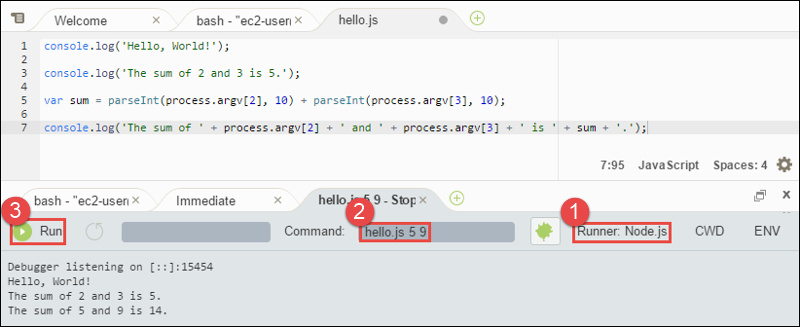

.. Copyright 2010-2018 Amazon.com, Inc. or its affiliates. All Rights Reserved.

   This work is licensed under a Creative Commons Attribution-NonCommercial-ShareAlike 4.0
   International License (the "License"). You may not use this file except in compliance with the
   License. A copy of the License is located at http://creativecommons.org/licenses/by-nc-sa/4.0/.

   This file is distributed on an "AS IS" BASIS, WITHOUT WARRANTIES OR CONDITIONS OF ANY KIND,
   either express or implied. See the License for the specific language governing permissions and
   limitations under the License.

.. _sample-nodejs:

############################
Node.js Sample for |AC9long|
############################

.. meta::
    :description:
        Provides a hands-on sample that you can use to experiment with Node.js in AWS Cloud9.

This sample enables you to run some Node.js scripts in an |envfirst|.

Creating this sample might result in charges to your AWS account. These include possible charges for services such as |EC2| and |S3|. For more information, see
`Amazon EC2 Pricing <https://aws.amazon.com/ec2/pricing/>`_ and `Amazon S3 Pricing <https://aws.amazon.com/s3/pricing/>`_.

* :ref:`sample-nodejs-prereqs`
* :ref:`sample-nodejs-install`
* :ref:`sample-nodejs-code`
* :ref:`sample-nodejs-run`
* :ref:`sample-nodejs-sdk`
* :ref:`sample-nodejs-sdk-code`
* :ref:`sample-nodejs-sdk-run`
* :ref:`sample-nodejs-clean-up`

.. _sample-nodejs-prereqs:

Prerequisites
=============

.. include:: _sample-prereqs.txt

.. _sample-nodejs-install:

Step 1: Install Required Tools
==============================

In this step, you install Node.js, which is required to run this sample.

#. In a terminal session in the |AC9IDE|, confirm whether Node.js is already installed by running the :command:`node --version` command. (To start a new terminal session,
   on the menu bar, choose :menuselection:`Window, New Terminal`.) If successful, the output contains
   the Node.js version number. If Node.js is installed, skip ahead to :ref:`sample-nodejs-code`.
#. Run the :command:`yum update` command to help ensure the latest security updates and bug fixes are installed.

   .. code-block:: sh

      sudo yum -y update

#. To install Node.js, begin by running this command to download Node Version Manager (nvm). (nvm is a simple
   Bash shell script that is useful for installing and managing Node.js versions. For more information, see
   `Node Version Manager <https://github.com/creationix/nvm/blob/master/README.md>`_ on the GitHub website.)

   .. code-block:: sh

      curl -o- https://raw.githubusercontent.com/creationix/nvm/v0.33.0/install.sh | bash

#. To start using nvm, either close the terminal session and start it again, or source the :file:`~/.bashrc` file that contains the commands to load nvm.

   .. code-block:: sh

      . ~/.bashrc

#. Run this command to install the latest version of Node.js.

   .. code-block:: sh

      nvm install node

.. _sample-nodejs-code:

Step 2: Add Code
================

In the |AC9IDE|, create a file with this content, and save the file with the name :file:`hello.js`.
(To create a file, on the menu bar, choose :menuselection:`File, New File`. To save the file, choose :menuselection:`File, Save`.)

.. code-block:: javascript

   console.log('Hello, World!');

   console.log('The sum of 2 and 3 is 5.');

   var sum = parseInt(process.argv[2], 10) + parseInt(process.argv[3], 10);

   console.log('The sum of ' + process.argv[2] + ' and ' +
     process.argv[3] + ' is ' + sum + '.');

.. _sample-nodejs-run:

Step 3: Run the Code
====================

#. In the |AC9IDE|, on the menu bar, choose :menuselection:`Run, Run Configurations, New Run Configuration`.
#. On the :guilabel:`[New] - Idle` tab, choose :guilabel:`Runner: Auto`, and then choose :guilabel:`Node.js`.
#. For :guilabel:`Command`, type :kbd:`hello.js 5 9`. In the code, :code:`5` represents :code:`process.argv[2]`,
   and :code:`9` represents :code:`process.argv[3]`. (:code:`process.argv[0]` represents the name of the runtime (:code:`node`), and :code:`process.argv[1]` represents the name
   of the file (:file:`hello.js`).)
#. Choose the :guilabel:`Run` button, and compare your output.

   .. code-block:: text

      Hello, World!
      The sum of 2 and 3 is 5.
      The sum of 5 and 9 is 14.

.. _sample-nodejs-sdk:

Step 4: Install and Configure the |sdk-nodejs|
==============================================

You can enhance this sample to use the |sdk-nodejs| to create an |s3| bucket, list your available buckets, and then delete the bucket you just created.

In this step, you install and configure the |sdk-nodejs|, which provides a convenient way to interact with AWS services such as |s3|, from your JavaScript code.
After you install the |sdk-nodejs|, you must set up credentials management in your |env|. The |sdk-nodejs| needs these credentials to interact with AWS services.

.. topic:: To install the |sdk-nodejs|

   Use npm to run the :command:`install` command.

   .. code-block:: sh

      npm install aws-sdk

   For more information, see :sdk-for-javascript-dev-guide-v2:`Installing the SDK for JavaScript <installing-jssdk.html>` in the
   |sdk-js-dg|.

.. topic:: To set up credentials management in your |env|

   Each time you use the |sdk-nodejs| to call an AWS service, you must provide a set of credentials with the call. These credentials determine whether the |sdk-nodejs| has the appropriate permissions to make that call. If the
   credentials do not cover the appropriate permissions, the call will fail.

   In this step, you store your credentials within the |env|. To do this, follow the instructions in :ref:`Call AWS Services from an Environment <credentials>`, and then return to this topic.

   For additional information, see :sdk-for-javascript-dev-guide-v2:`Setting Credentials in Node.js <setting-credentials-node.html>` in the
   |sdk-js-dg|.

.. _sample-nodejs-sdk-code:

Step 5: Add AWS SDK Code
========================

In this step, you add some more code, this time to interact with |s3| to create a bucket, list your available buckets, and then delete the bucket you just created. You
will run this code later.

In the |AC9IDE|, create a file with this content, and save the file with the name :file:`s3.js`.

.. code-block:: javascript

   if (process.argv.length < 4) {
     console.log('Usage: node s3.js <the bucket name> <the AWS Region to use>\n' + 
       'Example: node s3.js my-test-bucket us-east-2');
     process.exit(1);
   }

   var AWS = require('aws-sdk'); // To set the AWS credentials and region.
   var async = require('async'); // To call AWS operations asynchronously.

   AWS.config.update({
     region: region
   });

   var s3 = new AWS.S3({apiVersion: '2006-03-01'});
   var bucket_name = process.argv[2];
   var region = process.argv[3];
   
   var create_bucket_params = {
     Bucket: bucket_name,
     CreateBucketConfiguration: {
       LocationConstraint: region
     }
   };

   var delete_bucket_params = {Bucket: bucket_name};

   // List all of your available buckets in this AWS Region.
   function listMyBuckets(callback) {
     s3.listBuckets(function(err, data) {
       if (err) {

       } else {
         console.log("My buckets now are:\n");

         for (var i = 0; i < data.Buckets.length; i++) {
           console.log(data.Buckets[i].Name);
         }
       }

       callback(err);
     });
   }

   // Create a bucket in this AWS Region.
   function createMyBucket(callback) {
     console.log('\nCreating a bucket named ' + bucket_name + '...\n');

     s3.createBucket(create_bucket_params, function(err, data) {
       if (err) {
         console.log(err.code + ": " + err.message);
       }

       callback(err);
     });
   }

   // Delete the bucket you just created.
   function deleteMyBucket(callback) {
     console.log('\nDeleting the bucket named ' + bucket_name + '...\n');

     s3.deleteBucket(delete_bucket_params, function(err, data) {
       if (err) {
         console.log(err.code + ": " + err.message);
       }

       callback(err);
     });
   }

   // Call the AWS operations in the following order.
   async.series([
     listMyBuckets,
     createMyBucket,
     listMyBuckets,
     deleteMyBucket,
     listMyBuckets
   ]);

.. _sample-nodejs-sdk-run:

Step 6: Run the AWS SDK Code
============================

#. Enable the code to call |S3| operations asynchronously by using npm to run the :command:`install` command.

   .. code-block:: sh

      npm install async

#. In the |AC9IDE|, on the menu bar, choose :menuselection:`Run, Run Configurations, New Run Configuration`.
#. On the :guilabel:`[New] - Idle` tab, choose :guilabel:`Runner: Auto`, and then choose :guilabel:`Node.js`.
#. For :guilabel:`Command`, type :code:`s3.js my-test-bucket us-east-2`, where :code:`my-test-bucket` is the name of the bucket you want to create 
   and then delete, and :code:`us-east-2` is the ID of the AWS Region you want to create the bucket in. 
   For more IDs, see :aws-gen-ref:`Amazon Simple Storage Service (Amazon S3) <rande.html#s3_region>` in the |AWS-gr|.

   .. note:: |S3| bucket names must be unique across AWS |mdash| not just your AWS account.

#. Choose the :guilabel:`Run` button, and compare your output.

   .. code-block:: text

      My buckets now are:

      Creating a new bucket named 'my-test-bucket'...

      My buckets now are:

      my-test-bucket

      Deleting the bucket named 'my-test-bucket'...

      My buckets now are:

.. _sample-nodejs-clean-up:

Step 7: Clean Up
================

To prevent ongoing charges to your AWS account after you're done using this sample, you should delete the |env|.
For instructions, see :doc:`Deleting an Environment <delete-environment>`.
