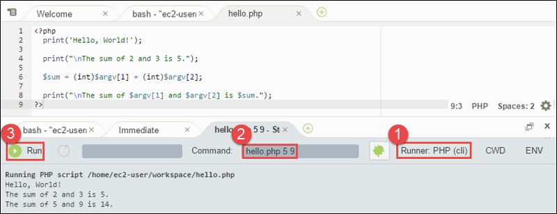

.. Copyright 2010-2018 Amazon.com, Inc. or its affiliates. All Rights Reserved.

   This work is licensed under a Creative Commons Attribution-NonCommercial-ShareAlike 4.0
   International License (the "License"). You may not use this file except in compliance with the
   License. A copy of the License is located at http://creativecommons.org/licenses/by-nc-sa/4.0/.

   This file is distributed on an "AS IS" BASIS, WITHOUT WARRANTIES OR CONDITIONS OF ANY KIND,
   either express or implied. See the License for the specific language governing permissions and
   limitations under the License.

.. _sample-php:

########################
PHP Sample for |AC9long|
########################

.. meta::
    :description:
        Provides a hands-on sample that you can use to experiment with PHP in AWS Cloud9.

This sample enables you to run some PHP scripts in an |envfirst|.

Creating this sample might result in charges to your AWS account. These include possible charges for services such as |EC2| and |S3|. For more information, see
`Amazon EC2 Pricing <https://aws.amazon.com/ec2/pricing/>`_ and `Amazon S3 Pricing <https://aws.amazon.com/s3/pricing/>`_.

* :ref:`sample-php-prereqs`
* :ref:`sample-php-install`
* :ref:`sample-php-code`
* :ref:`sample-php-run`
* :ref:`sample-php-sdk`
* :ref:`sample-php-sdk-code`
* :ref:`sample-php-sdk-run`
* :ref:`sample-php-clean-up`

.. _sample-php-prereqs:

Prerequisites
=============

.. include:: _sample-prereqs.txt

.. _sample-php-install:

Step 1: Install Required Tools
==============================

In this step, you install PHP, which is required to run this sample.

.. note:: The following procedure installs PHP only. To install related tools such as an Apache web server and a MySQL database, see
   :ec2-ug:`Tutorial: Installing a LAMP Web Server on Amazon Linux <install-LAMP>` in the |ec2-ug|.

#. In a terminal session in the |AC9IDE|, confirm whether PHP is already installed by running the :command:`php --version` command. (To start a new terminal session,
   on the menu bar, choose :menuselection:`Window, New Terminal`.) If successful, the output contains
   the PHP version number. If PHP is installed, skip ahead to :ref:`sample-php-code`.
#. Run the :command:`yum update` command to help ensure the latest security updates and bug fixes are installed.

   .. code-block:: sh

      sudo yum -y update

#. Install PHP by running the :command:`install` command.

   .. code-block:: sh

      sudo yum -y install php56

   For more information, see `Installation and Configuration <http://php.net/manual/en/install.php>`_ on the PHP website.

.. _sample-php-code:

Step 2: Add Code
================

In the |AC9IDE|, create a file with this content, and save the file with the name :file:`hello.php`.
(To create a file, on the menu bar, choose :menuselection:`File, New File`. To save the file, choose :menuselection:`File, Save`, type :code:`hello.php` for :guilabel:`Filename`, and then choose :guilabel:`Save`.)

.. code-block:: php

   <?php
     print('Hello, World!');

     print("\nThe sum of 2 and 3 is 5.");

     $sum = (int)$argv[1] + (int)$argv[2];

     print("\nThe sum of $argv[1] and $argv[2] is $sum.");
   ?>

.. note:: The preceding code doesn't rely on any external files. However, if you ever include or require other PHP files in your file, and you want |AC9| to use 
   those files to do code completion as you type, 
   turn on the :guilabel:`Project, PHP Support, Enable PHP code completion` setting in :guilabel:`Preferences`, 
   and then add the paths to those files to the :guilabel:`Project, PHP Support, PHP Completion Include Paths` setting. 
   (To view and change your preferences, choose :guilabel:`AWS Cloud9, Preferences` on the menu bar.)

.. _sample-php-run:

Step 3: Run the Code
====================

#. In the |AC9IDE|, on the menu bar, choose :menuselection:`Run, Run Configurations, New Run Configuration`.
#. On the :guilabel:`[New] - Idle` tab, choose :guilabel:`Runner: Auto`, and then choose :guilabel:`PHP (cli)`.
#. For :guilabel:`Command`, type :samp:`hello.php 5 9`. In the code, :code:`5` represents :code:`$argv[1]`,
   and :code:`9` represents :code:`$argv[2]`. (:code:`$argv[0]` represents the name of the file (:file:`hello.php`).)
#. Choose the :guilabel:`Run` button, and compare your output.

   .. code-block:: text

      Hello, World!
      The sum of 2 and 3 is 5.
      The sum of 5 and 9 is 14.

.. _sample-php-sdk:

Step 4: Install and Configure the |sdk-php|
===========================================

You can enhance this sample to use the |sdk-php| to create an |s3| bucket, list your available buckets, and then delete the bucket you just created.

In this step, you install and configure the |sdk-php|, which provides a convenient way to interact with AWS services such as |s3|, from your PHP code.
Before you can install the |sdk-php|, you should install `Composer <https://getcomposer.org/>`_. After you install the |sdk-php|, you must set up credentials management in your |env|.
The |sdk-php| needs these credentials to interact with AWS services.

.. topic:: To install Composer

   Run the :command:`curl` command with the silent (:code:`-s`) and show error (:code:`-S`) options, piping the Composer installer into a PHP archive (PHAR) file,
   named :file:`composer.phar` by convention.

   .. code-block:: sh

      curl -sS https://getcomposer.org/installer | php

.. topic:: To install the |sdk-php|

   Use the php command to run the Composer installer to install the |sdk-php|.

   .. code-block:: sh

      php composer.phar require aws/aws-sdk-php

   This command creates several folders and files in your |env|. The primary file you will use is :file:`autoload.php`, which is in the :file:`vendor` folder in your |env|.

   For more information, see :sdk-php-gsg-v3:`Installation <installation>` in the |sdk-php-gsg|.

.. topic:: To set up credentials management in your |env|

   Each time you use the |sdk-php| to call an AWS service, you must provide a set of credentials with the call. These credentials determine whether the |sdk-php| has the appropriate permissions to make that call. If the
   credentials don't cover the appropriate permissions, the call will fail.

   In this step, you store your credentials within the |env|. To do this, follow the instructions in :ref:`Call AWS Services from an Environment <credentials>`, and then return to this topic.

   For additional information, see the "Creating a client" section of :sdk-php-gsg-v3:`Basic Usage <basic-usage>` in the |sdk-php-gsg|.

.. _sample-php-sdk-code:

Step 5: Add AWS SDK Code
========================

In this step, you add some more code, this time to interact with |s3| to create a bucket, list your available buckets, and then delete the bucket you just created. You
will run this code later.

In the |AC9IDE|, create a file with this content, and save the file with the name :file:`s3.php`.

.. code-block:: php

   <?php
     require './vendor/autoload.php';

     if ($argc < 4) {
       exit("Usage: php s3.php <the time zone> <the bucket name> <the AWS Region to use>\n" .
         "Example: php s3.php America/Los_Angeles my-test-bucket us-east-2");
     }
     
     $timeZone = $argv[1];
     $bucketName = $argv[2];
     $region = $argv[3];
     
     date_default_timezone_set($timeZone);

     $s3 = new Aws\S3\S3Client([
       'region' => $region,
       'version' => '2006-03-01'
     ]);

     # Lists all of your available buckets in this AWS Region.
     function listMyBuckets($s3) {
       print("\nMy buckets now are:\n");

       $promise = $s3->listBucketsAsync();

       $result = $promise->wait();

       foreach ($result['Buckets'] as $bucket) {
         print("\n");
         print($bucket['Name']);
       }
     }

     listMyBuckets($s3);

     # Create a new bucket.
     print("\n\nCreating a new bucket named '$bucketName'...\n");

     try {
       $promise = $s3->createBucketAsync([
         'Bucket' => $bucketName,
         'CreateBucketConfiguration' => [
           'LocationConstraint' => $region
         ]
       ]);

       $promise->wait();

     } catch (Exception $e) {
       if ($e->getCode() == 'BucketAlreadyExists') {
         exit("\nCannot create the bucket. " .
           "A bucket with the name '$bucketName' already exists. Exiting.");
       }
     }

     listMyBuckets($s3);

     # Delete the bucket you just created.
     print("\n\nDeleting the bucket named '$bucketName'...\n");

     $promise = $s3->deleteBucketAsync([
       'Bucket' => $bucketName
     ]);

     $promise->wait();

     listMyBuckets($s3);
   ?>

.. _sample-php-sdk-run:

Step 6: Run the AWS SDK Code
============================

#. In the |AC9IDE|, on the menu bar, choose :menuselection:`Run, Run Configurations, New Run Configuration`.
#. On the :guilabel:`[New] - Idle` tab, choose :guilabel:`Runner: Auto`, and then choose :guilabel:`PHP (cli)`.
#. For :guilabel:`Command`, type :samp:`s3.php {YOUR_TIME_ZONE} {YOUR_BUCKET_NAME} {THE_AWS_REGION}`, where:

   * :samp:`{YOUR_TIME_ZONE}` is your default time zone ID. For example, for the Pacific Time Zone, use :code:`America/Los_Angeles`.
     For more IDs, see `List of Supported Timezones <http://php.net/manual/en/timezones.php>`_ on the PHP website.
   * :samp:`{YOUR_BUCKET_NAME}` is the name of the bucket you want to create and then delete.
   * :samp:`{THE_AWS_REGION}` is the ID of the AWS Region you want to create the bucket in. For example, for the US East (Ohio) Region, 
     use :code:`us-east-2`. For more IDs, see :aws-gen-ref:`Amazon Simple Storage Service (Amazon S3) <rande.html#s3_region>` in the |AWS-gr|. 

   .. note:: |S3| bucket names must be unique across AWS |mdash| not just your AWS account.

#. Choose the :guilabel:`Run` button, and compare your output.

   .. code-block:: text

      My buckets now are:

      Creating a new bucket named 'my-test-bucket'...

      My buckets now are:

      my-test-bucket

      Deleting the bucket named 'my-test-bucket'...

      My buckets now are:

.. _sample-php-clean-up:

Step 7: Clean Up
================

To prevent ongoing charges to your AWS account after you're done using this sample, you should delete the |env|.
For instructions, see :doc:`Deleting an Environment <delete-environment>`.
