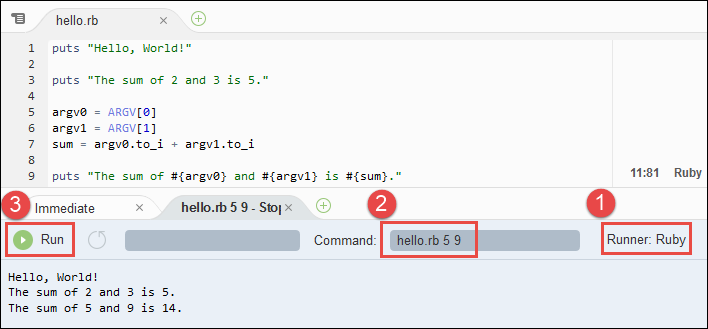

.. Copyright 2010-2018 Amazon.com, Inc. or its affiliates. All Rights Reserved.

   This work is licensed under a Creative Commons Attribution-NonCommercial-ShareAlike 4.0
   International License (the "License"). You may not use this file except in compliance with the
   License. A copy of the License is located at http://creativecommons.org/licenses/by-nc-sa/4.0/.

   This file is distributed on an "AS IS" BASIS, WITHOUT WARRANTIES OR CONDITIONS OF ANY KIND,
   either express or implied. See the License for the specific language governing permissions and
   limitations under the License.

.. _sample-ruby:

#########################
Ruby Sample for |AC9long|
#########################

.. meta::
    :description:
        Provides a hands-on sample that you can use to experiment with Ruby in AWS Cloud9.

This sample enables you to run some Ruby scripts in an |envfirst|.

Creating this sample might result in charges to your AWS account. These include possible charges for services such as |EC2| and |S3|. For more information, see
`Amazon EC2 Pricing <https://aws.amazon.com/ec2/pricing/>`_ and `Amazon S3 Pricing <https://aws.amazon.com/s3/pricing/>`_.

* :ref:`sample-ruby-prereqs`
* :ref:`sample-ruby-install`
* :ref:`sample-ruby-code`
* :ref:`sample-ruby-run`
* :ref:`sample-ruby-sdk`
* :ref:`sample-ruby-sdk-code`
* :ref:`sample-ruby-sdk-run`
* :ref:`sample-ruby-clean-up`

.. _sample-ruby-prereqs:

Prerequisites
=============

.. include:: _sample-prereqs.txt

.. _sample-ruby-install:

Step 1: Install Required Tools
==============================

In this step, you install Ruby, which is required to run this sample.

#. In a terminal session in the |AC9IDE|, confirm whether Ruby is already installed by running the :command:`ruby --version` command. (To start a new terminal session,
   on the menu bar, choose :menuselection:`Window, New Terminal`.) If successful, the output contains the Ruby version number.
   If Ruby is installed, skip ahead to :ref:`sample-ruby-code`.
#. Run the :command:`yum update` command to help ensure the latest security updates and bug fixes are installed.

   .. code-block:: sh

      sudo yum -y update

#. Install Ruby by running the :command:`install` command.

   .. code-block:: sh

      sudo yum -y install ruby

   For more information, see `Installing Ruby <https://www.ruby-lang.org/en/documentation/installation>`_ on the Ruby website.

.. _sample-ruby-code:

Step 2: Add Code
================

In the |AC9IDE|, create a file with this content, and save the file with the name :file:`hello.rb`.
(To create a file, on the menu bar, choose :menuselection:`File, New File`. To save the file, choose :menuselection:`File, Save`.)

.. code-block:: ruby

   puts "Hello, World!"

   puts "The sum of 2 and 3 is 5."

   argv0 = ARGV[0]
   argv1 = ARGV[1]
   sum = argv0.to_i + argv1.to_i

   puts "The sum of #{argv0} and #{argv1} is #{sum}."

.. _sample-ruby-run:

Step 3: Run the Code
====================

#. In the |AC9IDE|, on the menu bar, choose :menuselection:`Run, Run Configurations, New Run Configuration`.
#. On the :guilabel:`[New] - Idle` tab, choose :guilabel:`Runner: Auto`, and then choose :guilabel:`Ruby`.
#. For :guilabel:`Command`, type :kbd:`hello.rb 5 9`. In the code, :code:`5` represents :code:`ARGV[0]`,
   and :code:`9` represents :code:`ARGV[1]`.
#. Choose the :guilabel:`Run` button, and compare your output.

   .. code-block:: text

      Hello, World!
      The sum of 2 and 3 is 5.
      The sum of 5 and 9 is 14.

.. _sample-ruby-sdk:

Step 4: Install and Configure the |sdk-ruby|
==================================================

You can enhance this sample to use the |sdk-ruby| to create an |s3| bucket, list your available buckets, and then delete the bucket you just created.

In this step, you install and configure the |sdk-ruby|, which provides a convenient way to interact with AWS services such as |s3|, from your Ruby code. Before you can install the
|sdk-ruby|, you must install RubyGems. After you install the |sdk-ruby|, you must set up credentials management in your |env|. The
|sdk-ruby| needs these credentials to interact with AWS services.

.. topic:: To install RubyGems

   #. In the |AC9IDE|, confirm whether RubyGems is already installed by running the :command:`gem --version` command. If successful, the
      output contains the RubyGems version number. Otherwise, an error message should be output. If RubyGems is installed, skip ahead to "Step 4.2: Install the |sdk-ruby|."
   #. To install RubyGems, run the :command:`install` command.

      .. code-block:: sh

         sudo yum -y install gem

      For more information, see `Download RubyGems <https://rubygems.org/pages/download>`_ on the RubyGems website.

.. topic:: To install the |sdk-ruby|

   After you install RubyGems, run the :command:`gem install` command.

   .. code-block:: sh

      sudo gem install aws-sdk

   For more information, see :sdk-for-ruby-dev-guide-v3:`Installing the AWS SDK for Ruby <setup-install.html>` in the |sdk-ruby-dg|.

.. topic:: To set up credentials management in your |env|

   Each time you use the |sdk-ruby| to call an AWS service, you must provide a set of credentials with the call. These credentials determine whether the |sdk-ruby| has the appropriate permissions to make that call. If the
   credentials don't cover the appropriate permissions, the call will fail.

   In this step, you will store your credentials within the |env|. To do this, follow the instructions in :ref:`Call AWS Services from an Environment <credentials>`, and then return to this topic.

   For additional information, see :sdk-for-ruby-dev-guide-v3:`Configuring the AWS SDK for Ruby <setup-config.html>` in the |sdk-ruby-dg|.

.. _sample-ruby-sdk-code:

Step 5: Add AWS SDK Code
========================

In this step, you will add some more code, this time to interact with |s3| to create a bucket, list your available buckets, and then delete the bucket you just created. You
will run this code later.

In the |AC9IDE|, create a file with this content, and save the file with the name :file:`s3.rb`.

.. code-block:: ruby

   require 'aws-sdk'

   if ARGV.length < 2
     puts "Usage: ruby s3.rb <the bucket name> <the AWS Region to use>\n" +
       "Example: ruby s3.rb my-test-bucket us-east-2"
   end
   
   bucket_name = ARGV[0]
   region = ARGV[1]
   s3 = Aws::S3::Client.new(region: region)

   # Lists all of your available buckets in this AWS Region.
   def list_my_buckets(s3)
     resp = s3.list_buckets()
     puts "My buckets now are:\n\n"

     resp.buckets.each do |bucket|
       puts bucket.name
     end

   end

   list_my_buckets(s3)

   # Create a new bucket.
   begin
     puts "\nCreating a new bucket named '#{bucket_name}'...\n\n"
     s3.create_bucket({
       bucket: bucket_name,
       create_bucket_configuration: {
         location_constraint: region
       }
     })
   rescue Aws::S3::Errors::BucketAlreadyExists
     puts "Cannot create the bucket. " +
       "A bucket with the name '#{bucket_name}' already exists. Exiting."
     exit(false)
   end

   list_my_buckets(s3)

   # Delete the bucket you just created.
   puts "\nDeleting the bucket named '#{bucket_name}'...\n\n"
   s3.delete_bucket(bucket: bucket_name)

   list_my_buckets(s3)

.. _sample-ruby-sdk-run:

Step 6: Run the AWS SDK Code
============================

#. In the |AC9IDE|, on the menu bar, choose :menuselection:`Run, Run Configurations, New Run Configuration`.
#. In the :guilabel:`[New] - Idle` tab, choose :guilabel:`Runner: Auto`, and then choose :guilabel:`Ruby`.
#. For :guilabel:`Command`, type :samp:`s3.rb {YOUR_BUCKET_NAME} {THE_AWS_REGION}`, where :samp:`{YOUR_BUCKET_NAME}` is the name of the bucket you want to create 
   and then delete, and :samp:`{THE_AWS_REGION}` is the ID of the AWS Region you want to create the bucket in. For example, for the US East (Ohio) Region, 
   use :code:`us-east-2`. For more IDs, see :aws-gen-ref:`Amazon Simple Storage Service (Amazon S3) <rande.html#s3_region>` in the |AWS-gr|.

   .. note:: |S3| bucket names must be unique across AWS |mdash| not just your AWS account.

#. Choose the :guilabel:`Run` button, and compare your output.

   .. code-block:: text

      My buckets now are:

      Creating a new bucket named 'my-test-bucket'...

      My buckets now are:

      my-test-bucket

      Deleting the bucket named 'my-test-bucket'...

      My buckets now are:

.. _sample-ruby-clean-up:

Step 7: Clean Up
================

To prevent ongoing charges to your AWS account after you're done using this sample, you should delete the |env|.
For instructions, see :doc:`Deleting an Environment <delete-environment>`.
