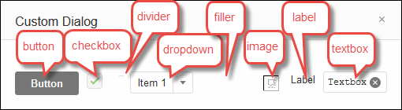
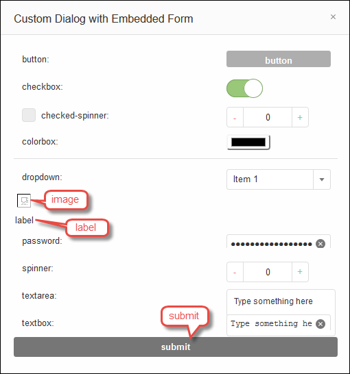

.. Copyright 2010-2018 Amazon.com, Inc. or its affiliates. All Rights Reserved.

   This work is licensed under a Creative Commons Attribution-NonCommercial-ShareAlike 4.0
   International License (the "License"). You may not use this file except in compliance with the
   License. A copy of the License is located at http://creativecommons.org/licenses/by-nc-sa/4.0/.

   This file is distributed on an "AS IS" BASIS, WITHOUT WARRANTIES OR CONDITIONS OF ANY KIND,
   either express or implied. See the License for the specific language governing permissions and
   limitations under the License.

.. _settings-init-script:

############################################################
Working with Initialization Scripts in the |AC9IDElongtitle|
############################################################

.. meta::
    :description:
        Describes how to work with initialization scripts in the AWS Cloud9 IDE.

An :dfn:`initialization script` defines custom initialization code to run in your IDE after all plugins
are loaded. This applies across each |envfirst| associated with your |IAM| user. As you make changes to your initialization script, |AC9| pushes those changes to the cloud and
associates them with your |IAM| user. |AC9| also continually scans the cloud for changes to the initialization
script associated with your |IAM| user, and applies those changes
to your current |env|.

You can share your initialization script with other users.

* :ref:`settings-init-script-view`
* :ref:`settings-init-script-share`
* :ref:`settings-init-script-coding`

.. _settings-init-script-view:

View or Change Your Initialization Script
=========================================

#. To view your initialization script, on the menu bar, choose :menuselection:`AWS Cloud9, Open Your Init Script`.
#. To change your initialization script, on the :guilabel:`init.js` tab, use code to change your initialization script's behavior. For more information, see
   :ref:`settings-init-script-coding`.
#. To apply your changes to any other |env|, simply open the |env| you want to apply the changes to.
   If that |env| is already open, refresh the web browser tab for that |env|.

.. _settings-init-script-share:

Share Your Initialization Script with Another User
==================================================

#. In both the source and target |env|, on the menu bar of the |AC9IDE|, choose :guilabel:`AWS Cloud9, Open Your Init Script`.
#. In the source |env|, copy the contents of the :guilabel:`init.js` tab that is displayed.
#. In the target |env|, overwrite the contents of the :guilabel:`init.js` tab with the copied contents from the source |env|.
#. In the target |env|, save the :guilabel:`init.js` tab.

.. _settings-init-script-coding:

Working with Initialization Script Code
=======================================

You can add code to your initialization script (:file:`init.js` file) in the |AC9IDE| to do common
things when your |env| starts or reloads, such as the following:

* Add custom commands and menus to the menu bar.
* Show built-in alert, question, and file dialog boxes, and create custom dialog boxes.
* Add and delete files in the file system.
* Set and get custom user preference settings.
* Add custom side panels.
* Add custom builders and runners.
* Add custom tabs.

To run your :file:`init.js` file after you add code to it or change existing code in it, save your :file:`init.js`
file, then reload your |env|. Do this by choosing your web browser's reload button. For Windows or Linux,
you can also press :kbd:`Ctrl+F5`
or :kbd:`Ctrl+Shift+R`. For Mac, you
can also press :kbd:`Cmd+Shift+R`.

* :ref:`settings-init-script-coding-global`
* :ref:`settings-init-script-coding-discovery`
* :ref:`settings-init-script-coding-menus`

  * :ref:`settings-init-script-coding-menus-command`
  * :ref:`settings-init-script-coding-menus-menu`

* :ref:`settings-init-script-coding-dialogs`

  * :ref:`settings-init-script-coding-dialogs-alert`
  * :ref:`settings-init-script-coding-dialogs-question`
  * :ref:`settings-init-script-coding-dialogs-file`
  * :ref:`settings-init-script-coding-dialogs-custom`

* :ref:`settings-init-script-coding-filesystem`

  * :ref:`settings-init-script-coding-filesystem-add`
  * :ref:`settings-init-script-coding-filesystem-delete`

* :ref:`settings-init-script-coding-user-prefs`

  * :ref:`settings-init-script-coding-user-prefs-set`
  * :ref:`settings-init-script-coding-user-prefs-setting`
  * :ref:`settings-init-script-coding-user-prefs-get`

* :ref:`settings-init-script-coding-panels`

  * :ref:`settings-init-script-coding-panels-built-in`
  * :ref:`settings-init-script-coding-panels-custom`

* :ref:`settings-init-script-coding-builders`

  * :ref:`settings-init-script-coding-builders-list-all`
  * :ref:`settings-init-script-coding-builders-list-indiv`
  * :ref:`settings-init-script-coding-builders-create`

* :ref:`settings-init-script-coding-runners`

  * :ref:`settings-init-script-coding-runners-list-all`
  * :ref:`settings-init-script-coding-runners-list-indiv`
  * :ref:`settings-init-script-coding-runners-create`

* :ref:`settings-init-script-coding-tabs`

  * :ref:`settings-init-script-coding-tabs-list-all`
  * :ref:`settings-init-script-coding-tabs-create`

.. _settings-init-script-coding-global:

Declaring the Services Global Variable
--------------------------------------

In your initialization script, you access |AC9IDE| APIs from your code through the :code:`services` global
variable.
At the beginning of your :file:`init.js` file, you must add the :code:`/*global*/` directive to specify
that the :code:`services` global variable is available to this file.

.. code-block:: javascript

   /*global services*/

.. _settings-init-script-coding-discovery:

Discovering the Services APIs
-----------------------------

To see what is available to you as part of the :code:`services` global variable, you can log the global
to your web browser's console. For example:

.. code-block:: javascript

   console.log(services);

To display your web browser's console:

* For Google Chrome, choose :guilabel:`Customize and control Google Chrome, More tools, Developer tools, Console`.
* For Safari, choose :guilabel:`Develop, Show JavaScript Console`.
  (If the :guilabel:`Develop` menu isn't visible, choose :guilabel:`Safari, Preferences, Advanced, Show
  Develop menu in menu bar`.)
* For Mozilla Firefox, choose :guilabel:`Open menu, Developer, Web console`.
* For Internet Explorer, choose :guilabel:`Tools, F12 Developer Tools, Console`.
* For Microsoft Edge, choose :guilabel:`More, F12 Developer Tools, Console`.
* For other web browsers, consult the specific web browser documentation.

.. _settings-init-script-coding-menus:

Working with Menus
------------------

Code in your :file:`init.js` file starts running immediately after your |env| starts or reloads. For example,
you can use custom menus to delay the running of preloaded commands until you choose to run them.

You can add custom menus anywhere throughout the |AC9IDE|. For example,
you can add your own menu command to an existing built-in menu on the
menu bar. You can also add your own menu to the menu bar.

.. _settings-init-script-coding-menus-command:

Add a Custom Command to the Menu Bar
~~~~~~~~~~~~~~~~~~~~~~~~~~~~~~~~~~~~

The following code example adds a menu command named :guilabel:`Current Time` to the end of the built-in :guilabel:`Tools` menu. When you choose :guilabel:`Current Time`, an alert displays
the current time.

.. code-block:: javascript

   // Add a custom menu command to an existing menu on the menu bar.
   var menus = services["menus"];    // Accesses the menu bar.
   var MenuItem = services.MenuItem; // Use this to create a menu item.
   var Divider = services.Divider;   // Use this to create a menu divider.

   // Add a Current Time command to the built-in Tools menu.
   menus.addItemByPath("Tools/Current Time", new MenuItem({
     onclick: chooseCurrentTime
   }), 200001, plugin);

   // Add a dividing line before the Current Time menu command on
   // the Tools menu.
   menus.addItemByPath("Tools/~", new Divider(), 200000, plugin);

   // Run this when the user chooses the Current Time command.
   function chooseCurrentTime() {

     var today = new Date();
     var h = today.getHours();
     var m = today.getMinutes();
     var s = today.getSeconds();

     // Add a zero in front of minutes or seconds, if less than 10.
     m = checkTime(m);
     s = checkTime(s);

     // Show a built-in alert dialog box displaying the current time.
     services["dialog.alert"].show("Time", "Current time",
       "The current time is " + h + ":" + m + ":" + s + ".");
   }

   // Add a zero in front of minutes or seconds, if less than 10.
   function checkTime(i) {
     if (i < 10) {
       i = "0" + i;
     }
     return i;
   }

To specify the menu to add the :guilabel:`Current Time` command to, in the :code:`addItemByPath` method,
provide the menu name (in this example, :code:`Tools`),
followed by a forward slash (:code:`/`), followed by the name of the menu command (in this example, :guilabel:`Current
Time`).

To separate the :guilabel:`Current Time` command from the menu's other commands, add a divider before
the command. The divider appears as a horizontal rule.
To specify the menu to add the divider to, in the :code:`addItemByPath` method, provide the menu name (in this example, :code:`Tools`),
followed by a forward slash (:code:`/`), followed by a tilde (:code:`~`).

To add this command toward the end of the menu, you specify a sufficiently large index number (:code:`200000`
for the divider and :code:`200001` for the :guilabel:`Current Time` command).
Menus and menu commands with larger index numbers are placed toward the ends of menus.
To see the index number of each menu and menu command, add :code:`?menus=1` to the end of your |env| URL,
then reload your |env|. To hide these index numbers,
remove :code:`?menus=1` from the end of your |env| URL, then reload your |env|.

The :code:`show` method of the :code:`dialog.alert` service shows an :code:`alert` dialog. For more information,
see :ref:`settings-init-script-coding-dialogs-alert`.

.. _settings-init-script-coding-menus-menu:

Add a Custom Menu to the Menu Bar
~~~~~~~~~~~~~~~~~~~~~~~~~~~~~~~~~

The following code example adds a top-level menu named :guilabel:`Weekends` to the end of the menu bar.
When you choose one of the menu's commands, an :code:`alert` dialog box is displayed with various
information.

Adding a custom menu to the menu bar is similar to adding a custom command to a built-in menu. Use the :code:`setRootMenu` method to set where to put the menu at the top level on the menu bar.

Because this code uses the :code:`plugin` global variable, you must add the :code:`/*global services,
plugin*/` directive at the beginning of your :file:`init.js` file to specify that the
:code:`services` and :code:`plugin` globals are available to this file.

.. code-block:: javascript

   // Add a custom top-level menu to the menu bar.
   // Add commands and dividers to this menu.
   var menuCaption = "Weekends";     // Menu caption.
   var menus = services["menus"];    // Access the menu bar.
   var MenuItem = services.MenuItem; // Use this to create a menu item.
   var Divider = services.Divider;   // Use this to create a menu divider.

   // Set the top-level menu caption.
   menus.setRootMenu(menuCaption, 900, plugin);

   // Add a Saturday menu command to the menu.
   // When the user chooses this command, run the chooseWeekendDay function,
   // passing in the string Saturday.
   menus.addItemByPath(menuCaption + "/Saturday", new MenuItem({
     onclick: chooseWeekendDay.bind(null, "Saturday")
   }), 100, plugin);

   // Add a Sunday menu command to the menu.
   // When the user chooses this command, run the chooseWeekendDay function,
   // passing in the string Sunday.
   menus.addItemByPath(menuCaption + "/Sunday", new MenuItem({
     onclick: chooseWeekendDay.bind(null, "Sunday")
   }), 200, plugin);

   // Add an About menu command to the menu.
   // When the user chooses this command, run the chooseAbout function.
   menus.addItemByPath(menuCaption + "/About", new MenuItem({
     onclick: chooseAbout
   }), 400, plugin);

   // Add a dividing line before the About menu command.
   menus.addItemByPath(menuCaption + "/~", new Divider(), 300, plugin);

   // Show a built-in alert with the chosen day name.
   function chooseWeekendDay(day) {
     services["dialog.alert"].show("Results", "Which day?",
       "You chose " + day + ".");
   }

   // Show a built-in alert with the menu caption.
   function chooseAbout() {
     services["dialog.alert"].show("About", menuCaption + " menu",
       "This is the " + menuCaption + " menu. Enjoy your weekend.");
   }

.. _settings-init-script-coding-dialogs:

Working with Dialogs
--------------------

You use dialogs to display information to users, and to get information
from users. This section describes how to work with four types of dialog:

* A built-in :code:`alert` dialog, which displays information but doesn't enable you to get information
  from users.
* A built-in question dialog, which enables you to capture "yes" or "no" responses from users.
* A built-in :code:`file` dialog, which enables you to capture information from users about folders
  and files
  in the file system of the |env|.
* A custom dialog, which enables you to display information and special controls to capture
  various information from users.

.. _settings-init-script-coding-dialogs-alert:

Show a Built-In Alert Dialog
~~~~~~~~~~~~~~~~~~~~~~~~~~~~

An :code:`alert` dialog contains a title, optional heading, optional text, and an :guilabel:`OK` button.

The following code example uses the :code:`show` method of the :code:`dialog.alert` service to display various information based on the current time of day.

.. code-block:: javascript

   // Create an alert dialog.
   var d = new Date();   // Get the current time.
   var n = d.getHours(); // Get the current hour.
   var greeting;
   var meal;

   if ( n >= 0 && n <=11 ) {
     greeting = "Good morning";
     meal = "breakfast";
   } else if ( n >=12 && n <=16 ) {
     greeting = "Good afternoon";
     meal = "lunch";
   } else if ( n >= 17 && n <= 23) {
     greeting = "Good evening";
     meal = "dinner";
   } else {
     greeting = "Hello";
     meal = "something";
   }

   // Show a built-in alert dialog with a message based on the current hour.
   services["dialog.alert"].show(greeting, "Reminder", "Have you eaten " +
     meal + " yet?");

.. _settings-init-script-coding-dialogs-question:

Show a Built-In Question Dialog
~~~~~~~~~~~~~~~~~~~~~~~~~~~~~~~

A :code:`question` dialog contains a title, optional heading, optional text, and :guilabel:`Yes`
and :guilabel:`No` buttons.

The following code example displays various information based on the current time of day. To do
something that depends on whether you choose :guilabel:`Yes` or :guilabel:`No`, declare
related functions within the :guilabel:`show` method.

The following code example uses the :code:`show` method of the :code:`dialog.question` service to display
various information based on whether the user chooses :guilabel:`Yes` or :guilabel:`No`.
In your own code, you can do something different if the user chooses :guilabel:`Yes` or :guilabel:`No`.

.. code-block:: javascript

   // Create a question dialog.
   var language = "Node.js";  // Programming language type displayed in dialog.

   // Show a built-in question dialog with a message based on whether the
   // user chooses Yes or No.
   services["dialog.question"].show(
     "Survey",
     "Do you like " + language + "?",
     "Choose Yes or No.",
     function() {
       // User chose the Yes button.
       services["dialog.alert"].show("Results", "Language preference",
         "You seem to like " + language + ".");
     },
     function() {
       // User chose the No button.
       services["dialog.alert"].show("Results", "Language preference",
         "It seems that you don't like " + language + ".");
     }
   );

.. _settings-init-script-coding-dialogs-file:

Show a Built-In File Dialog
~~~~~~~~~~~~~~~~~~~~~~~~~~~

A :code:`file` dialog contains :guilabel:`Save` and :guilabel:`Cancel` buttons. It also contains
file name,
path, and folder boxes, a :guilabel:`Create folder` button, and
a :guilabel:`Show files in tree` check box.

Use the :code:`file` dialog's :code:`filename` and :code:`directory` properties to get the specified
file name
and directory name.

The following code example uses the :code:`show` method of the :code:`dialog.file` service to enable the user to select a file name and directory path.
After the user chooses :guilabel:`Save`, information about the selected file name and directory path is displayed. In your own code, you can do something different if the
user chooses :guilabel:`Save` or :guilabel:`Cancel`.

.. code-block:: javascript

   // Create a file dialog.
   var fileDialog = services["dialog.file"];

   // Show a built-in file dialog.
   // After the user chooses Save, show a built-in alert with
   // information about the user's specified file name and directory path.
   fileDialog.show(
     "Specify the file name and choose a path",
     "my-filename",
     function() {
       // User chose the Save button.
       services["dialog.alert"].show("Results", "File info",
         "Filename = " + fileDialog.filename +
         "\nDirectory = " + fileDialog.directory);
      fileDialog.hide();
     },
     function() {
       // User chose the Cancel button.
       services["dialog.alert"].show("Results", "File info", "You chose Cancel.");
       fileDialog.hide();
     }
   );

.. _settings-init-script-coding-dialogs-custom:

Create a Custom Dialog
~~~~~~~~~~~~~~~~~~~~~~

A custom dialog provides a row across its bottom edge that you can put special
controls
into, as shown here.

This row, named the *button bar*, can contain the following items:

* :code:`button`: Represents a button the user can choose. A :code:`button` can have a name, caption,
  and function to run when the user chooses it.
* :code:`checkbox`: Represents a box with checked and unchecked states. A :code:`checkbox` can
  have a name, default value (:code:`checked` or :code:`unchecked`), and custom values you can associate
  with the checked and unchecked states.
* :code:`divider`: Represents a dividing line.
* :code:`dropdown`: Represents a list of choices for the user. A :code:`dropdown` can have a name,
  list of items the user can choose from, default choice, and message to return if the user doesn't
  select any choice and no default choice is specified.
* :code:`filler`: Represents an empty space to separate items.
* :code:`image`: Represents a viewable picture. An :code:`image` can have a name, source location,
  margin, and height.
* :code:`label`: Represents a string of text. A :code:`label` can have a name and a caption.
* :code:`textbox`: Represents a box the user can type text into. A :code:`textbox` can have a name,
  default value, and message if the user doesn't type anything into the box. It can be set to continuously
  determine a value as the user types or determine a value only after the user
  exits the :code:`box`.

The following code demonstrates all of the available button bar items in a custom dialog. By default,
the button bar displays items horizontally with no labels. When the user chooses
the button, another dialog is displayed with the values of the :code:`checkbox`, :code:`dropdown`,
and :code:`textbox`.

.. code-block:: javascript

   var Dialog = services.Dialog;
   var myDialog = new Dialog("AWS Cloud9", [], {
     allowClose: true,
     title: "My Dialog",
     elements: [
       {
         name: "myButton",
         type: "button",
         caption: "My Button",
         onclick: myButtonOnClick
       },
       {
         name: "myCheckbox",
         type: "checkbox",
         defaultValue: "checked",
         values: [ "checked", "unchecked" ]
       },
       {
         name: "myDivider",
         type: "divider"
       },
       {
         name: "myDropdown",
         type: "dropdown",
         items: [
           { value: "item1", caption: "Item 1" },
           { value: "item2", caption: "Item 2" },
           { value: "item3", caption: "Item 3" }
         ],
         defaultValue: "item1",
         emptyMessage: "No item selected"
       },
       { type: "filler" },
       {
         name: "myImage",
         type: "image",
         src: "",
         margin: "5 5 5 5",
         height: 20
       },
       {
         name: "myLabel",
         type: "label",
         caption: "My Label"
       },
       {
         name: "myTextbox",
         type: "textbox",
         message: "myTextbox is blank",
         defaultValue: "Type something here",
         realtime: true
       }
     ]
   });

   myDialog.show();

   function myButtonOnClick() {
     services["dialog.alert"].show("My Dialog",
       "My Dialog values:",
       "myCheckbox = " + myDialog.getElement("myCheckbox").value + "\n" +
       "myDropdown = " + myDialog.getElement("myDropdown").value + "\n" +
       "myTextbox = " + myDialog.getElement("myTextbox").value
     );
   }

Custom dialogs can also contain a :code:`Form` object, as shown here.

This :code:`Form`
object can contain the following
items:

* :code:`button`: Represents a button the user can choose. A button can have a title, name, caption,
  and function to run when the user chooses it.
* :code:`checkbox`: Represents a sliding on (checked) and off (unchecked) switch. A check box
  can have a title, name, default value (:code:`checked` or :code:`unchecked`), and
  custom values you can associate with the checked and unchecked states.
* :code:`checked-spinner`: Represents a box with checked and unchecked states, with
  a spinner next to it. A :code:`checked-spinner` can have a title, name,
  default check box value (:code:`checked` or :code:`unchecked`), default spinner value, and minimum
  and maximum values. It can be set to continuously determine values as
  the user changes them, or determine them only after the user exits the :code:`checked-spinner`.
* :code:`colorbox`: Represents a chosen color. A :code:`colorbox` can have a title, name, and default
  value. It can be set to continuously determine the value as the user picks different color
  values, or determine the value only after the user exits the :code:`colorbox`.
* :code:`divider`: Represents a dividing line.
* :code:`dropdown`: Represents a list of choices for the user. A :code:`dropdown` can
  have a title, name, list of items the user can choose from, default choice, and
  message that can be returned if the user doesn't select an item and no default choice is specified.
* :code:`image`: Represents a viewable picture. An image can have a name, source location,
  margin, and height.
* :code:`label`: Represents a text string. A :code:`label` can have a name and a caption.
* :code:`password`: Represents a box a user can type a password into. A :code:`password` can have
  a title, name, default value,
  and message that can be returned if the user doesn't type a password. It can be set to continuously
  determine a value
  as the user changes the value, or determine the value only after the user exits
  the :code:`password`.
* :code:`spinner`: Represents a value that can be increased or decreased. A :code:`spinner` can
  have a title, name, default value, and minimum and maximum values. It can be set to continuously
  determine a value as the user changes the value, or determine the value only after the user exits the :code:`spinner`.
* :code:`textarea`: Represents a box the user can type text into. A :code:`textarea` can have a
  title, name, default value, and height. It can be set to continuously determine a value
  as the user types, or determine the value only after the user exits the box.
* :code:`textbox`: Represents a box the user can type text into. A :code:`textbox` can have a title,
  name, default value, and message if the user doesn't type anything into the box. It
  can be set to continuously determine the value as the user types, or determine the value only
  after the user exits the box.
* :code:`submit`: Represents a button the user can choose. A :code:`submit` button can have a name,
  caption, and function to run when the user chooses it. You can also specify whether the button is chosen if
  the user presses :kbd:`Enter`.

The following code demonstrates all of the available items in a custom dialog. The dialog displays
titles on the left and the items on the right, except for the :code:`image` and :code:`submit` button.
When the user chooses the button, another dialog is displayed. When the user chooses :guilabel:`submit`,
the item names and values in the dialog are displayed in JSON format.

.. code-block:: javascript

   var Form = services.Form;
   var myForm = new Form({
     title: "My Title",
     name: "myForm",
     form: [
       {
         title: "Button",
         name: "myButton",
         type: "button",
         caption: "My Button",
         onclick: myButtonOnClick
       },
       {
         title: "Checkbox",
         name: "myCheckbox",
         type: "checkbox",
         defaultValue: "checked",
         values: [ "checked", "unchecked" ]
       },
       {
         title: "Checked Spinner",
         name: "myCheckedspinner",
         type: "checked-spinner",
         defaultCheckboxValue: "checked",
         defaultValue: 0,
         min: 0,
         max: 10,
         realtime: false
       },
       {
         title: "Color Box",
         name: "myColorbox",
         type: "colorbox",
         defaultValue: "green",
         realtime: false
       },
       {
         name: "myDivider",
         type: "divider"
       },
       {
         title: "Dropdown",
         name: "myDropdown",
         type: "dropdown",
         items: [
           { value: "item1", caption: "Item 1" },
           { value: "item2", caption: "Item 2" },
           { value: "item3", caption: "Item 3" }
         ],
         defaultValue: "item1",
         emptyMessage: "No item selected"
       },
       {
         name: "myImage",
         type: "image",
         src: "",
         margin: "5 5 5 5",
         height: 20
       },
       {
         name: "myLabel",
         type: "label",
         caption: "My Label"
       },
       {
         title: "Password",
         name: "myPassword",
         type: "password",
         defaultValue: "No password typed",
         realtime: false
       },
       {
         title: "Spinner",
         name: "mySpinner",
         type: "spinner",
         defaultValue: 0,
         min: 0,
         max: 10,
         realtime: false
       },
       {
         title: "Text Area",
         name: "myTextarea",
         type: "textarea",
         height: 20,
         defaultValue: "Type something here",
         realtime: true
       },
       {
         title: "Textbox",
         name: "myTextbox",
         type: "textbox",
         message: "myTextbox is blank",
         defaultValue: "Type something here",
         realtime: true
       },
       {
         name: "mySubmit",
         type: "submit",
         caption: "Submit",
         onclick: mySubmitOnClick,
         default: false
       }
     ]
   });

   var Dialog = services.Dialog;
   var myDialog = new Dialog("AWS Cloud9", [], {
     allowClose: true,
     title: "My Dialog"
   });

   myDialog.on("draw", function(e) {
     myForm.attachTo(e.html);
   });

   myDialog.show();

   function myButtonOnClick() {
     services["dialog.alert"].show("My Button",
       "My Button was clicked.");
   }

   function mySubmitOnClick() {
     services["dialog.alert"].show("My Form", "My Form values", JSON.stringify(myForm.toJson()));
     myDialog.hide();
   }

.. _settings-init-script-coding-filesystem:

Working with the File System
----------------------------

You can use the :code:`fs` service to work with the file system in an |env|. You can use the file system to:

* Add, read, and delete files.
* Add, read, rename, and delete directories.
* Search through files and directories.
* Change file modes.

.. _settings-init-script-coding-filesystem-add:

Add a File
~~~~~~~~~~

To add a file, use the :code:`writeFile` method. The following example adds a file named :file:`my-file.txt` to the root directory of the |env|.

.. code-block:: javascript

   var fs = services["fs"];
   var writeFilePath = "~/environment/my-file.txt";

   fs.writeFile(writeFilePath, "Hello, World!",
     function(err, success) {
       if (err) {
         services["dialog.alert"].show(
           "Error",
           "File Write Operation",
           "Could not write file '" + writeFilePath + "'.");
       } else {
         services["dialog.alert"].show(
           "Success",
           "File Write Operation",
           "Wrote file '" + writeFilePath + "'.");
       }
     }
   );

.. _settings-init-script-coding-filesystem-delete:

Delete a File
~~~~~~~~~~~~~

To delete a file, use the :code:`rmfile` method. The following example removes a file named :file:`my-file.txt` from the root directory of the |env|.

.. code-block:: javascript

   var fs = services["fs"];
   var fileDeletePath = "~/environment/my-file.txt";

   fs.rmfile(fileDeletePath,
     function(err, success) {
       if (err) {
         services["dialog.alert"].show(
           "Error",
           "File Delete Operation",
           "Could not delete file '" + fileDeletePath + "'.");
       } else {
         services["dialog.alert"].show(
           "Success",
           "File Delete Operation",
           "Deleted file '" + fileDeletePath + "'.");
       }
     }
   );

.. _settings-init-script-coding-user-prefs:

Working with Preference Settings
--------------------------------

Use preferences to customize the behavior of the |AC9IDE| for users. Common preferences include settings for code editors, code formatting,
and terminal sessions. For more information about preference settings, see :doc:`Working with Project Settings <settings-project>` and :doc:`Working with User Settings <settings-user>`.

You can create your own custom preference settings. You can also set and get the values of existing
custom and built-in preference settings.

.. _settings-init-script-coding-user-prefs-set:

Create Custom Preference Settings
~~~~~~~~~~~~~~~~~~~~~~~~~~~~~~~~~

Use the :code:`add` method of the :code:`preferences` service to add custom preferences that users can set. For each collection of custom preference settings,
specify information such as the collection's display name and location in the :guilabel:`Preferences`
pane, and the collection's individual settings and display controls.

The following code example displays a collection of settings within a section named :guilabel:`My Custom
Preferences`. It's displayed on the
:guilabel:`User Settings` page in the :guilabel:`Preferences` pane.

.. code-block:: javascript

   services["preferences"].add({
     "My Custom Preferences" : { // The title of the section to which
                                 // the following subsections will be added.
                                 // If this section doesn't already exist,
                                 // it will be added to the User Settings page.
       position: 500, // The index number of the section within the parent page.
       "Python Preferences": { // The title of this subsection.
         position: 100, // The index number of this subsection within the section.
         "I like Python" : { // The title of this setting, which
                             // will be added to the subsection.
           type: "checkbox",  // The type of control for this setting.
           position: 101,  // The index number of this setting within the subsection.
           values: [ "yes", "no" ], // Values for checked and unchecked states.
           setting: "myCustomPrefs/myPythonPrefs/@likesPython" // Where the setting
                                                               // will be stored.
         },
         "Times per week (up to 10) I use Python" : {
           type: "spinner",
           position: 102,
           defaultValue: 0, // Default spinner value.
           min: 0, // Lowest valid spinner value.
           max: 10, // Highest valid spinner value.
           setting: "myCustomPrefs/myPythonPrefs/@weeklyPythonTimesUsed"
         }
       },
       "Favorite Food and Drink": {
         position: 200,
         "My favorite type of food" : {
           type: "dropdown",
           position: 201,
           items: [  // Dropdown choices.
             { value: "Grains", caption: "Bread" },
             { value: "Grains", caption: "Cereal" },
             { value: "Dairy", caption: "Cheese" },
             { value: "Fruits", caption: "Fruits" },
             { value: "Meat", caption: "Meat" },
             { value: "Dairy", caption: "Milk" },
             { value: "Grains", caption: "Pasta" },
             { value: "Grains", caption: "Rice" },
             { value: "Vegetables", caption: "Vegetables" },
             { value: "Dairy", caption: "Yogurt" },
             { value: "Other", caption: "Other" },
             { value: "None of the above", caption: "None of the above" }
           ],
           setting: "myCustomPrefs/myFoodPrefs/@myFavoriteFood"
         },
         "My favorite drink" : {
           type: "textbox",
           position: 202,
           setting: "myCustomPrefs/myFoodPrefs/@myFavoriteDrink"
         }
       }
     }
   }, plugin);

To display this section near the end of the :guilabel:`User Settings` page in the :guilabel:`Preferences`
pane, you specify a relatively larger index number (:code:`500`).
Sections with larger index numbers are placed toward the ends of pages. Similarly, subsections with larger
index numbers are placed toward the ends of sections, and
settings with larger index numbers are placed toward the ends of subsections.
To see the index numbers of sections, subsections, and settings in the :guilabel:`Preferences` pane, add :code:`?menus=1` to the end of your |env| URL
and then reload your |env|. To hide these index numbers,
remove :code:`?menus=1` from the end of your |env| URL, and then reload your |env|.

.. _settings-init-script-coding-user-prefs-setting:

Set Existing Preference Settings
~~~~~~~~~~~~~~~~~~~~~~~~~~~~~~~~

To set the value of an existing preference setting, use the :code:`set` method of the :code:`settings`
service, and specify the path to the setting and the value to set.

To view your existing project settings,
choose :menuselection:`AWS Cloud9, Open Your Project Settings`.
To view your existing user settings, choose :menuselection:`AWS Cloud9, Open Your User Settings` on the menu bar.

The following code example displays the :guilabel:`Open Files` section in the :guilabel:`Environment` window.

.. code-block:: javascript

   services["settings"].set("user/openfiles/@show", "true");

This is equivalent to manually choosing :guilabel:`Show Open Files` in the
:guilabel:`Environment` window's settings context menu. To see this value, choose :menuselection:`AWS Cloud9, Open Your User Settings` on the menu bar. Then look in the
settings JSON for the following value. For brevity, ellipses (:code:`...`) represent omitted JSON.

.. code-block:: json

   {
     "ace": {
       ...
     },
     "breakpoints": {
       ...
     },
     ...
     "openfiles": {
       ...
       "@show": true
     },
     ...
   }

.. _settings-init-script-coding-user-prefs-get:

Get Preference Settings
~~~~~~~~~~~~~~~~~~~~~~~

Use the :code:`get` method of the :code:`settings` service to get the value of a preference setting, specifying the path to the setting.

The following code example displays various custom preference settings in a dialog box.

.. code-block:: javascript

   var settings = services["settings"];

   services["dialog.alert"].show(
     "Custom Preferences",
     "My Custom Preferences",
     "Likes Python: " +
     settings.get("myCustomPrefs/myPythonPrefs/@likesPython") + "\n" +
     "Number of times using Python per week: " +
     settings.get("myCustomPrefs/myPythonPrefs/@weeklyPythonTimesUsed") + "\n" +
     "Favorite food category: " +
     settings.get("myCustomPrefs/myFoodPrefs/@myFavoriteFood") + "\n" +
     "Favorite drink: " +
     settings.get("myCustomPrefs/myFoodPrefs/@myFavoriteDrink")
   );

.. _settings-init-script-coding-panels:

Working with Side Panels
------------------------

Built-in side panels include windows such as :guilabel:`Environment`, :guilabel:`Navigate`, :guilabel:`Commands`, :guilabel:`Outline`, and :guilabel:`Debugger`.
You can also create your own custom side panels.

.. _settings-init-script-coding-panels-built-in:

Show and Hide Side Panels
~~~~~~~~~~~~~~~~~~~~~~~~~

To access side panels, use the :code:`panels` service.

To get the list of all available side panels, use the :code:`panels` property.

To get the list of side panels that are currently showing, use the :code:`activePanels` property.

To show or hide a side panel, use the :code:`activate` or :code:`deactivate` method.

Side panels have corresponding buttons. To show or hide these buttons, use the :code:`enablePanel` or
:code:`disablePanel` method.

The following example demonstrates all of these properties and methods.

.. code-block:: javascript

   var panels = services["panels"];

   // Lists all side panels that are currently shown.
   console.log(panels.activePanels);

   // Lists all available side panels.
   console.log(panels.panels);

   // Shows the Debugger side panel, if it isn't already shown.
   panels.activate("debugger");

   // Hides the Environment side panel, if it isn't already hidden.
   panels.deactivate("tree");

   // Removes the Outline side panel button, if it isn't already removed.
   panels.disablePanel("outline");

   // Displays the Navigate side panel button, if it isn't already displayed.
   panels.enablePanel("navigate");

.. _settings-init-script-coding-panels-custom:

Create a Custom Side Panel
~~~~~~~~~~~~~~~~~~~~~~~~~~

Use the :code:`Panel` object to create a side panel, and specify settings such as the side panel's caption
and side location.

To format the side panel, use the :code:`on` method.

To load and then display the side panel, use the :code:`load` and :code:`show` methods.

The following example creates, loads, and displays a custom side panel.

.. code-block:: javascript

   var Panel = services.Panel;
   var zooPanel = new Panel(
     "AWS Cloud9",
     [],
     {
       index: 100,
       caption: "Zoo",
       where: "right",
       autohide: true
     }
   );

   zooPanel.on("draw", function(e) {
     e.html.style.padding = "10px";
     e.html.innerHTML = "<h1>Welcome</h1>" +
       "
Welcome to our zoo.
" +
       "
We have the following animals to visit:
" +
       "<ul>" +
       "<li>Bear</li>" +
       "<li>Lion</li>" +
       "<li>Monkey</li>" +
       "<li>Octopus</li>" +
       "</ul>" +
       "<h2>We want to hear from you!</h2>" +
       "
Please send us your feedback.
" +
       "<a href=\"mailto:the-zoo@example.com\">the-zoo@example.com</a>";
   });

   zooPanel.load();
   zooPanel.show();

.. _settings-init-script-coding-builders:

Working with Builders
---------------------

You use builders to build code. If |AC9| doesn't provide a built-in builder for your programming language,
you can create one manually or programmatically.
To create a builder manually, see :ref:`build-run-debug-create-builder-runner`.

.. _settings-init-script-coding-builders-list-all:

List All Available Builders
~~~~~~~~~~~~~~~~~~~~~~~~~~~

Use the :code:`build` service to work with builders. The following code example uses the :code:`listBuilders` method to list all builders that are available to your |env|.

.. code-block:: javascript

   var build = services["build"];

   build.listBuilders(function (err, builders) {
     if (err) {
       services["dialog.alert"].show(
         "Error",
         "Builders Listing Error",
         "Cannot display the list of builders: " + err
       );
     } else {
       services["dialog.alert"].show(
         "Success",
         "Builders Listing",
         "The list of builders is:\n\n" + JSON.stringify(builders)
       );
     }
   });

.. _settings-init-script-coding-builders-list-indiv:

List Information about an Individual Builder
~~~~~~~~~~~~~~~~~~~~~~~~~~~~~~~~~~~~~~~~~~~~

Use the :code:`build` service to work with builders. The following code example uses the :code:`getBuilder` method to list information about the built-in CoffeeScript builder.

.. code-block:: javascript

   var build = services["build"];
   var builderName = "CoffeeScript";

   build.getBuilder(builderName, false, function(err, builder) {
     if (err) {
       services["dialog.alert"].show(
         "Error",
         "Builder Listing Error",
         "Cannot display information for '" + builderName + "': " + err
       );
     } else {
       services["dialog.alert"].show(
         "Success",
         "Builder Listing",
         "The builder definition for '" +
           builderName + "' is '" + builder.cmd + "'.");
     }
   });

.. _settings-init-script-coding-builders-create:

Create a Custom Builder
~~~~~~~~~~~~~~~~~~~~~~~

Use the :code:`addBuilder` method of the :code:`build` service to create a builder. The following code example creates a builder that uses G++ to build C++ code.
To learn how to specify what a builder does when it builds, see :ref:`build-run-debug-define-builder-runner`.

.. code-block:: javascript

   var build = services["build"];

   build.addBuilder("G++", {
     "cmd": [ "g++", "-o", "$file_base_name", "$file_name" ],
     "info": "Compiling $file_name and linking to $file_base_name...",
     "selector": "source.cpp"
   }, plugin);

.. _settings-init-script-coding-runners:

Working with Runners
--------------------

You use runners to run code. If |AC9| doesn't provide a built-in runner for your programming language,
you can create one manually or programmatically.
To create a runner manually, see :ref:`build-run-debug-create-builder-runner`.

.. _settings-init-script-coding-runners-list-all:

List All Available Runners
~~~~~~~~~~~~~~~~~~~~~~~~~~

Use the :code:`run` service to work with runners. The following code example uses the :code:`listRunners` method to list all runners that are available to your |env|.

.. code-block:: javascript

   var run = services["run"];

   run.listRunners(function (err, runners) {
     if (err) {
       services["dialog.alert"].show(
         "Error",
         "Runners Listing Error",
         "Cannot display the list of runners: " + err
       );
     } else {
       services["dialog.alert"].show(
         "Success",
         "Runners Listing",
         "The list of runners is:\n\n" + JSON.stringify(runners)
       );
     }
   });

.. _settings-init-script-coding-runners-list-indiv:

List Information about an Individual Runner
~~~~~~~~~~~~~~~~~~~~~~~~~~~~~~~~~~~~~~~~~~~

Use the :code:`build` service to work with runners. The following code example uses the :code:`getRunner` method to list information about the built-in Ruby runner.

.. code-block:: javascript

   var run = services["run"];
   var runnerName = "Ruby";

   run.getRunner(runnerName, false, function(err, runner) {
     if (err) {
       services["dialog.alert"].show(
         "Error",
         "Runner Listing Error",
         "Cannot display information for '" + runnerName + "': " + err
       );
     } else {
       services["dialog.alert"].show(
         "Success",
         "Runner Listing",
         "The runner definition for '" +
         runnerName + "' is '" + runner.cmd + "'.");
     }
   });

.. _settings-init-script-coding-runners-create:

Create a Custom Runner
~~~~~~~~~~~~~~~~~~~~~~

Use the :code:`addRunner` method of the :code:`run` service to create a runner. The following code example creates a runner that runs Python code.
To learn how to specify what a runner does when it runs, see :ref:`build-run-debug-define-builder-runner`.

.. code-block:: javascript

   var run = services["run"];

   run.addRunner("Python", {
     "cmd": [ "python", "$file_name", "$args" ],
     "info": "Running $file_name...",
     "selector": "source.py"
   }, plugin);

.. _settings-init-script-coding-tabs:

Working with Tabs
-----------------

The |AC9IDE| uses tabs to display files and some types of windows, for example, code files, terminal sessions, :guilabel:`Immediate` tabs,
and run configurations. Tabs are contained within panes. Tabs can contain editors or documents, for example, the JavaScript code editor or the contents of a read-only file.

.. _settings-init-script-coding-tabs-list-all:

List All Available Tabs
~~~~~~~~~~~~~~~~~~~~~~~

Use the :code:`tabManager` service to work with tabs. The following code example displays the titles of
all the tabs that are currently displayed and the names
of the panes that host these tabs.

.. code-block:: javascript

   var tabManager = services["tabManager"];
   var tabs = tabManager.getTabs();
   var tabsList = "";

   for (var i = 0; i < tabs.length; i++)
   {
     tabsList += tabs[i].title + " (in " + tabs[i].pane.name + ")\n";
   }

   services["dialog.alert"].show(
     "Tab Manager",
     "Tabs",
     tabsList);

.. _settings-init-script-coding-tabs-create:

Create a Custom Tab
~~~~~~~~~~~~~~~~~~~

Use the :code:`open` method of the :code:`tabManager` service to create a custom tab. The following code example creates a text file and also creates a tab that displays the
file's contents inside of a text editor.

.. code-block:: javascript

   var tabManager = services["tabManager"];

   tabManager.open({
     path: "~/hello.txt",
     pane: tabManager.findPane("pane0"),
     editorType: "ace",
     active: true,
     focus: true,
     value: "Hello, World!"
   });
