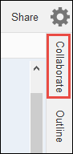
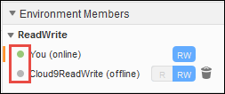
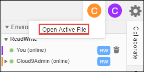
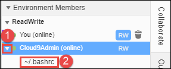
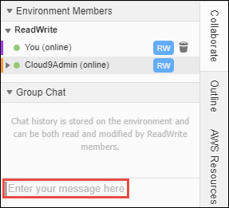

.. Copyright 2010-2018 Amazon.com, Inc. or its affiliates. All Rights Reserved.

   This work is licensed under a Creative Commons Attribution-NonCommercial-ShareAlike 4.0
   International License (the "License"). You may not use this file except in compliance with the
   License. A copy of the License is located at http://creativecommons.org/licenses/by-nc-sa/4.0/.

   This file is distributed on an "AS IS" BASIS, WITHOUT WARRANTIES OR CONDITIONS OF ANY KIND,
   either express or implied. See the License for the specific language governing permissions and
   limitations under the License.

.. _share-environment:

#############################################
Working with Shared Environments in |AC9long|
#############################################

.. meta::
    :description:
        Describes how to share an environment and work with shared environments in AWS Cloud9.

A :dfn:`shared environment` is an |envfirst| that multiple |IAM| users have been invited to participate in.

A shared |env| is good for:

* Pair programming (also know as :dfn:`peer programming`). This is where two users work together on the same code in a single |env|. In pair programming, typically one user writes code while
  the other user observes the code being written. The observer gives immediate input and feedback to the code writer. These positions frequently switch during a project. Without a shared
  |env|, teams of pair programmers typically sit in front of a single machine, and only one user at a
  time can write code. With a shared |env|, both users can sit in front of
  their own machine and can write code at the same time, even if they are in different physical offices.
* Computer science classes. This is useful when teachers or teaching assistants want to access a student's |env| to review their homework or fix issues with their |env| in real time.
  Students can also work together with their classmates on shared homework projects, writing code together in a single |env| in real time. They can do this even though they might be in different locations using
  different computer operating systems and web browser types.
* Any other situation where multiple users need to collaborate on the same code in real time.

This topic provides instructions for sharing an |env| in |AC9| and how to participate in a shared |env|.

* :ref:`share-environment-member-roles`
* :ref:`share-environment-invite-user`
* :ref:`share-environment-open`
* :ref:`share-environment-members-list`
* :ref:`share-environment-active-file`
* :ref:`share-environment-open-file`
* :ref:`share-environment-active-cursor`
* :ref:`share-environment-chat`
* :ref:`share-environment-chat-view`
* :ref:`share-environment-chat-delete`
* :ref:`share-environment-chat-delete-all`
* :ref:`share-environment-change-access`
* :ref:`share-environment-delete-you`
* :ref:`share-environment-delete-member`
* :ref:`share-environment-best-practices`

.. _share-environment-member-roles:

About |memlongtitle| Access Roles
=================================

Before you share an |env| or participate in a shared |env| in |AC9|, you should understand the access permission levels for a shared |env|. We call these
permission levels :dfn:`environment member access roles`.

A shared |env| in |AC9| offers three |memlong| access roles: :dfn:`owner`, :dfn:`read/write`, and :dfn:`read-only`.

* An |memown| has full control over an |env|. Each |env| has one and only one |memown|, who is the |env| creator.
  An |memown| can do the following:

  * Add, change, and remove |mems| for the |env|
  * Open, view, and edit files
  * Run code
  * Change |env| settings
  * Chat with other |mems|
  * Delete existing chat messages

  In the |AC9IDE|, an |env| owner is displayed with :guilabel:`Read+Write` access.
* A |memrw| member can do the following:

  * Open, view, and edit files
  * Run code
  * Change various |env| settings from within the |AC9IDE|
  * Chat with other |mems|
  * Delete existing chat messages

  In the |AC9IDE|, |memrw| members are displayed with :guilabel:`Read+Write` access.
* A |memro| member can do the following:

  * Open and view files
  * Chat with other |mems|
  * Delete existing chat messages

  In the |AC9IDE|, |memro| members are displayed with :guilabel:`Read Only` access.

Before an |IAM| user can become an |env| owner or |mem|, that user must meet one of the following criteria:

* The user is an |IAM| administrator user in your AWS account. 
  For more information, see :IAM-ug:`Creating Your First IAM Admin User and Group <getting-started_create-admin-group>` in the |IAM-ug|.
* The user belongs to an |IAM| group in your AWS account, and that group has the AWS managed policy :code:`AWSCloud9Administrator` or :code:`AWSCloud9User` (or :code:`AWSCloud9EnvironmentMember`, to be a |mem| only) attached. 
  For more information, see :ref:`AWS Managed (Predefined) Policies <auth-and-access-control-managed-policies>`.

To attach one of the preceding managed policies to a group, you can use the |IAM| console as follows.

#. Sign in to the AWS Management Console, if you are not already signed in.

   For this step, we recommend you sign in using credentials for an |IAM| administrator user in your AWS account. If you cannot
   do this, check with your AWS account administrator.

#. Open the |IAM| console. To do this, in the console's navigation bar, choose :guilabel:`Services`. Then choose :guilabel:`IAM`.
#. Choose :guilabel:`Groups`.
#. Choose the group's name.
#. On the :guilabel:`Permissions` tab, for :guilabel:`Managed Policies`, choose :guilabel:`Attach Policy`.
#. In the list of policy names, choose one of the following boxes:

   * :guilabel:`AWSCloud9User` (preferred) or :guilabel:`AWSCloud9Administrator` to enable each user in the group to be an |env| owner 
   * :guilabel:`AWSCloud9EnvironmentMember` to enable each user in the group to be a member only

   (If you don't see one of these policy names in the list, type the policy name in
   the :guilabel:`Search` box to display it.)

#. Choose :guilabel:`Attach policy`.

.. _share-environment-invite-user:

Invite an |IAM| User to Your |envtitle|
=======================================

To invite an |IAM| user to your |env|:

#. Be sure the corresponding access policy is attached to the group containing the user you want to invite. For more information,
   see :ref:`share-environment-member-roles`.
#. Sign in to |AC9| using the credentials of the |env| owner, if you are not already signed in. For more information, see :ref:`setup-sign-in-ide` in *Team Setup*.
#. Open the |env| that you own and want to invite the user to, if the |env| is not already open. For more information, see :doc:`open-environment`.
#. In the menu bar in the |AC9IDE|, do one of the following:

   * Choose :guilabel:`Window, Share`.
   * Choose :guilabel:`Share` (located next to the :guilabel:`Preferences` gear icon).

     .. image:: images/ide-share.png
        :alt: The Share command in the AWS Cloud9 IDE menu bar

#. In the :guilabel:`Share this environment` dialog box, for :guilabel:`Invite Members`, type the name
   of the |IAM| user you want to invite to this |env|.
   The invited user must be within the same AWS account as the |env| owner.

   .. note:: In addition to inviting |IAM| users, you can invite the AWS account root user, |IAM| users with assumed roles, and federated users, who are within the same AWS account as the |env| owner.

      * To invite the AWS account root user, type :code:`arn:aws:iam::ACCOUNT_ID:root`. 
      * To invite an |IAM| user with an assumed role, type :code:`arn:aws:sts::ACCOUNT_ID:assumed-role/ROLE_NAME/ROLE_SESSION_NAME`, where :samp:`{ROLE_NAME}` is the name of the assumed role, 
        and :samp:`{ROLE_SESSION_NAME}` is the session name for the assumed role.
      * To invite a federated user, type :code:`arn:aws:sts::ACCOUNT_ID:federated-user/USER_NAME`, where :samp:`{USER_NAME}` is the name of the federated user identified in |IAM|.

#. To make this user a |memro| member, choose :guilabel:`R`. To make this user |memrw|, choose :guilabel:`RW`.
#. Choose :guilabel:`Invite`.

   .. note:: If you make this user a |memrw| member, a dialog box is displayed, containing information
      about possibly putting your
      AWS security credentials at risk. The following information provides more background about this issue.

      You should share an |env| only with those you trust.

      A |memrw| member may be able to use the |cli| or AWS SDK code in your
      |env| to take actions in AWS on your behalf. Furthermore, if you store your permanent AWS access credentials within the |env|,
      that |mem| could potentially copy those credentials and use them
      outside of the |env|.

      Removing your permanent AWS access credentials from your |env| and using temporary AWS access credentials
      instead does not fully address this issue. It lessens
      the opportunity of the |mem| to copy those temporary credentials and use them outside of the |env| (as those temporary credentials will work only for a limited time).
      However, temporary credentials still enable a |memrw| member to take actions in AWS from the |env| on your behalf.

#. Contact the user to let them know they can open this |env| and begin using it.

.. note:: The following entities can invite themselves to any |env| in their AWS account:

   * The AWS account root user.
   * An |IAM| administrator user (or user belonging to an |IAM| administrator group) or equivalent in their AWS account.
   * An |IAM| user (or user belonging to an |IAM| group) in their AWS account that has the AWS managed policy :code:`AWSCloud9Administrator` or equivalent attached. 

   To invite themselves (or other |IAM| users or federated users in their AWS account), these entities can use the |CLI| to run the 
   AWS Cloud9 :code:`create-environment-membership` command, specifying the ID of the |env| (represented here as :samp:`{ENVIRONMENT_ID}`) 
   and the Amazon Resource Name (ARN) (represented here as :samp:`{ENTITY_ARN}`) of the entity to invite. For example:
   
   .. code-block:: sh
     
      aws cloud9 create-environment-membership --environment-id ENVIRONMENT_ID --user-arn ENTITY_ARN --permissions PERMISSION_LEVEL

   For example, to invite the AWS account root user for account ID :code:`123456789012` to an |env| with ID :code:`0c00a6ff0e8244698d33fdab581ea3EX` as a |memrw| member:

   .. code-block:: sh
     
      aws cloud9 create-environment-membership --environment-id 0c00a6ff0e8244698d33fdab581ea3EX --user-arn arn:aws:iam::123456789012:root --permissions read-write

.. _share-environment-open:

Open a Shared |envtitle|
========================

To open a shared |env|, you use your |AC9| dashboard. You then use the |AC9IDE| to do things in a shared |env| such as work with files and chat with
other |mems|.

#. Be sure the corresponding access policy is attached to the group containing your user.
   For more information, see :ref:`share-environment-member-roles`.
#. Sign in to |AC9|, if you are not already signed in. For more information, see :ref:`setup-sign-in-ide` in *Team Setup*.
#. Open the shared |env| from your |AC9| dashboard. For more information, see :doc:`open-environment`.

You use the :guilabel:`Collaborate` window to interact with other |mems|, as described in the rest of this topic.

.. note:: If the :guilabel:`Collaborate` window is not visible, choose the :guilabel:`Collaborate` button. If the
   :guilabel:`Collaborate` button is not visible, on the menu bar, choose :guilabel:`Window, Collaborate`.

.. _share-environment-members-list:

See a List of |memslongtitle|
=============================

With the shared |env| open, in the :guilabel:`Collaborate` window, expand :guilabel:`Environment Members`, if the list of |mems| is not visible.

A circle next to each |mem| indicates their online status, as follows:

* Active |mems| have a green circle
* Offline |mems| have a gray circle
* Idle |mems| have an orange circle

.. _share-environment-active-file:

Open the Active File of an |memlongtitle|
=========================================

With the shared |env| open, in the menu bar, choose the |mem| name. Then choose :guilabel:`Open Active File`.

.. _share-environment-open-file:

Open the Open File of an |memlongtitle|
=======================================

#. With the shared |env| open, in the :guilabel:`Collaborate` window, expand :guilabel:`Environment Members`, if the list of |mems| is not visible.
#. Expand the name of the user whose open file you want to open in your |env|.
#. Double-click the name of the file you want to open.

.. _share-environment-active-cursor:

Go to the Active Cursor of an |memlongtitle|
============================================

#. With the shared |env| open, in the :guilabel:`Collaborate` window, expand :guilabel:`Environment Members`, if the list of |mems| is not visible.
#. Right-click the |mem| name, and then choose :guilabel:`Show Location`.

.. _share-environment-chat:

Chat with Other |memslongtitle|
===============================

With the shared |env| open, at the bottom of the :guilabel:`Collaborate` window, for :guilabel:`Enter your message here`, type your chat message, and then press :kbd:`Enter`.

.. _share-environment-chat-view:

View Chat Messages in a Shared |envtitle|
=========================================

With the shared |env| open, in the :guilabel:`Collaborate` window, expand :guilabel:`Group Chat`, if the list of chat messages is not visible.

.. _share-environment-chat-delete:

Delete a Chat Message from a Shared |envtitle|
==============================================

With the shared |env| open, in the :guilabel:`Collaborate` window, right-click the chat message in :guilabel:`Group Chat`, and then choose :guilabel:`Delete Message`.

.. note:: When you delete a chat message, it is deleted from the |env| for all |mems|.

.. _share-environment-chat-delete-all:

Delete All Chat Messages from a Shared |envtitle|
=================================================

With the shared |env| open, in the :guilabel:`Collaborate` window, right-click anywhere in :guilabel:`Group Chat`, and then choose :guilabel:`Clear history`.

.. note:: When you delete all chat messages, they are deleted from the |env| for all |mems|.

.. _share-environment-change-access:

Change the Access Role of an |memlongtitle|
===========================================

#. Open the |env| that you own and that contains the |mem| whose access role you want to change, if the
   |env| is not already open. For more information, see :doc:`open-environment`.
#. In the :guilabel:`Collaborate` window, expand :guilabel:`Environment Members`, if the list of |mems| is not visible.
#. Do one of the following:

   * Next to the |mem| name whose access role you want to change, choose :guilabel:`R` or :guilabel:`RW`
     to make this |mem| owner or |memrw|, respectively.
   * To change a |memrw| member to |memro|, right-click the |mem| name, and then choose :guilabel:`Revoke Write Access`.
   * To change a |memro| member to |memrw|, right-click the |mem| name, and then choose :guilabel:`Grant Read+Write Access`.

     .. note:: If you make this user a |memrw| member, a dialog box is displayed, containing information
        about possibly putting your
        AWS security credentials at risk. Do not make a user a |memrw| member unless you trust that user to take actions in AWS
        on your behalf. For more information, see the related note in :ref:`share-environment-invite-user`.

.. _share-environment-delete-you:

Remove Your User From a Shared |envtitle|
=========================================

.. note:: You cannot remove your user from an |env| if you are the |env| owner.

   Removing your user from a |mem| does not remove your user from |IAM|.
   
#. With the shared |env| open, in the :guilabel:`Collaborate` window, expand :guilabel:`Enviroment Members`, if the list of |mems| is not visible.
#. Do one of the following:

   * Next to :guilabel:`You`, choose the trash can icon.
   * Right-click :guilabel:`You`, and then choose :guilabel:`Leave environment`.

#. When prompted, choose :guilabel:`Leave`.

.. _share-environment-delete-member:

Remove Another |memlongtitle|
=============================

.. note:: To remove any |mem| other than your user from an |env|, you must be signed in to |AC9| using the credentials of the |env| owner.

   Removing a |mem| does not remove the user from |IAM|.
   
#. Open the |env| that contains the |mem| you want to remove, if the |env| is not already open. For more information, see :doc:`open-environment`.
#. In the :guilabel:`Collaborate` window, expand :guilabel:`Environment Members`, if the list of |mems| is not visible.
#. Do one of the following:

   * Next to the name of the |mem| you want to delete, choose the trash can icon.
   * Right-click the name of the |mem| you want to delete, and then choose :guilabel:`Revoke Access`.

#. When prompted, choose :guilabel:`Remove Member`.

.. _share-environment-best-practices:

|envtitle| Sharing Best Practices
=================================

We recommend the following practices when sharing |envplural|.

* Only invite read/write members you trust to your |envplural|.
* For |envec2plural|, read/write members can use the |env| owner's AWS access credentials, instead of
  their own credentials, to make calls from the |env| to AWS services.
  To prevent this,
  the |env| owner can disable |AC9tempcreds| for the |env|. However, this also prevents the |env| owner
  from making calls. For more information, see :ref:`auth-and-access-control-temporary-managed-credentials`.
* Turn on |CTlong| to track activity in your |envplural|. For more information, see the |CT-ug|_.
* Do not use your AWS account root user to create and share |envplural|. Use |IAM| users in the account instead. For more information, see
  :iam-user-guide:`First-Time Access Only: Your Root User Credentials <introduction_identity-management.html#intro-identity-first-time-access>` and
  :iam-user-guide:`IAM Users <introduction_identity-management.html#intro-identity-users>` in the |IAM-ug|.
