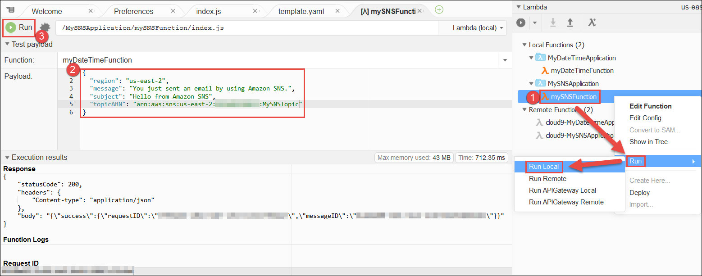

.. Copyright 2010-2018 Amazon.com, Inc. or its affiliates. All Rights Reserved.

   This work is licensed under a Creative Commons Attribution-NonCommercial-ShareAlike 4.0
   International License (the "License"). You may not use this file except in compliance with the
   License. A copy of the License is located at http://creativecommons.org/licenses/by-nc-sa/4.0/.

   This file is distributed on an "AS IS" BASIS, WITHOUT WARRANTIES OR CONDITIONS OF ANY KIND,
   either express or implied. See the License for the specific language governing permissions and
   limitations under the License.

.. _tutorial-lambda-advanced:

#########################################
Advanced |LAMlong| Tutorial for |AC9long|
#########################################

.. meta::
    :description:
        Provides an advanced hands-on tutorial that you can use to continue experimenting with AWS Lambda functions by using AWS Cloud9.

In this tutorial, you use the |AC9IDE| to create a function in |LAMlong| and an accompanying API in |ABPlong|. After you create the function and its API, you run and debug them locally.
Then you run the function and API in |LAM| and |ABP| in production. The function and its API call |SNSlong| (|SNS|) to send messages to an email address that you specify.

.. note:: Completing this tutorial might result in charges to your AWS account. These include possible charges for |EC2|, |LAM|, |ABP|, and |SNS|.
   For more information, see
   `Amazon EC2 Pricing <https://aws.amazon.com/ec2/pricing/>`_, `AWS Lambda Pricing <https://aws.amazon.com/lambda/pricing/>`_,
   `Amazon API Gateway Pricing <https://aws.amazon.com/api-gateway/pricing/>`_, and `Amazon SNS Pricing <https://aws.amazon.com/sns/pricing/>`_.

* :ref:`tutorial-lambda-advanced-prereqs`
* :ref:`tutorial-lambda-advanced-create-function`
* :ref:`tutorial-lambda-advanced-sns-setup`
* :ref:`tutorial-lambda-advanced-run-local-function`
* :ref:`tutorial-lambda-advanced-debug-local-function`
* :ref:`tutorial-lambda-advanced-run-local-api`
* :ref:`tutorial-lambda-advanced-debug-local-api`
* :ref:`tutorial-lambda-advanced-deploy-function`
* :ref:`tutorial-lambda-advanced-clean-up`
* :ref:`tutorial-lambda-advanced-next-steps`

.. _tutorial-lambda-advanced-prereqs:

Prerequisites
=============

Before you start this tutorial, we recommend that you first complete the companion :ref:`AWS Lambda Tutorial for AWS Cloud9 <tutorial-lambda>`. This tutorial
builds on the prerequisites and concepts that are presented there.

.. note:: If you don't want to complete that entire tutorial first, you must at least complete the following steps in that tutorial or else create the equivalent AWS resources:

   * :ref:`tutorial-lambda-prereqs`: This includes creating an AWS account if you don't already have one, and deciding which |IAM| entity in the account you'll use to complete this tutorial.
   * :ref:`tutorial-lambda-create-environment`: This includes creating an |envfirstlongec2| and opening the |AC9IDE| for that |env|.

.. _tutorial-lambda-advanced-create-function:

Step 1: Create the |LAM| Function and API
=========================================

In this step, you use
the |AC9IDE| to create the |LAM| function and its accompanying API at the same time. |AC9| stores the new function on the |EC2| instance and deploys a
copy of the function to |LAM|. |AC9| also stores the new accompanying API on the instance and deploys a copy of the API to |ABP|.

The function uses |SNSlong| (|SNS|) to send messages to your email address.
In a later step, you create the |SNS| resources that this function needs.

Currently, you can use the |IDE| to create functions that use only Node.js or Python. This function uses Node.js.

#. With the |IDE| displayed for the |env|, on the menu bar, choose :guilabel:`AWS Cloud9, Preferences`.
#. In the navigation pane of the :guilabel:`Preferences` tab, choose :guilabel:`AWS Settings`.
#. For :guilabel:`AWS Region`, select the AWS Region you want to create the function in.

   .. image:: images/ide-prefs-aws-region.png
      :alt: AWS Region selector in the AWS Cloud9 IDE

#. On the edge of the |IDE|, choose :guilabel:`AWS Resources`.
#. Expand the :guilabel:`Lambda` pane, if it's not already expanded. On the toolbar, choose :guilabel:`Create a new Lambda function`.

   .. image:: images/ide-create-lambda-function.png
      :alt: Create a new Lambda function

#. In the :guilabel:`Create serverless application` dialog box, for :guilabel:`Function name`, type a name for the function (for
   example, :code:`mySNSFunction`).
#. For :guilabel:`Application name`, type a name for the function's containing serverless application (for example, :code:`MySNSApplication`).
#. Choose :guilabel:`Next`.
#. For :guilabel:`Select runtime`, choose :guilabel:`Node.js 6.10`.
#. For :guilabel:`Select blueprint`, choose :guilabel:`sns-send-message`. (You might need to scroll through the list of blueprints to see it.)
#. Choose :guilabel:`Next`.
#. For :guilabel:`Function trigger`, choose :guilabel:`API Gateway`.
#. For :guilabel:`Resource Path`, type :code:`/`.
#. For :guilabel:`Security`, choose :guilabel:`NONE`, and then choose :guilabel:`Next`.
#. For :guilabel:`Memory (MB)`, leave the default value of :guilabel:`128 MB`, which is sufficient for this tutorial.
#. For :guilabel:`Role`, leave the default value of :guilabel:`Automatically generate role`, and then choose :guilabel:`Next`. (You change this role in the next step.)
#. Review your choices, and then choose :guilabel:`Finish`.

|AC9| creates the function and its related API on the instance and then deploys a copy of the function and API to |LAM| and |ABP|.
The serverless application and function are displayed in the :guilabel:`Local Functions` and :guilabel:`Remote Functions` lists in the :guilabel:`Lambda` pane of the :guilabel:`AWS Resources` window.
The serverless application's and function's component files (for example, a |CFN| template that you use later to create |SNS| resources) are displayed in the :guilabel:`Environment` window.
The editor opens the function's code file, :file:`index.js`.

If you run this function or API now, it won't work. This is because the |SNS| resources that this function needs
are not set up yet. Also, the function doesn't have permission to call |SNS|. In the next step, you set up these resources and provide this permission.

.. _tutorial-lambda-advanced-sns-setup:

Step 2: Set up |SNS|
====================

In this tutorial, the |LAM| function uses |SNS| to send messages to your email address.
In this step, you run an |CFNlong| stack that quickly creates a topic in |SNS| and then subscribes your email address to the topic. The stack also
creates an execution role in |IAM| to allow the |LAM| function
permission to use |SNS|. (You could do all of this setup in |SNS| and |IAM| manually, but |CFN| makes this setup easier and faster.)
After |CFN| creates the stack, you attach the execution role to the function, and then give |SNS| permission to start
sending messages to your email address.

#. In the terminal, change to the directory that contains the |CFN| template file named :file:`sns-create-topic-subscription.yaml`. For example:

   .. code-block:: sh

      cd ~/environment/MySNSApplication

   .. note:: In the |IDE|, :file:`~/environment` is the same as specifying the root directory in the :code:`Environment` window.

#. Use the |cli| to run the following command, which creates and runs a |CFN| stack based on this template file.

   .. code-block:: sh

      aws cloudformation create-stack --template-body file://sns-create-topic-subscription.yaml --capabilities CAPABILITY_NAMED_IAM --parameters ParameterKey=SNSTopicName,ParameterValue=SNS_TOPIC_NAME ParameterKey=EmailAddress,ParameterValue=EMAIL_ADDRESS --stack-name STACK_NAME --region REGION_ID

   In the preceding command, do the following:

   * Leave :code:`CAPABILITY_NAMED_IAM` unchanged.
   * Replace :code:`SNS_TOPIC_NAME` with whatever you want to name the |SNS| topic to send messages to (for example, :code:`MySNSTopic`).
   * Replace :code:`EMAIL_ADDRESS` with your email address for |SNS| to send messages to.
   * Replace :code:`STACK_NAME` with whatever you want to name the stack (for example, :code:`MySNSStack`).
   * Replace :code:`REGION_ID` with the ID of the AWS Region where you created the function (see the corner of the :guilabel:`Lambda` pane in the :guilabel:`AWS Resources` window).

   .. note:: If you use an |IAM| user to call |CFN| for this tutorial, instead of an AWS account root user or an |IAM| administrator
      user, the |IAM| user must have the following additional AWS access permissions:

      * :code:`cloudformation:CreateUploadBucket`
      * :code:`cloudformation:GetTemplateSummary`
      * :code:`cloudformation:ListStacks`
      * :code:`iam:CreateRole`
      * :code:`iam:PutRolePolicy`
      * :code:`sns:CreateTopic`
      * :code:`sns:GetTopicAttributes`
      * :code:`sns:Publish`
      * :code:`sns:SetTopicAttributes`
      * :code:`sns:Subscribe`

      If you cannot add these permissions to the |IAM| user, see your organization's AWS account administrator.

#. Confirm that |CFN| successfully created the stack. To do this, use the |cli| to run the following command.

   .. code-block:: sh

      aws cloudformation describe-stacks --query 'Stacks[0].StackStatus' --output text --stack-name MySNSStack --region REGION_ID

   Do not proceed until the |cli| outputs
   :code:`CREATE_COMPLETE`. (You might need to run this command multiple times before you see :code:`CREATE_COMPLETE`.)

#. In a few minutes, after |CFN| successfully creates the stack, check your inbox for an incoming email from :guilabel:`no-reply@sns.amazon.com`.
   In this email, choose the :guilabel:`Confirm subscription` link. A webpage then opens, confirming the subscription. Your email can't receive messages from this
   |SNS| topic until you confirm the subscription.
#. Change the function's settings to use the newly created execution role. To do this, in the :guilabel:`Environment` window,
   open the :file:`template.yaml` file in the :file:`~/environment/MySNSApplication` folder. In the editor,
   between the lines of code :code:`Properties` and :code:`Handler: mySNSFunction/index.handler`, add the following
   two lines of code to specify the Amazon Resource Name (ARN) of the execution role for the function to use.

   .. code-block:: yaml

          Properties:
            Role:
              'Fn::Sub': 'arn:aws:iam::${AWS::AccountId}:role/LambdaSNSExecutionRole'
            Handler: mySNSFunction/index.handler

   .. note:: Because the :file:`template.yaml` file uses `YAML <http://yaml.org/>`_ syntax, spacing is important. Ensure that :code:`Role` is indented exactly **two** spaces from :code:`Properties`, and
      :code:`'Fn::Sub'` is indented exactly **two** spaces from :code:`Role`. Be sure to use spaces, and not tabs, to represent whitespace in this file.

#. In the same :file:`template.yaml` file, extend the function's default timeout period by changing the :code:`Timeout` value
   from :code:`15` to :code:`60`. Then save the file.

.. _tutorial-lambda-advanced-run-local-function:

Step 3: Run the Function Locally
================================

In this step, you use the |IDE| to run the newly created function on the instance, which sends messages to your email address.
Currently, you can use the |IDE| to run functions that use only Node.js or Python.

#. With the |IDE| still displayed for the |env|, in the :guilabel:`Lambda` pane of the :guilabel:`AWS Resources` window,
   expand :guilabel:`Local Functions`, expand the :guilabel:`MySNSApplication` Lambda folder, right-click the :guilabel:`mySNSFunction` Lambda icon, and then choose :guilabel:`Run, Run Local`.
#. In the :guilabel:`Payload` pane on the run tab, replace the pane's contents with the following, which sends the specified data to the function for processing.

   .. code-block:: json

      {
        "region": "REGION_ID",
        "message": "You just sent an email by using Amazon SNS.",
        "subject": "Hello from Amazon SNS",
        "topicARN": "arn:aws:sns:REGION_ID:ACCOUNT_ID:TOPIC_NAME"
      }

   In the preceding payload, do the following:

   * Replace :code:`REGION_ID` with the ID of the AWS Region where the |SNS| topic exists. (For example, we use :code:`us-east-2` throughout the rest of this tutorial.)
   * Replace :code:`ACCOUNT_ID` with your AWS account ID. (For example, we use the placeholder :code:`123456789012` throughout the rest of this tutorial.)
   * Replace :code:`TOPIC_NAME` with the name of the |SNS| topic. (For example, we use :code:`MySNSTopic` throughout the rest of this tutorial.)

#. Choose :guilabel:`Run`.
#. If the response shows a :code:`statusCode` of :code:`200`, then in a few minutes, check your email for the message that was sent.

Compare your results to the following.

.. _tutorial-lambda-advanced-debug-local-function:

Step 4: Debug the Function Locally
==================================

In this step, you use the |IDE| to debug the function on the instance. Currently, you can use the |IDE| to debug functions that use only Node.js or Python.
Also, you can use the |IDE| to debug functions locally only. You cannot use the |IDE| to debug functions in |LAM| itself.

#. With the |IDE| still displayed for the |env|, open the :file:`index.js` file.
#. Create a breakpoint for the debugger. To do this, in the editor, click inside the gutter next to the line of code
   that starts with :code:`sns.publish` on line 45.
   A red circle is displayed, representing the breakpoint.
#. On the edge of the |IDE|, choose :guilabel:`Debugger`.
#. Add four expressions for the debugger to watch. To do this, in the :guilabel:`Watch Expressions` area,
   for :guilabel:`Type an expression here`, type :code:`event['subject']`, and then press :kbd:`Enter`.
   Do this three more times, typing :code:`context['memoryLimitInMB']`, :code:`sns.endpoint.hostname`, and :code:`AWS.config.credentials.accessKeyId`.

   .. note:: If you completed the previous |LAM| tutorial, you can delete any of those watch expressions that might still be there. To do this, simply right-click
      an expression, and then choose :guilabel:`Remove Watch Expression`.

#. On the run tab from the previous step, choose the icon that looks like a bug. (It will switch from grey to green.)
#. Choose :guilabel:`Run`.

   Code execution pauses at the breakpoint and displays the current values of the
   message's subject line, the function's memory limit in megabytes, the |SNS| service's hostname, and the caller's AWS access key ID.

   Compare your results to the following.

   .. image:: images/ide-lambda-debug-sns.png
      :alt: Debugging the Lambda function

   You can also see these values by hovering your mouse over :code:`event`, :code:`context`, :code:`sns`, and
   :code:`AWS` in the code, followed by expanding the screen tip that is displayed.

#. In the :code:`Debugger` window, choose the blue :guilabel:`Resume` button to finish running the code.
#. On the run tab, if the response shows a :code:`statusCode` of :code:`200`, then in a few minutes, check your email for the message that was sent.

.. _tutorial-lambda-advanced-run-local-api:

Step 5: Run the API Locally
===========================

In this step, you use the |IDE| to have |ABP| run the |LAM| function on the instance.

#. In the :guilabel:`Lambda` pane of the :guilabel:`AWS Resources` window,
   right-click the :guilabel:`mySNSFunction` Lambda icon, and then choose :guilabel:`Run, Run APIGateway Local`.

   .. note:: You can also do this by choosing the :guilabel:`Lambda (local)` list on the run tab from the previous step, and then choosing :guilabel:`API Gateway (local)`.

#. On the run tab, for :guilabel:`Path`, type :code:`/`.
#. For :guilabel:`Method`, choose :guilabel:`POST`.
#. For :guilabel:`Body`, replace the pane's contents with the following, which sends this data as input to the API for processing.

   .. code-block:: json

      {
        "region": "us-east-2",
        "message": "You just sent an email by using Amazon SNS.",
        "subject": "Hello from Amazon SNS",
        "topicARN": "arn:aws:sns:us-east-2:123456789012:MyDemoSNSTopic"
      }

#. If the bug icon is green, choose it to turn it off. (It switches back to grey.)
#. Choose :guilabel:`Run`.
#. If the response shows :code:`success`, then in a few minutes, check your email for the message that was sent.

.. _tutorial-lambda-advanced-debug-local-api:

Step 6: Debug the API Locally
=============================

In this step, you use the |IDE| to have |ABP| debug the |LAM| function on the instance.

#. Ensure that the :file:`index.js` file still has a breakpoint set on the line of code
   :code:`sns.publish`.
#. Ensure that the :guilabel:`Watch Expressions` area of the :guilabel:`Debugger` window is still watching
   :code:`event['subject']`, :code:`context['memoryLimitInMB']`, :code:`sns.endpoint.hostname`, and :code:`AWS.config.credentials.accessKeyId`.
#. On the run tab from the previous step, choose the icon that looks like a bug. (It switches from grey to green.)
#. Choose :guilabel:`Run`.

   Code execution pauses at the breakpoint and displays the current values of the
   message's subject line, the function's memory limit in megabytes, the |SNS| service's hostname, and the caller's AWS access key ID.

   You can also see these values by hovering your mouse over :code:`event`, :code:`context`, :code:`sns`, and
   :code:`AWS` in the code, followed by expanding the screen tip that is displayed.

#. In the :code:`Debugger` window, choose the blue :guilabel:`Resume` button to finish running the code.
#. If the response shows :code:`success`, then in a few minutes, check your email for the message that was sent.

.. _tutorial-lambda-advanced-deploy-function:

Step 7: Deploy and Run the Changed Function in Production
=========================================================

In this step, you deploy the function that you changed in :ref:`tutorial-lambda-advanced-run-local-api` to |LAM| and |ABP|. You then test the changes in production to confirm the deployment.

#. In the :guilabel:`Lambda` pane of the :guilabel:`AWS Resources` window, right-click the :guilabel:`mySNSFunction` Lambda icon, and then choose :guilabel:`Deploy`.
#. After the deployment succeeds, run the changed function in production. To do this, in the :guilabel:`Lambda` pane of the :guilabel:`AWS Resources` window,
   right-click the :guilabel:`mySNSFunction` Lambda icon, and then choose :guilabel:`Run, Run Remote`.

   .. note:: You can also do this by choosing the :guilabel:`API Gateway (local)` list on the run tab from the previous step, and then choosing :guilabel:`Lambda (remote)`.

#. Ensure that the :guilabel:`Payload` pane on the run tab still contains the following data.

   .. code-block:: json

      {
        "region": "us-east-2",
        "message": "You just sent an email by using Amazon SNS.",
        "subject": "Hello from Amazon SNS",
        "topicARN": "arn:aws:sns:us-east-2:123456789012:MyDemoSNSTopic"
      }

#. Choose :guilabel:`Run`.
#. If the response shows a :code:`statusCode` of :code:`200`, then in a few minutes, check your email for the message that was sent.
#. Run the API in production. To do this, in the :guilabel:`Lambda` pane of the :guilabel:`AWS Resources` window,
   right-click the :guilabel:`mySNSFunction` Lambda icon, and then choose :guilabel:`Run, Run APIGateway Remote`.

   .. note:: You can also do this by choosing the :guilabel:`Lambda (remote)` list on the run tab, and then choosing :guilabel:`API Gateway (remote)`.

#. On the run tab, for :guilabel:`Path`, type :code:`/`.
#. For :guilabel:`Method`, choose :guilabel:`POST`.
#. For :guilabel:`Body`, be sure the following data is still displayed.

   .. code-block:: json

      {
        "region": "us-east-2",
        "message": "You just sent an email by using Amazon SNS.",
        "subject": "Hello from Amazon SNS",
        "topicARN": "arn:aws:sns:us-east-2:123456789012:MyDemoSNSTopic"
      }

#. Choose :guilabel:`Run`.
#. If the response shows :code:`success`, then in a few minutes, check your email for the message that was sent.

.. _tutorial-lambda-advanced-clean-up:

Step 8: Clean Up
================

To prevent ongoing charges to your AWS account related to this tutorial, you can delete the function from |LAM|, the API from |ABP|, the topic and subscription from |SNS|,
the |LAM| execution role from |IAM|, and the |env| from |AC9|.

Step 8.1: Delete the Function and the API from |LAM| and |ABP|
--------------------------------------------------------------

For |AC9| to create the function and its associated API, behind the scenes |AC9| uses the AWS Serverless Application Model (AWS SAM) to create a stack in |CFNlong|. This stack then creates the function and its associated API.
In this procedure, you use the |IDE| to have |CFN| delete the stack, which also deletes the function and the API. (You could use the |LAM| and |ABP| consoles instead of |CFN| to delete the function and its associated API.
However, that approach takes longer and still leaves the stack in |CFN| when it's no longer needed.)

.. warning:: Deleting a stack cannot be undone. When you delete this stack, the associated function and its API are deleted from |LAM| and |ABP| and cannot be recovered.

#. From the |IDE|, use the |cli| in the terminal to run the |CFN| :code:`delete-stack` command, specifying the name of the
   stack. This stack's name follows the format :code:`cloud9-APPLICATION_NAME`, so you would specify :code:`cloud9-MySNSApplication` for this tutorial.

   .. code-block:: sh

      aws cloudformation delete-stack --stack-name cloud9-MySNSApplication --region REGION_ID

   If the command ran successfully, no output and no error message are displayed.

   .. note:: If you use an |IAM| user to run this command for this tutorial, instead of an AWS account root user or an |IAM| administrator user,
      the |IAM| user must have the following additional AWS access permissions:

      * :code:`cloudformation:ListStacks`
      * :code:`cloudformation:DeleteStack`

      If you cannot add these permissions to the |IAM| user, see your organization's AWS account administrator.

#. To verify that the stack is deleted, use the |cli| to run the |CFN| :code:`describe-stacks` command. If the function is deleted, a message is displayed that the stack doesn't exist.

   .. code-block:: sh

      aws cloudformation describe-stacks --query 'Stacks[0].StackStatus' --output text --stack-name cloud9-MySNSApplication --region REGION_ID

#. If you no longer want to keep the local function in the |IDE|, delete the :file:`~/environment/MySNSApplication` folder (for example, by running the command
   :code:`rm -rf ~/environment/MySNSApplication`).

Step 8.2: Delete the Topic and Subscription from |SNS| and the |LAM| Execution Role from |IAM|
----------------------------------------------------------------------------------------------

When you delete the |CFN| stack that you created in :ref:`tutorial-lambda-advanced-sns-setup`, the |SNS| topic and subscription are deleted, as well as the execution role for the |LAM| function.

.. warning:: Deleting a stack cannot be undone. When you delete this stack, the associated topic, subscription, and execution role are deleted from |SNS| and |IAM| and cannot be recovered.

#. With the |IDE| still displayed for the |env|, use the |cli| in the terminal to run the |CFN| :code:`delete-stack` command, specifying the name of the stack. For example:

   .. code-block:: sh

      aws cloudformation delete-stack --stack-name MySNSStack --region REGION_ID

   .. note:: If you use an |IAM| user to run this command, instead of an AWS account root user or an |IAM| administrator
      user, the |IAM| user must have the following additional AWS access permissions:

      * :code:`cloudFormation:DeleteStack`
      * :code:`iam:DeleteRole`
      * :code:`iam:DeleteRolePolicy`
      * :code:`sns:DeleteTopic`
      * :code:`sns:Unsubscribe`

      If you cannot add these permissions to the |IAM| user, see your organization's AWS account administrator.

   If the command ran successfully, no output and no error message are displayed.

#. To verify that the stack is deleted, use the |cli| to run the following command.

   .. code-block:: sh

      aws cloudformation describe-stacks --query 'Stacks[0].StackStatus' --output text --stack-name MySNSStack --region REGION_ID

   Keep running the preceding command until the output states that the stack doesn't exist.

Step 8.3: Delete the |envtitle| from |AC9|
------------------------------------------

.. warning:: Deleting an |env| cannot be undone. Also, when you delete an |envec2|, |AC9| also terminates the |EC2| instance that it previously launched and connected to the |env|.
   Once terminated in |EC2|, the instance cannot be reactivated or recovered.

#. With the |IDE| still displayed for the |env|, open the dashboard in the |AC9| console. To do this, on the menu bar in the |IDE|, choose :menuselection:`AWS Cloud9, Go To Your Dashboard`.
#. Do one of the following:

   * Choose the title that matches the name of the |env|, and then choose :guilabel:`Delete`.
   * Select the card that contains the name of the |env|, and then choose :guilabel:`Delete`.

#. In the :guilabel:`Delete` dialog box, type :kbd:`Delete`, and then choose :guilabel:`Delete`.

.. _tutorial-lambda-advanced-next-steps:

Next Steps
==========

Explore any or all of the following topics to continue getting familiar with |AC9|.

.. list-table::
   :widths: 1 1
   :header-rows: 0

   * - Learn more about how to use |AC9| with |LAM|
     - :ref:`Working with AWS Lambda Functions <lambda-functions>`
   * - Learn more about the |AC9IDE|
     - :ref:`IDE Tutorial <tutorial>` and :ref:`Working with the IDE <ide>`
   * - Invite others to use your |env| with you, in real time and with text chat support
     - :ref:`Working with Shared Environments <share-environment>`
   * - Create |envsshplural| (|envplural| that use your own |EC2| instance or server, instead of an |EC2| instance that is
       managed by |AC9|)
     - :ref:`Creating an Environment <create-environment>` and :ref:`SSH Environment Host Requirements <ssh-settings>`
   * - Use |AC9| with |lightsaillong|
     - :ref:`Working with Amazon Lightsail Instances <lightsail-instances>`
   * - Use |AC9| with |ACSlong|
     - :ref:`Working with AWS CodeStar Projects <codestar-projects>`
   * - Use |AC9| with |ACPlong|
     - :ref:`Working with AWS CodePipeline <codepipeline-repos>`
   * - Use |AC9| with the |cli|, the aws-shell, |ACClong|, GitHub, or |DDBlong|, as well as Node.js, Python, or other programming languages
     - :ref:`Samples <samples>`

To get help with |AC9| from the community, see the `AWS Cloud9 Discussion Forum <https://forums.aws.amazon.com/forum.jspa?forumID=268>`_. (When you enter this forum, AWS might require you to sign in.)

To get help with |AC9| directly from AWS, see the support options on the `AWS Support <https://aws.amazon.com/premiumsupport>`_ page.
