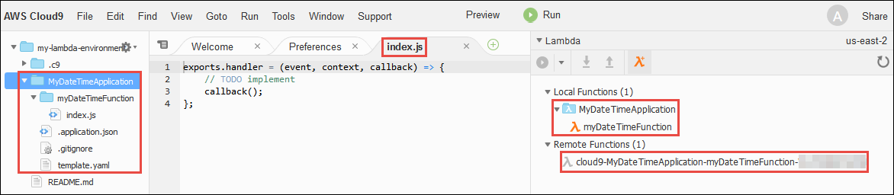
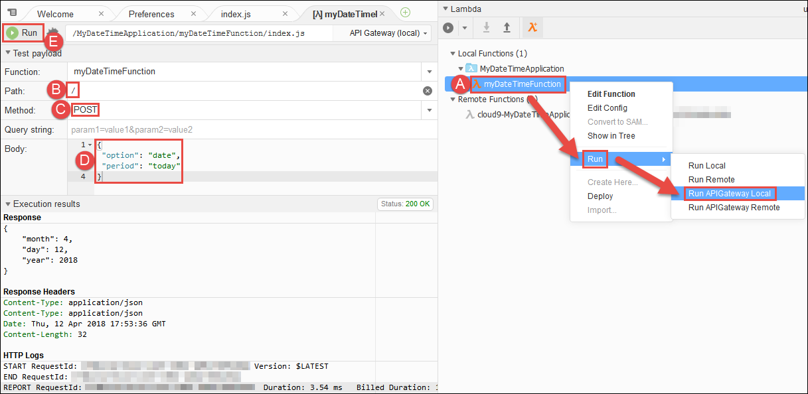

.. Copyright 2010-2019 Amazon.com, Inc. or its affiliates. All Rights Reserved.

   This work is licensed under a Creative Commons Attribution-NonCommercial-ShareAlike 4.0
   International License (the "License"). You may not use this file except in compliance with the
   License. A copy of the License is located at http://creativecommons.org/licenses/by-nc-sa/4.0/.

   This file is distributed on an "AS IS" BASIS, WITHOUT WARRANTIES OR CONDITIONS OF ANY KIND,
   either express or implied. See the License for the specific language governing permissions and
   limitations under the License.

.. _tutorial-lambda:

################################
|LAMlong| Tutorial for |AC9long|
################################

.. meta::
    :description:
        Provides a hands-on tutorial that you can use to begin experimenting with AWS Lambda functions by using AWS Cloud9.

In this tutorial, you use the |AC9IDE| to create a function in |LAMlong| and an accompanying API in |ABPlong|. After you create the function and its API, you run and debug them locally.
Then you run the function and API in |LAM| and |ABP| in production.

.. note:: Completing this tutorial might result in charges to your AWS account. These include possible charges for |EC2|, |LAM|, and |ABP|.
   For more information, see
   `Amazon EC2 Pricing <https://aws.amazon.com/ec2/pricing/>`_, `AWS Lambda Pricing <https://aws.amazon.com/lambda/pricing/>`_, and `Amazon API Gateway Pricing <https://aws.amazon.com/api-gateway/pricing/>`_.

* :ref:`tutorial-lambda-prereqs`
* :ref:`tutorial-lambda-create-environment`
* :ref:`tutorial-lambda-create-function`
* :ref:`tutorial-lambda-add-code`
* :ref:`tutorial-lambda-run-local-function`
* :ref:`tutorial-lambda-debug-local-function`
* :ref:`tutorial-lambda-run-local-api`
* :ref:`tutorial-lambda-debug-local-api`
* :ref:`tutorial-lambda-run-deployed-function`
* :ref:`tutorial-lambda-run-deployed-api`
* :ref:`tutorial-lambda-change-function`
* :ref:`tutorial-lambda-deploy-function`
* :ref:`tutorial-lambda-clean-up`
* :ref:`tutorial-lambda-next-steps`

.. _tutorial-lambda-prereqs:

Prerequisites
=============

To successfully complete this tutorial, you must first complete the steps in :ref:`Express Setup <setup-express>` or :ref:`Team Setup <setup>`.

.. _tutorial-lambda-create-environment:

Step 1: Create and Open the |envtitle|
======================================

In this step, you use the |AC9| console to create and then open an |envfirst|.

If you already have an |env|, open it, and then skip ahead to :ref:`tutorial-lambda-create-function`.

In |AC9|, a :dfn:`development environment` (or just :dfn:`environment`) is a place where you store your development project's files and where you run the tools to develop your apps. 
In this tutorial, you create a special kind of |env| called an :dfn:`EC2 environment`. For this kind of |env|, |AC9| launches and manages a new |EC2| instance running Amazon Linux, 
creates the |env|, and then connects the |env| to the newly-launched instance. When you open the |env|, |AC9| displays the |AC9IDE| that enables you to work with the files and tools in that |env|.

#. Sign in to |AC9| console, at |AC9Console_link|.
#. In the top navigation bar, choose the AWS Region to create the |env| in.

   .. image:: images/console-region.png
      :alt: AWS Region selector in the AWS Cloud9 console

#. If a welcome page is displayed, for :guilabel:`New AWS Cloud9 environment`, choose :guilabel:`Create environment`.
   Otherwise, choose :guilabel:`Create environment`.

   .. image:: images/console-welcome-new-env.png
      :alt: Welcome page in the AWS Cloud9 console

   Or:

   .. image:: images/console-new-env.png
      :alt: Create environment button in the AWS Cloud9 console

#. On the :guilabel:`Name environment` page, for :guilabel:`Name`, type a name for your |env| (for example, :code:`my-lambda-environment`).
#. For :guilabel:`Description`, type something about your |env| (for example, :code:`This environment is for the AWS Cloud9 tutorial for Lambda.`).
#. Choose :guilabel:`Next step`.
#. On the :guilabel:`Configure settings` page, for :guilabel:`Environment type`, leave the default choice of
   :guilabel:`Create a new instance for environment (EC2)`.
#. For :guilabel:`Instance type`, leave the default choice of :guilabel:`t2.micro`. This choice has relatively low RAM and vCPUs, which is sufficient for this tutorial.

   .. note:: Choosing an instance type with greater compute resources might result in more charges to your AWS account.

#. For :guilabel:`Cost-saving setting`, leave the default choice of :guilabel:`After 30 minutes`. This is the amount of time until |AC9| shuts down the |EC2| instance for the
   |env|, after all web browser instances that are connected to the |IDE| for the |env| have been closed.

   .. note:: Choosing a longer time period might result in more charges to your AWS account.

#. Choose :guilabel:`Next step`.
#. On the :guilabel:`Review` page, choose :guilabel:`Create environment`. Wait while |AC9| creates
   your |env|. This can take a few minutes.

After |AC9| creates your |env|, it displays the |AC9IDE| for the |env|.

If |AC9| doesn't display the |IDE| after at least five minutes, there might be a problem with your web browser, your AWS access permissions, the instance, or the associated
virtual private cloud (VPC). For possible fixes, see 
:ref:`troubleshooting-env-loading` in *Troubleshooting*.

.. _tutorial-lambda-create-function:

Step 2: Create the |LAM| Function and API
=========================================

In this step, you use
the |AC9IDE| to create the |LAM| function and its accompanying API at the same time. |AC9| stores the new function on the |EC2| instance and deploys a
copy of the function to |LAM|. |AC9| also stores the new accompanying API on the instance and deploys a copy of the API to |ABP|.

The |LAM| function returns information about the day or time you specify, for example, the day, month, and year, or
the current hour, minute, and second.

Currently, you can use the |IDE| to automatically create functions that use only Node.js or Python. This function uses Node.js.

#. With the |IDE| open from the previous step, set the AWS Region that you want to create the function in. To do this, on the menu bar, choose :guilabel:`AWS Cloud9, Preferences`.
#. In the navigation pane of the :guilabel:`Preferences` tab, choose :guilabel:`AWS Settings`.
#. For :guilabel:`AWS Region`, select the AWS Region you want to create the function in.

   .. image:: images/ide-prefs-aws-region.png
      :alt: AWS Region selector in the AWS Cloud9 IDE

#. On the edge of the |IDE|, choose :guilabel:`AWS Resources`.

   .. image:: images/ide-create-lambda-function.png
      :alt: Create a new Lambda function

#. Expand the :guilabel:`Lambda`, if it isn't already expanded. On the toolbar, choose the :guilabel:`Create a new Lambda function` icon.
#. In the :guilabel:`Create serverless application` dialog box, for :guilabel:`Function name`, type a name for the function (for
   example, :code:`myDateTimeFunction`).
#. For :guilabel:`Application name`, type a name for the function's containing serverless application (for example, :code:`MyDateTimeApplication`).
#. Choose :guilabel:`Next`.
#. For :guilabel:`Select runtime`, choose :guilabel:`Node.js 6.10`.
#. For :guilabel:`Select blueprint`, choose :guilabel:`empty-nodejs`. This creates some starter code that you work with in the next step.
#. Choose :guilabel:`Next`.
#. For :guilabel:`Function trigger`, choose :guilabel:`API Gateway`. This creates an API in |ABP| that you use to run and debug the function in a later step.
#. For :guilabel:`Resource Path`, type :code:`/` (a forward slash). The :guilabel:`Resource Path` defines a portion of the URL that you use to run and debug the API in a later step. 
   For more information, see :ABP-dg:`Set up API Methods in API Gateway <how-to-method-settings>` in the |ABP-dg|.
#. For :guilabel:`Security`, choose :guilabel:`NONE`, and then choose :guilabel:`Next`. This specifies that you don't need any special credentials to run and debug this API.
#. For :guilabel:`Memory (MB)`, leave the default value of :guilabel:`128 MB`, which is sufficient for this tutorial.
#. For :guilabel:`Role`, leave the default value of :guilabel:`Automatically generate role`, and then choose :guilabel:`Next`. This specifies the access permissions that the function
   needs to work properly.
#. Review your choices, and then choose :guilabel:`Finish`.

|AC9| creates the function and its related API on the instance. Then it deploys a copy of the function and API to |LAM| and |ABP|.
The serverless application and function are displayed in the :guilabel:`Local Functions` and :guilabel:`Remote Functions` lists in the :guilabel:`Lambda` pane of the :guilabel:`AWS Resources` window.
The serverless application's and function's component files are displayed in the :guilabel:`Environment` window. The editor opens the function's code file, :file:`index.js`.

.. note:: In addition to the function's code file, |AC9| creates the following helper files.

   * :file:`.application.json`: A hidden file that contains JSON-formatted settings that are specific to
     the serverless application. |AC9| uses these settings
     for its internal use. Do not edit this file.
   * :file:`.gitignore`: A hidden file that contains a list of files Git ignores, if you want to
     use Git to manage your source code for this function.
   * :file:`template.yaml`: An AWS Serverless Application Model (AWS SAM) template file that contains information about the |LAM|
     function, the related API in |ABP|, and any other related, supported AWS resources. Whenever you update
     the local version of your function and then upload it to |LAM|, |AC9| calls AWS SAM to use this template file to do the upload.
     For more information, see :lambda-dev-guide:`Using the AWS Serverless Application Model (AWS SAM) <deploying-lambda-apps.html#serverless_app>` in the |LAM-dg|.

   The :file:`.application.json` and :file:`.gitignore` files are hidden. To show hidden files or hide
   them if they're shown, in the :guilabel:`Environment` window,
   choose the gear icon. Then choose :guilabel:`Show Hidden Files`.

   .. image:: images/console-lambda-files.png
      :alt: Showing the hidden Lambda files

.. _tutorial-lambda-add-code:

Step 3: Add Code to the Function
================================

In this step, you replace the starter code for the generated function with specific code that returns information about the day or time you specify.

With the :file:`index.js` file already open in the editor, completely replace the file's contents with the following code, and then save the file.

.. code-block:: javascript

   'use strict';

   exports.handler = function(event, context, callback) {

     if (event.body) {
       event = JSON.parse(event.body);
     }

     var sc; // Status code
     var result = ""; // Response payload

     switch(event.option) {
       case "date":
         switch(event.period) {
           case "yesterday":
             result = setDateResult("yesterday");
             sc = 200;
             break;
           case "today":
             result = setDateResult();
             sc = 200;
             break;
           case "tomorrow":
             result = setDateResult("tomorrow");
             sc = 200;
             break;
           default:
             result = {
               "error": "Must specify 'yesterday', 'today', or 'tomorrow'."
             };
             sc = 400;
             break;
         }
         break;
         case "time":
           var d = new Date();
           var h = d.getHours();
           var mi = d.getMinutes();
           var s = d.getSeconds();

           result = {
             "hour": h,
             "minute": mi,
             "second": s
           };
           sc = 200;
           break;
         default:
           result = {
             "error": "Must specify 'date' or 'time'."
           };
           sc = 400;
         break;
     }

     const response = {
       statusCode: sc,
       headers: { "Content-type": "application/json" },
       body: JSON.stringify( result )
     };

     callback(null, response);

     function setDateResult(option) {

       var d = new Date(); // Today
       var mo; // Month
       var da; // Day
       var y; // Year

       switch(option) {
         case "yesterday":
           d.setDate(d.getDate() - 1);
           break;
         case "tomorrow":
           d.setDate(d.getDate() + 1);
         default:
          break;
       }

       mo = d.getMonth() + 1; // Months are zero offset (0-11)
       da = d.getDate();
       y = d.getFullYear();

       result = {
         "month": mo,
         "day": da,
         "year": y
       };

       return result;
     }
   };

This function takes an incoming payload with an :code:`option` value of :code:`date` or :code:`time`. If :code:`date` is specified, you must also specify a :code:`period` value of
:code:`yesterday`, :code:`today`, or :code:`tomorrow`. The function then returns the corresponding :code:`month`, :code:`day`, and :code:`year`. If, however,
an :code:`option` value of :code:`time` is specified, the function returns the current :code:`hour`, :code:`minute`, and :code:`second`.

.. _tutorial-lambda-run-local-function:

Step 4: Run the Function Locally
================================

In this step, you use the |IDE| to run the function on the instance.
Currently, you can use the |IDE| to run functions that use only Node.js or Python.

#. In the :guilabel:`Lambda` pane of the :guilabel:`AWS Resources` window,
   expand the :guilabel:`MyDateTimeApplication` Lambda folder, and then right-click the :guilabel:`myDateTimeFunction` Lambda icon.
#. Choose :guilabel:`Run, Run Local`.

   .. image:: images/ide-lambda-run-local.png
      :alt: Running the Lambda function locally

#. In the :guilabel:`Payload` pane of the run tab, replace :code:`{}` with the following, which sends this data as input to the function for processing.

   .. code-block:: json

      {
        "option": "date",
        "period": "today"
      }

#. Choose :guilabel:`Run`.
#. The :guilabel:`Response` pane displays the following.

   .. code-block:: json

      {
        "statusCode": 200,
        "headers": {
          "Content-type": "application/json"
        },
        "body": "{\"month\":4,\"day\":12,\"year\":2018}"
      }

   .. note:: If the :guilabel:`Response` pane displays :code:`null`, be sure to save the :file:`index.js`, and then choose :guilabel:`Run` again.

   Compare your results to the following.

   .. image:: images/ide-run-lambda-local.png
      :alt: Running the Lambda function

#. Run the function several times with the following payloads to see what the :guilabel:`Response` pane displays.

   .. code-block:: json

      {
        "option": "date",
        "period": "yesterday"
      }

      {
        "option": "date",
        "period": "tomorrow"
      }

      {
        "option": "time"
      }

      Displays an error. Must also specify a 'period' of 'yesterday', 'today', or 'tomorrow'.
      {
        "option": "date"
      }

      Displays an error. Must specify an 'option' of 'date' or 'time'.
      {
        "option": "dates"
      }

.. _tutorial-lambda-debug-local-function:

Step 5: Debug the Function Locally
==================================

In this step, you use the |IDE| to debug the function on the instance. Currently, you can use the |IDE| to debug functions that use only Node.js or Python.
Also, you can use the |IDE| to debug functions locally only. You cannot use the |IDE| to debug functions in |LAM| itself.

#. In the :file:`index.js` file, create a breakpoint for the debugger. To do this, in the editor, next to the line of code
   :code:`callback(null, response)`, click the gutter just to the left of line 62. A red circle is displayed, representing the breakpoint.
#. On the right edge of the |IDE|, choose :guilabel:`Debugger`.
#. Add four expressions for the debugger to watch. To do this, in the :guilabel:`Watch Expressions` area,
   for :guilabel:`Type an expression here`, type :code:`event.option`, and then press :kbd:`Enter`.
   Do this three more times, typing :code:`event.period`, :code:`sc`, and :code:`response.body`.

   .. image:: images/ide-lambda-watch-expressions.png
      :alt: Adding watch expressions

#. On the run tab that |AC9| opened in :ref:`tutorial-lambda-run-local-function`, choose the icon that looks like a bug. (It switches from grey to green.)

   .. image:: images/debug-button.png
      :alt: The debug icon.

   .. image:: images/debug-icon-on.png
      :alt: Turning on debugging.

#. In the :guilabel:`Payload` pane on the run tab, be sure the following payload is still visible.

   .. code-block:: json

      {
        "option": "date",
        "period": "today"
      }

#. Choose :guilabel:`Run`.

   Code execution pauses at the breakpoint. The current values of :code:`event.option`, :code:`event.period`,
   :code:`sc`, and :code:`response.body` are displayed in the :guilabel:`Watch Expressions` area of the :guilabel:`Debugger` window.

   You can also see these values in the code by hovering your mouse over :code:`option` in line 12 in the code, :code:`period` in line 14,
   :code:`sc` in line 21, and :code:`response` in line 56. For :code:`response` in line 56, expand :guilabel:`Object {}`, and then see the :guilabel:`body` value.

   Compare your results to the following.

   .. image:: images/ide-lambda-debug-local.png
      :alt: Debugging the Lambda function

#. In the :code:`Debugger` window, choose the blue :guilabel:`Resume` arrow to finish running the code. (It looks like a triangular play button.)

.. _tutorial-lambda-run-local-api:

Step 6: Run the API Locally
===========================

In this step, you use the |IDE| to have |ABP| run the |LAM| function on the instance.

#. In the :guilabel:`Lambda` pane of the :guilabel:`AWS Resources` window,
   right-click the :guilabel:`myDateTimeFunction` Lambda icon, and then choose :guilabel:`Run, Run APIGateway Local`.

   .. note:: You can also do this by choosing the :guilabel:`Lambda (local)` list on the run tab from the previous step, and then choosing :guilabel:`API Gateway (local)`.

#. On the run tab, for :guilabel:`Path`, type :code:`/` (a forward slash).
#. For :guilabel:`Method`, choose :guilabel:`POST`.
#. For :guilabel:`Body`, replace :code:`{}` with the following, which sends this data as input to the API for processing.

   .. code-block:: json

      {
        "option": "date",
        "period": "today"
      }

#. If the bug icon is green, choose it to turn it off. (It switches back to grey.)

   .. image:: images/debug-icon-off.png
      :alt: Turning off debugging
  
#. Choose :guilabel:`Run`.
#. The :guilabel:`Response` pane displays the following response.

   .. code-block:: json

      {
        "month": 4,
        "day": 12,
        "year": 2018
      }

#. Run the function several times with the following payloads to see what the :guilabel:`Response` pane displays.

   .. code-block:: json

      {
        "option": "date",
        "period": "yesterday"
      }

      {
        "option": "date",
        "period": "tomorrow"
      }

      {
        "option":"time"
      }

      Displays an error. Must also specify a 'period' of 'yesterday', 'today', or 'tomorrow'.
      {
        "option":"date"
      }

      Displays an error. Must specify an 'option' of 'date' or 'time'.
      {
        "option":"dates"
      }

Compare your results to the following.

.. _tutorial-lambda-debug-local-api:

Step 7: Debug the API Locally
=============================

In this step, you use the |IDE| to have |ABP| debug the |LAM| function on the instance.

#. Ensure that the :file:`index.js` file still has a breakpoint set on the line of code
   :code:`callback(null, response)`.
#. Ensure that the :guilabel:`Watch Expressions` area of the :guilabel:`Debugger` window is still watching
   :code:`event.option`, :code:`event.period`, :code:`sc`, and :code:`response.body`.
#. On the run tab from the previous step, choose the icon that looks like a bug. (It switches from grey to green.)
#. In the :guilabel:`Body` pane on the run tab, ensure the following is still visible.

   .. code-block:: json

      {
        "option": "date",
        "period": "today"
      }

#. Choose :guilabel:`Run`.

   Code execution pauses at the breakpoint, and the current values of :code:`event.option`, :code:`event.period`,
   :code:`sc`, and :code:`response.body` are displayed in the :guilabel:`Watch Expressions` area of the :guilabel:`Debugger` window.

   You can also see these values in the code by hovering your mouse over :code:`option`, :code:`period`,
   :code:`sc`, and :code:`response` in the code. For :code:`response`, expand :guilabel:`Object {}`, and then see the :guilabel:`body` value.

#. In the :code:`Debugger` window, choose the blue :guilabel:`Resume` arrow to finish running the code.

.. _tutorial-lambda-run-deployed-function:

Step 8: Run the Function in Production
======================================

In this step, you use the |IDE| to run the function in |LAM| itself.

|AC9| deployed the function to |LAM| during :ref:`tutorial-lambda-create-function`. However, |AC9| deployed the function before you made the changes in
:ref:`tutorial-lambda-add-code`. That original function was very basic, taking no payload and returning no response. So, you must first deploy your changes to |LAM|, and then
you can run the deployed function there.

#. In the :guilabel:`Lambda` pane of the :guilabel:`AWS Resources` window, expand :guilabel:`Local Functions`, expand the :guilabel:`MyDateTimeApplication` Lambda folder,
   right-click the :guilabel:`myDateTimeFunction` Lambda icon, and then choose :guilabel:`Deploy`.
#. After the deployment finishes, right-click the :guilabel:`myDateTimeFunction` Lambda icon, and then choose :guilabel:`Run, Run Remote`.

   .. note:: You can also do this by choosing the :guilabel:`API Gateway (local)` list on the run tab from the previous step, and then choosing :guilabel:`Lambda (remote)`.

#. In the :guilabel:`Payload` pane on the run tab, be sure one of the payloads from :ref:`tutorial-lambda-run-local-function` is visible.
   If it isn't there, add it.
#. Choose :guilabel:`Run`, and see the results in the :guilabel:`Response` area. These should be the same results as in :ref:`tutorial-lambda-run-local-function`.

.. _tutorial-lambda-run-deployed-api:

Step 9: Run the API in Production
=================================

In this step, you use the |IDE| to run the API in |ABP| itself.

.. note:: |AC9| deployed the API to |ABP| during :ref:`tutorial-lambda-create-function`. Because you haven't made any changes to the API since |AC9| first deployed it, you don't need to deploy
   the API again before you can run it in |ABP| itself.

#. In the :guilabel:`Lambda` pane of the :guilabel:`AWS Resources` window,
   right-click the :guilabel:`myDateTimeFunction` Lambda icon, and then choose :guilabel:`Run, Run APIGateway Remote`.

   .. note:: You can also do this by choosing the :guilabel:`Lambda (remote)` list on the run tab from the previous step, and then choosing :guilabel:`API Gateway (remote)`.

#. Ensure :guilabel:`Path` is still set to :guilabel:`/`, :guilabel:`Method` is still set to :guilabel:`POST`, and :guilabel:`Body` is still set to one of the
   bodies in :ref:`tutorial-lambda-run-local-api`. If any of these aren't set correctly, set them.
#. Choose :guilabel:`Run`, and see the results in the :guilabel:`Response` area, which should be the same results as in :ref:`tutorial-lambda-run-local-api`.

.. _tutorial-lambda-change-function:

Step 10: Change the Function Locally
====================================

In this step, you use the |IDE| to make a small change to the |LAM| function. You then test the changed function locally and the original function in production to see
the differences.

#. In the :file:`index.js` file, on line 41, add a :code:`time` value to the :code:`result` variable, as follows.

   .. code:: javascript

      result = {
        "time": d.toTimeString(),
        "hour": h,
        "minute": mi,
        "second": s
      };

#. On line 86, add a :code:`date` value to the :code:`result` variable, as follows.

    .. code:: javascript

       result = {
         "date": d.toDateString(),
         "month": mo,
         "day": da,
         "year": y
       };

#. Save your changes to the :file:`index.js` file.
#. Run the changed function locally by following the instructions in :ref:`tutorial-lambda-run-local-function`. Notice that the :code:`time` or :code:`date` value is now displayed in the
   response.
#. Run the original function in production by following the instructions in :ref:`tutorial-lambda-run-deployed-function`. Notice that the :code:`time` or :code:`date` value doesn't display in the
   response yet. This is because you have not deployed the changed function into production. You do this in the next step.

.. _tutorial-lambda-deploy-function:

Step 11: Deploy the Changed Function into Production
====================================================

In this step, you deploy the changed function again to |LAM| itself. You then test the changed function in production to confirm the deployment.

#. In the :guilabel:`Lambda` pane of the :guilabel:`AWS Resources` window, right-click the :guilabel:`myDateTimeFunction` Lambda icon, and then choose :guilabel:`Deploy`.
#. After the deployment succeeds, run the changed function in production by following the instructions in :ref:`tutorial-lambda-run-deployed-function`.
   Notice that the :code:`time` or :code:`date` value now appears in the response.

Remember, whenever you make a change to the local function and you want to deploy those changes to |LAM| (and |ABP|, if an accompanying API exists), be sure to follow this step.

.. _tutorial-lambda-clean-up:

Step 12: Clean Up
=================

To prevent ongoing charges to your AWS account that are related to this tutorial after you're finished, you can delete the function from |LAM|, the API from |ABP|, and the |env| from |AC9|.

Step 12.1: Delete the Function and the API from |LAM| and |ABP|
---------------------------------------------------------------

For |AC9| to create the function and its associated API, behind the scenes |AC9| uses the AWS Serverless Application Model (AWS SAM) to create a stack in |CFNlong|. This stack then creates the function and its associated API.
In this procedure, you use the |IDE| to have |CFN| delete the stack, which also deletes the function and the API. (You could use the |LAM| and |ABP| consoles instead of |CFN| to delete the function and its associated API.
However, that approach takes longer and still leaves the stack in |CFN| when it's no longer needed.)

.. warning:: Deleting a stack cannot be undone. When you delete this stack, the associated function and its API are deleted from |LAM| and |ABP| and cannot be recovered.

#. From the |IDE|, use the |clilong| (|cli|) in the terminal to run the |CFN| :code:`delete-stack` command, specifying the name and the AWS Region ID for the
   stack. (To display the terminal, on the menu bar, choose :guilabel:`Window, New Terminal`). This stack's name follows the format :code:`cloud9-APPLICATION_NAME`, so you would specify :code:`cloud9-MyDateTimeApplication` for this tutorial.
   To get the AWS Region ID (represented in the following command as :code:`us-east-2`), see the corner of the :guilabel:`Lambda` pane in the :guilabel:`AWS Resources` window.

   .. code-block:: sh

      aws cloudformation delete-stack --stack-name cloud9-MyDateTimeApplication --region us-east-2

   If the command ran successfully, no output and no error message are displayed.

   .. note:: If you use an |IAM| user to run this command for this tutorial, instead of an AWS account root user or an |IAM| administrator,
      the |IAM| user must have the following additional AWS access permissions.

      * :code:`cloudformation:ListStacks`
      * :code:`cloudformation:DeleteStack`

      If you cannot add these permissions to the |IAM| user, see your organization's AWS account administrator.

#. To verify that the stack is deleted, use the |cli| to run the |CFN| :code:`describe-stacks` command. If the function is deleted, a message is displayed that the stack doesn't exist. (You might need to
   run this command multiple times until that message is displayed.)

   .. code-block:: sh

      aws cloudformation describe-stacks --query 'Stacks[0].StackStatus' --output text --stack-name cloud9-MyDateTimeApplication --region us-east-2

#. If you no longer want to keep the local function in the |IDE|, delete the :file:`~/environment/MyDateTimeApplication` folder (for example, by running the command
   :code:`rm -rf ~/environment/MyDateTimeApplication`).

   .. note:: In the |IDE|, :file:`~/environment` is the same as specifying the root directory in the :guilabel:`Environment` window.

Step 12.2: Delete the |envtitle| from |AC9|
-------------------------------------------

.. warning:: Deleting an |env| cannot be undone. Also, when you delete an |envec2|, |AC9| also terminates the |EC2| instance that it previously launched and connected to the |env|.
   Once terminated in |EC2|, the instance cannot be reactivated or recovered.

#. From the |IDE|, open the dashboard in the |AC9| console. To do this, on the menu bar, choose :menuselection:`AWS Cloud9, Go To Your Dashboard`.
#. Do one of the following:

   * Choose the title inside of the :guilabel:`my-demo-lambda-environment` card, and then choose :guilabel:`Delete`.
   * Select the :guilabel:`my-demo-lambda-environment` card, and then choose :guilabel:`Delete`.

#. In the :guilabel:`Delete` dialog box, type :kbd:`Delete`, and then choose :guilabel:`Delete`.

.. _tutorial-lambda-next-steps:

Next Steps
==========

Explore any or all of the following topics to continue getting familiar with |AC9|.

.. list-table::
   :widths: 1 1
   :header-rows: 0

   * - Learn more about how to use |AC9| with |LAM|
     - :ref:`Advanced AWS Lambda Tutorial <tutorial-lambda-advanced>` and :ref:`Working with AWS Lambda Functions <lambda-functions>`
   * - Learn more about the |AC9IDE|
     - :ref:`IDE Tutorial <tutorial>` and :ref:`Working with the IDE <ide>`
   * - Invite others to use your |env| with you, in real time and with text chat support
     - :ref:`Working with Shared Environments <share-environment>`
   * - Create |envsshplural| (|envplural| that use cloud compute instances or servers that you create, instead of an |EC2| instances that |AC9| creates for you).
     - :ref:`Creating an Environment <create-environment>` and :ref:`SSH Environment Host Requirements <ssh-settings>`
   * - Use |AC9| with |lightsaillong|
     - :ref:`Working with Amazon Lightsail Instances <lightsail-instances>`
   * - Use |AC9| with |ACSlong|
     - :ref:`Working with AWS CodeStar Projects <codestar-projects>`
   * - Use |AC9| with |ACPlong|
     - :ref:`Working with AWS CodePipeline <codepipeline-repos>`
   * - Use |AC9| with the |cli|, the aws-shell, |ACClong|, the AWS Cloud Development Kit (AWS CDK), GitHub, or |DDBlong|, as well as Node.js, Python, or other programming languages
     - :ref:`Samples <samples>`
   * - Work with code for intelligent robotics applications in AWS RoboMaker.
     - `Developing with AWS Cloud9 <https://docs.aws.amazon.com/robomaker/latest/dg/cloud9.html>`_ in the *AWS RoboMaker Developer Guide*

To get help with |AC9| from the community, see the `AWS Cloud9 Discussion Forum <https://forums.aws.amazon.com/forum.jspa?forumID=268>`_. (When you enter this forum, AWS might require you to sign in.)

To get help with |AC9| directly from AWS, see the support options on the `AWS Support <https://aws.amazon.com/premiumsupport>`_ page.
