.. Copyright 2010-2019 Amazon.com, Inc. or its affiliates. All Rights Reserved.

   This work is licensed under a Creative Commons Attribution-NonCommercial-ShareAlike 4.0
   International License (the "License"). You may not use this file except in compliance with the
   License. A copy of the License is located at http://creativecommons.org/licenses/by-nc-sa/4.0/.

   This file is distributed on an "AS IS" BASIS, WITHOUT WARRANTIES OR CONDITIONS OF ANY KIND,
   either express or implied. See the License for the specific language governing permissions and
   limitations under the License.

.. _tutorial:

############################
|IDE| Tutorial for |AC9long|
############################

.. meta::
    :description:
        Provides a hands-on tutorial that you can use to begin experimenting with the AWS Cloud9 IDE.

In this tutorial, you set up an |envfirst| and then tour the |AC9IDElong|. Along the way, you use the IDE to code, run, and debug your first app.

.. note:: Completing this tutorial might result in charges to your AWS account. These include possible charges for |EC2|. For more information, see
   `Amazon EC2 Pricing <https://aws.amazon.com/ec2/pricing/>`_.

* :ref:`tutorial-prereqs`
* :ref:`tutorial-create-environment`
* :ref:`tutorial-tour-ide`
* :ref:`tutorial-clean-up`
* :ref:`tutorial-next-steps`

.. _tutorial-prereqs:

Prerequisites
=============

To successfully complete this tutorial, you must first complete the steps in :ref:`Express Setup <setup-express>` or :ref:`Team Setup <setup>`.

.. _tutorial-create-environment:

Step 1: Create an |envtitle|
============================

In this step, you use |AC9| console to create and then open an |envfirst|.

If you already have an |env|, open it, and then skip ahead to :ref:`tutorial-tour-ide`.

In |AC9|, a :dfn:`development environment` (or just :dfn:`environment`) is a place where you store your development project's files and where you run the tools to develop your apps. 
In this tutorial, you create a special kind of |env| called an :dfn:`EC2 environment`. For this kind of |env|, |AC9| creates and manages a new |EC2| instance running Amazon Linux, 
creates the |env|, and then connects the |env| to the newly-created instance. When you open the |env|, |AC9| displays the |AC9IDE| that enables you to work with the files and tools in that |env|.

You can create a blank |envec2| with the :ref:`AWS Management Console <tutorial-create-environment-console>` 
or the :ref:`AWS Command Line Interface (AWS CLI) <tutorial-create-environment-cli>`.

.. note:: When you create an |envec2|, the |env| doesn't contain any sample code by default. To create an |env| along with sample code, see one of the following 
   topics instead.
   
   * :ref:`Working with Amazon Lightsail Instances <lightsail-instances>` 
   * :ref:`Working with AWS CodeStar Projects <codestar-projects>`

   After you create the |env|, skip ahead to :ref:`tutorial-tour-ide`.

.. _tutorial-create-environment-console:

Create an |envec2title| with the Console
----------------------------------------

#. Sign in to the |AC9| console, at |AC9Console_link|.
#. After you sign in to the |AC9| console, in the top navigation bar, choose an AWS Region to create the |env| in. For a list of available AWS Regions, see 
   :aws-gen-ref:`AWS Cloud9 <rande.html#cloud9_region>` in the |AWS-gr|.

   .. image:: images/console-region.png
      :alt: AWS Region selector in the AWS Cloud9 console

#. If a welcome page is displayed, for :guilabel:`New AWS Cloud9 environment`, choose :guilabel:`Create environment`.
   Otherwise, choose :guilabel:`Create environment`.

   .. image:: images/console-welcome-new-env.png
      :alt: Welcome page in the AWS Cloud9 console

   Or:
   
   .. image:: images/console-new-env.png
      :alt: Create environment button in the AWS Cloud9 console

#. On the :guilabel:`Name environment` page, for :guilabel:`Name`, type a name for your |env|.

   In this tutorial, we use the name :code:`my-demo-environment`.
   If you use a different |env| name, substitute it throughout this tutorial.

#. For :guilabel:`Description`, type something about your |env|. For example, :code:`This environment is for the AWS Cloud9 tutorial.`
#. Choose :guilabel:`Next step`.
#. On the :guilabel:`Configure settings` page, for :guilabel:`Environment type`, leave the default choice of
   :guilabel:`Create a new instance for environment (EC2)`.

   Choosing :guilabel:`Create a new instance for enviroment (EC2)` means you want |AC9| to create a new |EC2| instance and then connect the |env| to the newly-created instance. To use an existing cloud compute instance or your
   own server instead (which we call an :dfn:`SSH environment`), see
   :doc:`Creating an Environment <create-environment>`.

   .. note:: Choosing :guilabel:`Create a new instance for environment (EC2)` might result in possible charges to your AWS account for |EC2|.

#. For :guilabel:`Instance type`, leave the default choice. This choice has relatively low RAM and vCPUs, which is sufficient for this tutorial.

   .. note:: Choosing instance types with more RAM and vCPUs might result in additional charges to your AWS account for |EC2|.

#. Expand :guilabel:`Network settings (advanced)`.
#. |AC9| uses |VPClong| (|VPC|) to communicate with the newly-created |EC2| instance. Depending on how |VPC| is set up, do one of the following.

   .. list-table::
      :widths: 1
      :header-rows: 0

      * - If you're not sure what to choose, we recommend that you skip ahead to step 11 in this procedure. 

          When you skip past :guilabel:`Network settings (advanced)` and leave the preselected default settings, 
          |AC9| attempts to automatically use the default VPC with its single subnet in the same AWS account and 
          AWS Region as the new |env|.

   .. list-table::
      :widths: 1 1 1 1 3
      :header-rows: 1

      * - **Does the AWS account have access to an Amazon VPC?**
        - **Is that VPC in the same AWS account and AWS Region as the new environment?**
        - **Is that VPC the default VPC for its AWS account?**
        - **Does that VPC contain a single subnet?**
        - **Do this**
      * - No
        - |mdash|
        - |mdash|
        - |mdash|
        - If no VPC exists, create one.
        
          To create a VPC in the same AWS account and AWS Region as the new |env|, choose :guilabel:`Create new VPC`, and then follow the 
          on-screen directions. For more information, see :ref:`vpc-settings-create-vpc`.
          
          To create a VPC in a different AWS account than the new |env|, see :VPC-ug:`Working with Shared VPCs <vpc-sharing>` in the |VPC-ug|.
      * - Yes
        - Yes
        - Yes
        - Yes
        - Skip ahead to the step 11 in this procedure. 
        
          When you skip past :guilabel:`Network settings (advanced)` and leave the preselected default settings, 
          |AC9| attempts to automatically use the default VPC with its single subnet in the same account and region as the new |env|.
      * - Yes
        - Yes
        - Yes 
        - No
        - If the default VPC has multiple subnets, expand :guilabel:`Network settings (advanced)`. For :guilabel:`Subnet`, choose the 
          subnet you want |AC9| to use in the preselected default VPC.
          
          If the default VPC has no subnets, create one. To do this, choose :guilabel:`Create new subnet`, 
          and then follow the on-screen directions. For more information, see :ref:`vpc-settings-create-subnet`.
      * - Yes
        - Yes
        - No
        - Yes
        - Expand :guilabel:`Network settings`. For :guilabel:`Network (VPC)`, choose the VPC that you want |AC9| to use.
      * - Yes
        - Yes 
        - No
        - No
        - Expand :guilabel:`Network settings`. For :guilabel:`Network (VPC)`, choose the VPC that you want |AC9| to use.

          If the chosen VPC has multiple subnets, expand :guilabel:`Network settings (advanced)`. For :guilabel:`Subnet`, choose the 
          subnet you want |AC9| to use in the chosen VPC.
          
          If the chosen VPC has no subnets, create one. To do this, choose :guilabel:`Create new subnet`, 
          and then follow the on-screen directions. For more information, see :ref:`vpc-settings-create-subnet`.
      * - Yes
        - No
        - Yes
        - |mdash|
        - |AC9| cannot use a default VPC in an AWS account than is different than the AWS account for the new |env|. 
          Choose a different option in this list.
      * - Yes
        - No
        - No
        - Yes
        - Expand :guilabel:`Network settings`. For :guilabel:`Network (VPC)`, choose the VPC that you want |AC9| to use.

          .. note:: The VPC must be in the same AWS Region as the new |env|, even if the VPC is in a different AWS account.

      * - Yes
        - No
        - No
        - No
        - Expand :guilabel:`Network settings`. For :guilabel:`Network (VPC)`, choose the VPC that you want |AC9| to use.

          For :guilabel:`Subnet`, choose the subnet you want |AC9| to use in the chosen VPC.
          
          If the chosen VPC has no subnets, to create a subnet for a VPC in a different AWS account than the new |env|, 
          see :VPC-ug:`Working with Shared VPCs <vpc-sharing>` in the |VPC-ug|.

          .. note:: The VPC and subnet must be in the same AWS Region as the new |env|, even if the VPC and subnet are in a different AWS account.

   For more information, see :doc:`Amazon VPC Settings <vpc-settings>`.
  
#. For :guilabel:`Cost-saving setting`, choose the amount of time until |AC9| shuts down the |EC2| instance for the 
   |env| after all web browser instances that are connect to the |IDE| for the |env| have been closed. Or leave the default choice.

   .. note:: Choosing a shorter time period might result in fewer charges to your AWS account. Likewise, choosing a longer time might result in more charges.

#. Choose :guilabel:`Next step`.
#. On the :guilabel:`Review choices` page, choose :guilabel:`Create environment`. Wait while |AC9| creates
   your |env|. This can take several minutes. Please be patient.

After your |env| is created, the |AC9IDE| is displayed. You'll learn about the |AC9IDE| in the next
step.

If |AC9| doesn't display the |IDE| after at least five minutes, there might be a problem with your web browser, your AWS access permissions, the instance, or the associated
virtual private cloud (VPC). For possible fixes, see 
:ref:`troubleshooting-env-loading` in *Troubleshooting*.

To learn more about what you can do with an |env| after you finish this tutorial, see :doc:`Working with Environments <environments>`.

Skip ahead to :ref:`tutorial-tour-ide`.

.. _tutorial-create-environment-cli:

Create an |envec2title| with the |cli|
--------------------------------------

#. Install and configure the |cli|, if you have not done so already. To do this, see the following in the |cli-ug|.

   * :cli-ug:`Installing the AWS Command Line Interface <installing>`
   * :cli-user-guide:`Quick Configuration <cli-chap-getting-started.html#cli-quick-configuration>`
   
   We recommend you configure the |cli| using credentials for one of the following. 
   
   * The |IAM| user you created in :ref:`Team Setup <setup>`.
   * An |IAM| administrator user in your AWS account, if you will be working regularly with |AC9| resources for multiple users across the account. If you cannot 
     configure the |cli| as an |IAM| administrator user, check with your AWS account administrator. For more information, see 
     :IAM-ug:`Creating Your First IAM Admin User and Group <getting-started_create-admin-group>` in the |IAM-ug|.
   * An AWS account root user, but only if you will always be the only one using your own AWS account, and you don't need to share your 
     |envplural| with anyone else. For more information, see 
     :aws-gen-ref:`Creating, Disabling, and Deleting Access Keys for Your AWS Account <managing-aws-access-keys.html#create-aws-access-key>` in the |AWS-gr|.

#. Run the AWS Cloud9 :code:`create-environment-ec2` command.

   .. code-block:: sh

      aws cloud9 create-environment-ec2 --name my-demo-environment --description "This environment is for the AWS Cloud9 tutorial." --instance-type t2.micro --region us-east-1 --subnet-id subnet-12a3456b

   In the preceding command: 

   * :code:`--name` represents the name of the |env|. In this tutorial, we use the name :code:`my-demo-environment`. If you use a different |env| name, substitute it throughout this tutorial.
   * :code:`--description` represents an optional description for the |env|. 
   * :code:`--instance-type` represents the type of |EC2| instance |AC9| will launch and connect to the new |env|. 
     This example specifies :code:`t2.micro`, which has relatively low RAM and vCPUs and is sufficient for this tutorial. 
     Specifying instance types with more RAM and vCPUs might result in additional charges to your AWS account for |EC2|. 
     For a list of available instance types, see the create environment wizard in the |AC9| console.
   * :code:`--region` represents the ID of the AWS Region for |AC9| to create the |env| in. For a list of available AWS Regions, see 
     :aws-gen-ref:`AWS Cloud9 <rande.html#cloud9_region>` in the |AWS-gr|.
   * :code:`--subnet-id` represents the subnet you want |AC9| to use. Replace :code:`subnet-12a3456b` with the ID of the subnet, which must be compatible with |AC9|. For more information, see :doc:`Amazon VPC Settings <vpc-settings>`.
   * By default, |AC9| shuts down the |EC2| instance for the 
     |env| 30 minutes after all web browser instances that are connect to the |IDE| for the |env| have been closed. 
     To change this, add :code:`--automatic-stop-time-minutes` along with the number of minutes. 
     A shorter time period might result in fewer charges to your AWS account. Likewise, a longer time might result in more charges.
   * By default, the entity that calls this command owns the |env|. To change this, add :code:`--owner-id` along with the Amazon Resource Name (ARN) of the owning entity.

After you successfully run this command, open the |AC9IDE| for the newly-created |env|. To do this, see :ref:`Opening an Environment <open-environment>`. Then 
return to this topic and continue on with :ref:`tutorial-tour-ide` to learn how to use the |AC9IDE| to work with your new |env|.

If you try to open the |env|, but |AC9| doesn't display the |IDE| after at least five minutes, there might be a problem with your web browser, your AWS access permissions, the instance, or the associated
virtual private cloud (VPC). For possible fixes, see 
:ref:`troubleshooting-env-loading` in *Troubleshooting*.

To learn more about what you can do with an |env| after you finish this tutorial, see :doc:`Working with Environments <environments>`.

.. _tutorial-tour-ide:

Step 2: Tour the IDE
====================

In the previous step, you created an |env|, and the |AC9IDE| is now displayed. In this step, you'll learn how to use the |IDE|.  

The |AC9IDE| is a collection of tools you use to code, build, run, test, debug, and release software in the cloud. In this step, you experiment with the most common of these tools.
Toward the end of this tour, you use these tools to code, run, and debug your first app.

* :ref:`tutorial-menu-bar`
* :ref:`tutorial-dashboard`
* :ref:`tutorial-environment`
* :ref:`tutorial-editor`
* :ref:`tutorial-console`
* :ref:`tutorial-open-files`
* :ref:`tutorial-gutter`
* :ref:`tutorial-status-bar`
* :ref:`tutorial-outline`
* :ref:`tutorial-go`
* :ref:`tutorial-immediate`
* :ref:`tutorial-process-list`
* :ref:`tutorial-preferences`
* :ref:`tutorial-terminal`
* :ref:`tutorial-debugger`

.. _tutorial-menu-bar:

Step 2.1: Menu Bar
------------------

The :dfn:`menu bar`, at the top edge of the IDE, contains common commands for working with files and code and changing IDE settings. You can also preview and run code from the menu bar.

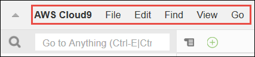

You can hide the menu bar by choosing the arrow at its edge, as follows.

You can show the menu bar again by choosing the arrow in the middle of where the menu bar was earlier, as follows.

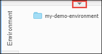

Compare your results to the following.

.. image:: images/ide-hide-show-menu-bar.gif
   :alt: Hiding and showing the menu bar in the AWS Cloud9 IDE

You can use the IDE to work with a set of files in the next several sections in this tutorial. To set
up these files, choose :menuselection:`File, New File`.

Next, copy the following text into the :file:`Untitled1` editor tab.

.. code-block:: text

   fish.txt
   --------
   A fish is any member of a group of organisms that consist of
   all gill-bearing aquatic craniate animals that lack limbs with
   digits. They form a sister group to the tunicates, together
   forming the olfactores. Included in this definition are
   lampreys and cartilaginous and bony fish as well as various
   extinct related groups.

To save the file, choose :menuselection:`File, Save`. Name the file :file:`fish.txt`, and then choose :guilabel:`Save`.

Repeat these instructions, saving the second file as :file:`cat.txt`, with the following contents.

.. code-block:: text

   cat.txt
   -------
   The domestic cat is a small, typically furry, carnivorous mammal.
   They are often called house cats when kept as indoor pets or
   simply cats when there is no need to distinguish them from
   other felids and felines. Cats are often valued by humans for
   companionship and for their ability to hunt.

There are often several ways to do things in the IDE. For example, to hide the menu bar, instead of choosing
the arrow at its edge,
you can choose :menuselection:`View, Menu Bar`. To create a new file, instead of choosing :menuselection:`File,
New File` you can press :kbd:`Alt-N` (for Windows/Linux) or
:kbd:`Control-N` (for MacOS).
To reduce this tutorial's length, we only describe one way to do things. As you get more comfortable with
the IDE, feel free to experiment and figure out the way that works best for you.

.. _tutorial-dashboard:

Step 2.2: Dashboard
-------------------

The :dfn:`dashboard` gives you quick access to each of your environments. From the dashboard, you can
create, open, and change the setting for an |env|.

To open the dashboard, on the menu bar, choose :guilabel:`AWS Cloud9, Go To Your Dashboard`, as follows.

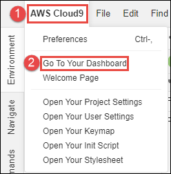

To view the settings for your |env|, choose the title inside of the :guilabel:`my-demo-environment` card.

To return to the IDE for your |env|, do one of the following.

* Choose your web browser's back button, and then choose :guilabel:`Open IDE` inside of the :guilabel:`my-demo-environment` card.
* In the navigation breadcrumb, choose :guilabel:`Your environments`, and then choose :guilabel:`Open IDE` inside of the :guilabel:`my-demo-environment` card.

.. note:: It can take a few moments for the IDE to display again. Please be patient.

.. _tutorial-environment:

Step 2.3: |envtitle| Window
---------------------------

The :guilabel:`Environment` window shows a list of your folders and files in the |env|. You can also show different types of files, such as hidden files.

To hide the :guilabel:`Environment` window and the :guilabel:`Environment` button, choose
:menuselection:`Window, Environment` on the menu bar.

To show the :guilabel:`Environment` button again, choose :menuselection:`Window, Environment` again.

To show the :guilabel:`Environment` window, choose the :guilabel:`Environment` button.

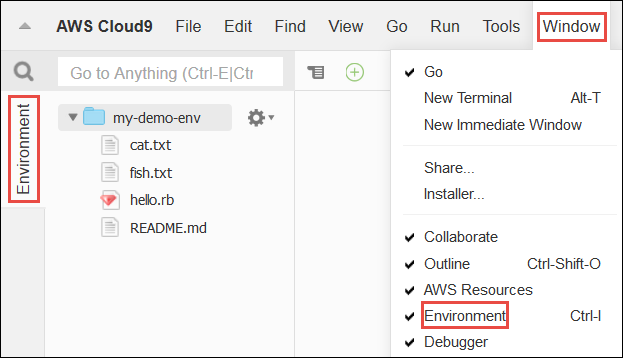

To show hidden files, in the :guilabel:`Environment` window, choose the gear icon, and then choose :menuselection:`Show Hidden Files`, as follows.

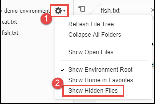

To hide hidden files, choose the gear icon again, and then choose :menuselection:`Show Hidden Files` again.

.. _tutorial-editor:

Step 2.4: Editor, Tabs, and Panes
---------------------------------

The :dfn:`editor` is where you can do things such as write code, run a terminal session, and change IDE settings. Each instance of an open file,
terminal session, and so on is represented by a :dfn:`tab`. Tabs can be grouped into :dfn:`panes`. Tabs are shown at the edge of their pane, as follows.

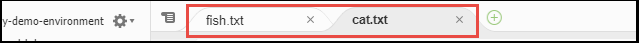

To hide tabs, choose :menuselection:`View, Tab Buttons` on the menu bar.

To show tabs again, choose :menuselection:`View, Tab Buttons` again.

To open a new tab, choose the :guilabel:`+` icon at the edge of the row of tabs. Then choose one of the available commands, for example, :menuselection:`New File`, as follows.

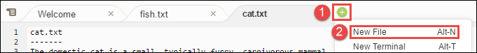

To display two panes, choose the icon that looks like a drop-down menu, which is at the edge of the row of tabs. Then choose :menuselection:`Split Pane in Two Rows`, as follows.

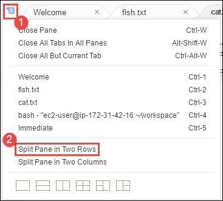

To return to a single pane, choose the drop-down menu icon again, and then choose the single square icon, as follows.

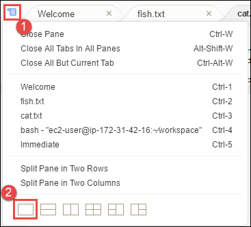

.. _tutorial-console:

Step 2.5: Console
-----------------

The :dfn:`console` is an alternate place for creating and managing tabs, as follows.

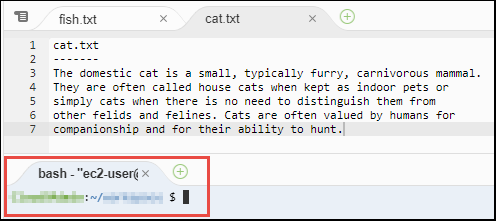

You can also change the console's display so that it takes over the entire IDE.

To hide the console, choose :menuselection:`View, Console` on the menu bar.

To show the console again, choose :menuselection:`View, Console` again.

To expand the console, choose the resize icon, which is at the edge of the console, as follows.

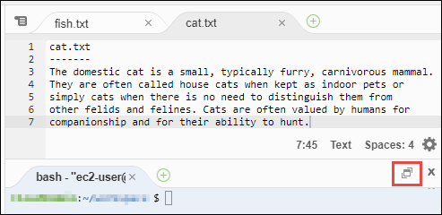

To shrink the console, choose the resize icon again.

.. _tutorial-open-files:

Step 2.6: Open Files Section
----------------------------

The :guilabel:`Open Files` section shows a list of all files that are currently open in the editor. :guilabel:`Open Files` is part of the :guilabel:`Environment` window, as follows.

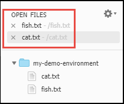

To open the :guilabel:`Open Files` section, choose :menuselection:`View, Open Files` on the menu bar.

To switch between open files, choose :guilabel:`fish.txt` and then :guilabel:`cat.txt` in the :guilabel:`Open Files` section.

To hide the :guilabel:`Open Files` section, choose :menuselection:`View, Open Files` again.

.. _tutorial-gutter:

Step 2.7: Gutter
----------------

The :dfn:`gutter`, at the edge of each file in the editor, shows things like line numbers and contextual symbols as you work with files, as follows.

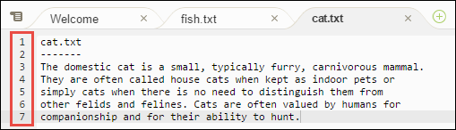

To hide the gutter, choose :menuselection:`View, Gutter` on the menu bar.

To show the gutter again, choose :menuselection:`View, Gutter` again.

.. _tutorial-status-bar:

Step 2.8: Status Bar
--------------------

The :dfn:`status bar`, at the edge of each file in the editor, shows things like line and character numbers, file type preference, space and tab settings, and related editor settings, as follows.

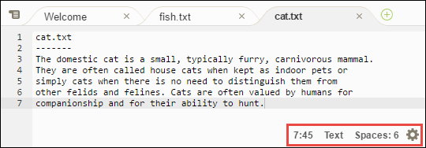

To hide the status bar, choose :menuselection:`View, Status Bar` on the menu bar.

To show the status bar, choose :menuselection:`View, Status Bar` again.

To go to a specific line number, choose a tab such as :guilabel:`cat.txt` if it's not already selected.
Then in the status bar, choose the line and character number
(it should be something like :guilabel:`7:45`). Type a line number (like :kbd:`4`), and then press :kbd:`Enter`, as follows.

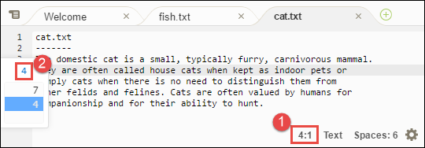

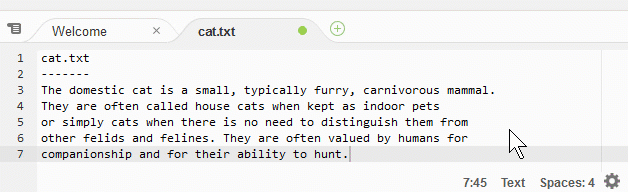

To change the file type preference, in the status bar, choose a different file type. For example, for
:guilabel:`cat.txt`, choose :guilabel:`Ruby` to see the syntax colors change.
To go back to plain text colors, choose :guilabel:`Plain Text`, as follows.

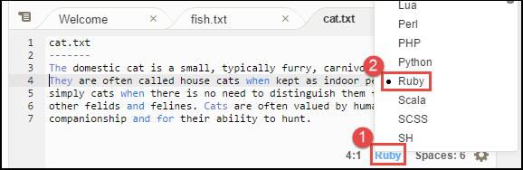

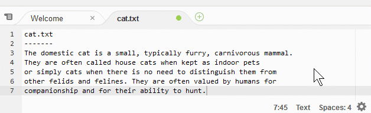

.. _tutorial-outline:

Step 2.9: Outline Window
------------------------

You can use the :guilabel:`Outline` window to quickly go to a specific file location.

To hide the :guilabel:`Outline` window and :guilabel:`Outline` button, choose :menuselection:`Window, Outline` on the menu bar.

To show the :guilabel:`Outline` button again, choose :menuselection:`Window, Outline` again.

To show the :guilabel:`Outline` window, choose the :guilabel:`Outline` button.

To see how the :guilabel:`Outline` window works, create a file named :file:`hello.rb`. Copy the following code into the file.

.. code-block:: rb

   def say_hello(i)
     puts "Hello!"
     puts "i is #{i}"
   end

   def say_goodbye(i)
     puts "i is now #{i}"
     puts "Goodbye!"
   end

   i = 1
   say_hello(i)
   i += 1
   say_goodbye(i)

Then, in the :guilabel:`Outline` window, choose :guilabel:`say_hello(i)`, and then choose :guilabel:`say_goodbye(i)`, as follows.

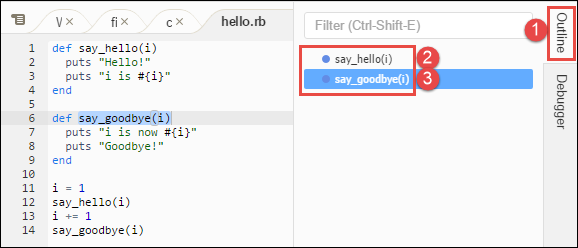

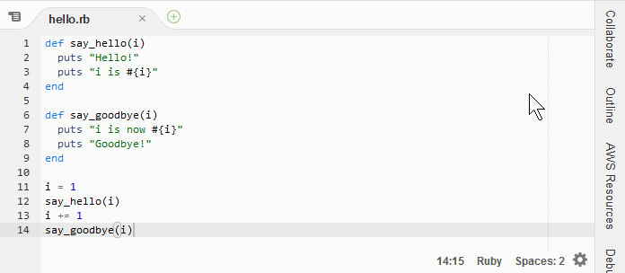

.. _tutorial-go:

Step 2.10: Go Window
--------------------

You can use the :guilabel:`Go` window to open a file in the editor, go to a symbol's definition, run a command, or go to a line in the active file in the editor.

To hide the :guilabel:`Go` window and :guilabel:`Go` button (the magnifying glass icon), choose :menuselection:`Window, Go` on the menu bar.

To show the :guilabel:`Go` button again, choose :menuselection:`Window, Go` again.

To show the :guilabel:`Go` window, choose the :guilabel:`Go` button (the magnifying glass).

With the :guilabel:`Go` window showing, you can:

* Type a forward slash (:kbd:`/`) followed by part or all of a file name. In the list of matching files that displays, choose a file to open it in the editor. 
  For example, typing :kbd:`/fish` lists :file:`fish.txt`, while typing :kbd:`/.txt` lists both :file:`fish.txt` and :file:`cat.txt`.

  .. note:: File search is scoped only to non-hidden files and non-hidden folders in the :guilabel:`Environment` window.

* Type an at symbol (:kbd:`@`) followed by the name of a symbol. In the list of matching symbols that displays, choose a symbol to go to it in the editor. 
  For example, with the :file:`hello.rb` file open and active in the editor, type :kbd:`@hello` to list :code:`say_hello(i)`, or type :kbd:`@say` to list 
  both :code:`say_hello(i)` and :code:`say_goodbye(i)`.

  .. note:: If the active file in the editor is part of a supported language project, symbol search is scoped to the current project. Otherwise, 
     symbol search is scoped only to the active file in the editor. For more information, see :ref:`Working with Language Projects <projects>`.

* Type a dot (:kbd:`.`) followed by the name of a command. In the list of commands that displays, choose a command to run it. 
  For example, typing :kbd:`.closetab` and then pressing :kbd:`Enter` closes the current tab in the editor. For a list of available commands, see the :ref:`Commands Reference <commands>`.
* Type a colon (:kbd:`:`) followed by a number to go to that line number in the active file in the editor. For example, with the :file:`hello.rb` file open and active 
  in the editor, type :kbd:`:11` to go to line 11 in that file.

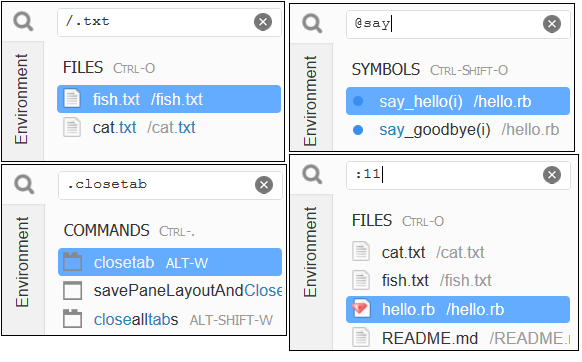

To see the keybindings for each of these actions based on the current keyboard mode and operating system, see each of the available :guilabel:`Go To` commands on the :guilabel:`Go` menu in the menu bar.

.. _tutorial-immediate:

Step 2.11: Immediate Tab
------------------------

The :guilabel:`Immediate` tab enables you to test small snippets of JavaScript code. To see how the :guilabel:`Immediate` tab works, do the following.

#. Open an :guilabel:`Immediate` tab by choosing :menuselection:`Window, New Immediate Window` on the menu bar.
#. Run some code in the :guilabel:`Immediate` tab. To try this, type the following code into the window, pressing :kbd:`Shift-Enter` after typing line 1 and again after line 2. Press :kbd:`Enter` after line 3.
   (If you press :kbd:`Enter` instead of :kbd:`Shift-Enter` after you type line 1 or line 2, the code
   will run earlier than you want it to.)

   .. code-block:: js

      for (i = 0; i <= 10; i++) { // Press Shift-Enter after typing this line.
        console.log(i)            // Press Shift-Enter after typing this line.
      }                           // Press Enter after typing this line. The numbers 0 to 10 will be printed.

   .. image:: images/ide-immediate.png
      :alt: Running code in the Immediate tab

.. _tutorial-process-list:

Step 2.12: Process List
-----------------------

The :guilabel:`Process List` shows all of the running processes. You can stop or even forcibly stop processes that you don't want to run anymore.
To see how the :guilabel:`Process List` window works, do the following.

#. Show the :guilabel:`Process List` by choosing :menuselection:`Tools, Process List` on the menu bar.
#. Find a process. In the :guilabel:`Process List`, type the name of the process.
#. Stop or forcibly stop a process. In the list of processes, choose the process, and then choose :guilabel:`Kill` or :guilabel:`Force Kill`, as follows.

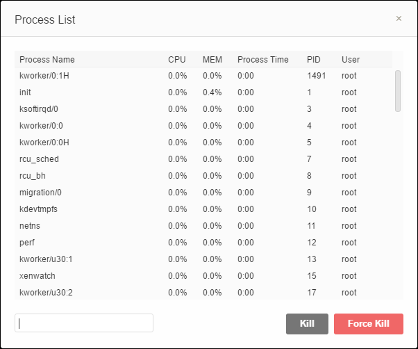

.. _tutorial-preferences:

Step 2.13: Preferences
----------------------

:dfn:`Preferences` include the following settings.

* Settings for the current |env| only, such as whether to use soft tabs in the editor, the file types to ignore, and code completion behaviors for languages such as PHP and Python.
* Your user settings across each of your environments, such as colors, fonts, and editor behaviors.
* Your keybindings, such as which shortcut key combinations you prefer to use to work with files and the editor.
* The IDE's overall theme.

To show preferences, choose :menuselection:`AWS Cloud9, Preferences` on the menu bar. The following is displayed.

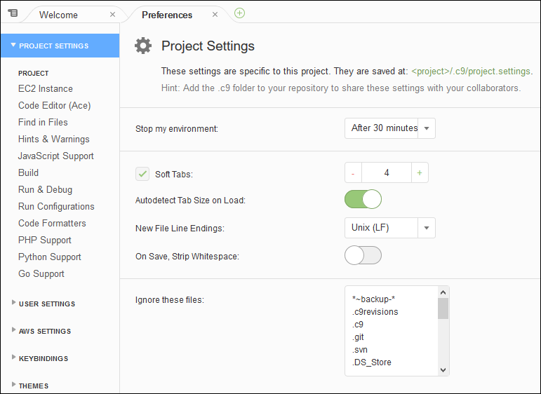

.. _tutorial-terminal:

Step 2.14: Terminal
-------------------

You can run one or more :dfn:`terminal` sessions in the IDE. To start a terminal session, choose :menuselection:`Window, New Terminal` on the menu bar.

You can try running a command in the terminal. For example, in the terminal, type :kbd:`echo $PATH` (to print the value of the :code:`PATH` environment variable), and then press :kbd:`Enter`.

You can also try running additional commands. For example, try commands such as the following.

* :command:`pwd` to print the path to the current directory.
* :command:`aws --version` to print version information about the |cli|.
* :command:`ls -l` to print information about the current directory.

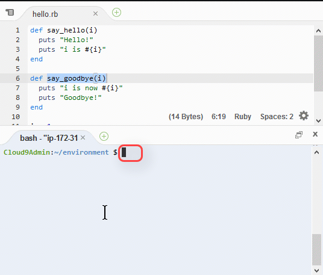

.. _tutorial-debugger:

Step 2.15: Debugger Window
--------------------------

You can use the :guilabel:`Debugger` window to debug your code. For example, you can step through running code a portion at a time, watch the values of variables
over time, and explore the call stack.

To hide the :guilabel:`Debugger` window and :guilabel:`Debugger` button, choose :menuselection:`Window, Debugger` on the menu bar.

To show the :guilabel:`Debugger` button again, choose :menuselection:`Window, Debugger` again.

To show the :guilabel:`Debugger` window, choose the :guilabel:`Debugger` button.

You can experiment with using the :guilabel:`Debugger` window and some JavaScript code. To try this, do the following.

#. Prepare to use the :guilabel:`Debugger` window to debug JavaScript code by installing Node.js into
   your |env|, if it isn't already installed. To confirm whether your |env| has Node.js installed,
   run the :command:`node --version` command. If Node.js is installed, the Node.js version number is output,
   and you can skip ahead to step 3 in this procedure to write some JavaScript code.
#. To install Node.js, do the following.

   #. Run the following two commands, one at a time, to be sure your |env| has the latest updates, and
      then download Node Version Manager (nvm). (nvm is a simple
      Bash shell script that is useful for installing and managing Node.js versions. For more information, see
      `Node Version Manager <https://github.com/creationix/nvm/blob/master/README.md>`_ on GitHub.)

      .. code-block:: sh

         sudo yum -y update
         curl -o- https://raw.githubusercontent.com/creationix/nvm/v0.33.0/install.sh | bash

   #. Use a text editor to update your :file:`~/.bashrc` file to enable nvm to load. For example, in the :guilabel:`Environment` window of the |IDE|, choose the gear icon, and then choose :guilabel:`Show Home in Favorites`.
      Repeat this step and choose :guilabel:`Show Hidden Files` as well.
   #. Open the :file:`~/.bashrc` file.
   #. Type or paste the following code at the end of the file to enable nvm to load.

      .. code-block:: sh

         export NVM_DIR="/home/ec2-user/.nvm"
         [ -s "$NVM_DIR/nvm.sh" ] && \. "$NVM_DIR/nvm.sh"  # This loads nvm.

   #. Save the file.
   #. Start a new terminal session, and then run this command to install the latest version of Node.js.

      .. code-block:: sh

         nvm install node

#. Write some JavaScript code to debug. For example, create a file, add the following code to the file, and save it as :file:`hello.js`.

   .. code-block:: js

      var i;

      i = 10;

      console.log("Hello!");
      console.log("i is " + i);

      i += 1;

      console.log("i is now " + i);
      console.log("Goodbye!");

#. Add some breakpoints to the code. For example, in the gutter, choose the margin next to lines 6 and
   10. A red circle is displayed next to each of these line numbers, as follows.

   .. image:: images/ide-breakpoints.png
      :alt: Adding breakpoints to code in the Debugger window

#. Now you're ready to debug the JavaScript code. To try this, do the following.

   #. Show the :guilabel:`Debugger` window, if it's not already displayed.
   #. Watch the value of the variable named :code:`i` while the code is running. In the :guilabel:`Debugger` window, for :guilabel:`Watch Expressions`, choose :guilabel:`Type an expression here`.
      Type the letter :kbd:`i`, and then press :kbd:`Enter`, as follows.

      .. image:: images/ide-watch-expression.png
         :alt: Debugger window

   #. Begin running the code. Choose :menuselection:`Run, Run With, Node.js`, as follows.

      .. image:: images/ide-run-with.png
         :alt: Debugger window

   #. The code pauses running on line 6. The :guilabel:`Debugger` window shows the value of :code:`i` in :guilabel:`Watch Expressions`, which is currently :code:`10`, as follows.

      .. image:: images/ide-breakpoint-hit.png
         :alt: Debugger window

   #. In the :guilabel:`Debugger` window, choose :guilabel:`Resume`, which is the blue arrow icon, as follows.

      .. image:: images/ide-resume.png
         :alt: Resuming debugging in the Debugger window

   #. The code pauses running on line 10. The :guilabel:`Debugger` window now shows the new value of :code:`i`, which is currently :code:`11`.
   #. Choose :guilabel:`Resume` again. The code runs to the end. The output is printed to the console's :guilabel:`hello.js` tab, as follows.

      .. image:: images/ide-debugger-output.png
         :alt: hello.js tab with debug output

Compare your results to the following.

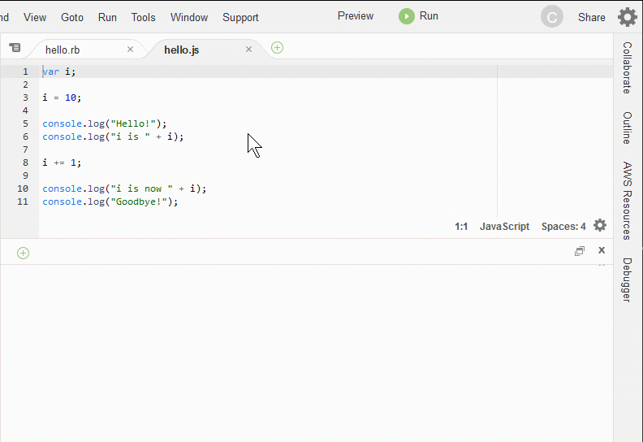

.. _tutorial-clean-up:

Step 3: Clean Up
================

To prevent ongoing charges to your AWS account related to this tutorial, you should delete the |env|.

.. warning:: Deleting an |env| cannot be undone.

You can delete the |env| with the :ref:`AWS Cloud9 console <tutorial-clean-up-console>` or the :ref:`AWS CLI <tutorial-clean-up-cli>`.

.. _tutorial-clean-up-console:

Delete the |envtitle| with the |AC9| Console
--------------------------------------------

#. Open the dashboard. To do this, on the menu bar in the |IDE|, choose :menuselection:`AWS Cloud9, Go To Your Dashboard`.
#. Do one of the following.

   * Choose the title inside of the :guilabel:`my-demo-environment` card, and then choose :guilabel:`Delete`.

     .. image:: images/console-delete-env.png
        :alt: Deleting an environment in the environment details page 

   * Select the :guilabel:`my-demo-environment` card, and then choose :guilabel:`Delete`.

     .. image:: images/console-delete-env-card.png
        :alt: Deleting an environment in the environments list

#. In the :guilabel:`Delete` dialog box, type :kbd:`Delete`, and then choose :guilabel:`Delete`.

.. note:: If the |env| was an |envec2|, |AC9| also terminates the |EC2| instance that was connected to that |env|.

   However, if the |env| was an |envssh|, and that |env| was connected to an |EC2| instance, |AC9| doesn't terminate 
   that instance. If you don't terminate that instance later, your AWS account might continue to have ongoing charges 
   for |EC2| related to that instance.

Skip ahead to :ref:`tutorial-next-steps`. 

.. _tutorial-clean-up-cli:

Delete the |envtitle| with the |cli|
------------------------------------

Run the AWS Cloud9 :code:`delete-environment` command, specifying the ID of the |env| to delete.

.. code-block:: sh

   aws cloud9 delete-environment --environment-id 12a34567b8cd9012345ef67abcd890e1

In the preceding command, replace :code:`12a34567b8cd9012345ef67abcd890e1` with the ID of the |env| to delete.

.. _tutorial-next-steps:

Next Steps
==========

Explore any or all of the following topics to continue getting familiar with |AC9|.

.. list-table::
   :widths: 1 1
   :header-rows: 0

   * - Learn more about the |AC9IDE|.
     - :ref:`Working with the IDE <ide>`
   * - Invite others to use your new |env| along with you, in real time and with text chat support.
     - :ref:`Working with Shared Environments <share-environment>`
   * - Create |envsshplural| (|envplural| that use cloud compute instances or servers that you create, instead of an |EC2| instances that |AC9| creates for you).
     - :ref:`Creating an Environment <create-environment>` and :ref:`SSH Environment Host Requirements <ssh-settings>`
   * - Use |AC9| with |LAM|.
     - :ref:`AWS Lambda Tutorial <tutorial-lambda>`, :ref:`Advanced AWS Lambda Tutorial <tutorial-lambda-advanced>`, and :ref:`Working with AWS Lambda Functions <lambda-functions>`
   * - Use |AC9| with |lightsaillong|.
     - :ref:`Working with Amazon Lightsail Instances <lightsail-instances>`
   * - Use |AC9| with |ACSlong|.
     - :ref:`Working with AWS CodeStar Projects <codestar-projects>`
   * - Use |AC9| with |ACPlong|.
     - :ref:`Working with AWS CodePipeline <codepipeline-repos>`
   * - Use |AC9| with the |cli|, the aws-shell, |ACClong|, the AWS Cloud Development Kit (AWS CDK), GitHub, or |DDBlong|, as well as Node.js, Python, or other programming languages.
     - :ref:`Samples <samples>`
   * - Work with code for intelligent robotics applications in AWS RoboMaker.
     - `Developing with AWS Cloud9 <https://docs.aws.amazon.com/robomaker/latest/dg/cloud9.html>`_ in the *AWS RoboMaker Developer Guide*

To get help with |AC9| from the community, see the `AWS Cloud9 Discussion Forum <https://forums.aws.amazon.com/forum.jspa?forumID=268>`_. (When you enter this forum, AWS might require you to sign in.)

To get help with |AC9| directly from AWS, see the support options on the `AWS Support <https://aws.amazon.com/premiumsupport>`_ page. 
