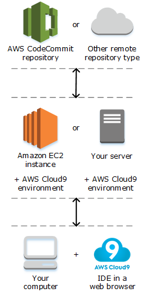

.. Copyright 2010-2019 Amazon.com, Inc. or its affiliates. All Rights Reserved.

   This work is licensed under a Creative Commons Attribution-NonCommercial-ShareAlike 4.0
   International License (the "License"). You may not use this file except in compliance with the
   License. A copy of the License is located at http://creativecommons.org/licenses/by-nc-sa/4.0/.

   This file is distributed on an "AS IS" BASIS, WITHOUT WARRANTIES OR CONDITIONS OF ANY KIND,
   either express or implied. See the License for the specific language governing permissions and
   limitations under the License.

.. _welcome:

##################
What Is |AC9long|?
##################

.. meta::
    :description:
        Provides an introduction to AWS Cloud9.

|AC9| contains a collection of tools that you use to code, build, run, test, debug, and
release software in the cloud. To work with these tools, you use the 
|AC9| integrated development environment, or :dfn:`IDE`.

You access the |AC9IDE| through a web browser. The |IDE| offers a rich code-editing experience with
support for several programming languages and runtime debuggers, as well as a built-in
terminal.

You can configure the |IDE| to your preferences. You can switch color themes, bind shortcut keys,
enable programming language-specific syntax coloring and code formatting, and more.

* :ref:`how-to-get-started`
* :ref:`what-can-i-do`
* :ref:`how-does-it-work`
* :ref:`pricing`
* :ref:`versions`
* :ref:`questions-help`

.. _how-to-get-started:

How Do I Get Started?
=====================

Start using |AC9| by following the steps in :doc:`Getting Started <get-started>`.

.. _what-can-i-do:

What Can I Do with |AC9|?
=========================

Explore the following resources to learn about using |AC9| for some common scenarios.

Topics in This Guide
--------------------

.. list-table::
   :widths: 1 1
   :header-rows: 1

   * - **Scenario**
     - **Resources**
   * - Create, run, and debug code in |LAMlong| functions, APIs in |ABPlong|, and serverless applications.
     - :ref:`AWS Lambda Tutorial <tutorial-lambda>`, :ref:`Advanced AWS Lambda Tutorial <tutorial-lambda-advanced>`, and :ref:`Working with AWS Lambda Functions <lambda-functions>`
   * - Work with |lightsaillong| instances preconfigured with popular apps and frameworks such as WordPress, LAMP (Linux, Apache, MySQL, and PHP), Node.js, Nginx, 
       Drupal, and Joomla, as well as Linux distributions such as Amazon Linux, Ubuntu, Debian, FreeBSD, and openSUSE.
     - :ref:`Working with Amazon Lightsail Instances <lightsail-instances>`
   * - Work with code in AWS software development projects and toolchains in |ACSlong|.
     - :ref:`Working with AWS CodeStar Projects <codestar-projects>`
   * - Work with code in continuous delivery solutions in |ACPlong|.
     - :ref:`Working with AWS CodePipeline <codepipeline-repos>`
   * - Automate AWS services by using the |cli| and the aws-shell.
     - :ref:`AWS CLI and aws-shell Sample <sample-aws-cli>`
   * - Work with source code repositories in |ACClong|.
     - :ref:`AWS CodeCommit Sample <sample-codecommit>`
   * - Work with source code repositories in GitHub.
     - :ref:`GitHub Sample <sample-github>`
   * - Work with NoSQL databases in |DDBlong|.
     - :ref:`Amazon DynamoDB Sample <sample-dynamodb>`
   * - Work with code for Java and the AWS SDK for Java.
     - :ref:`Java Sample <sample-java>`
   * - Work with code for C++ and the AWS SDK for C++.
     - :ref:`C++ Sample <sample-cplusplus>`
   * - Work with code for Python and the AWS SDK for Python (Boto).
     - :ref:`Python Sample <sample-python>`
   * - Work with code for .NET Core and the AWS SDK for .NET.
     - :ref:`.NET Core Sample <sample-dotnetcore>`
   * - Work with code for Node.js and the AWS SDK for JavaScript.
     - :ref:`Node.js Sample <sample-nodejs>`
   * - Work with code for PHP and the AWS SDK for PHP.
     - :ref:`PHP Sample <sample-php>`
   * - Work with code for Ruby and the AWS SDK for Ruby.
     - :ref:`Ruby Sample <sample-ruby>`
   * - Work with code for Go and the AWS SDK for Go.
     - :ref:`Go Sample <sample-go>`
   * - Work with code for TypeScript and the AWS SDK for JavaScript.
     - :ref:`TypeScript Sample <sample-typescript>`
   * - Work with code for the AWS Cloud Development Kit (AWS CDK). 
     - :ref:`AWS CDK Sample <sample-cdk>`
   * - Work with code in a running Docker container. 
     - :ref:`Docker Sample <sample-docker>`
   * - Invite others to use an |env| along with you, in real time and with text chat support.
     - :ref:`Working with Shared Environments <share-environment>`
   * - Work with code for intelligent robotics applications in AWS RoboMaker.
     - `Developing with AWS Cloud9 <https://docs.aws.amazon.com/robomaker/latest/dg/cloud9.html>`_ in the *AWS RoboMaker Developer Guide*

Related Videos
--------------

* `AWS re:Invent 2017 - Introducing AWS Cloud9: Werner Vogels Keynote <https://www.youtube.com/watch?v=fwFoU_Wb-fU>`_ (9 minutes, YouTube website)
* `AWS re:Invent Launchpad 2017 - AWS Cloud9 <https://www.youtube.com/watch?v=NNqVBo9k8n4>`_, (15 minutes, YouTube website)
* `Introducing AWS Cloud9 - AWS Online Tech Talks <https://www.youtube.com/watch?v=FvclLeg2vEQ>`_ (33 minutes, YouTube website)
* `AWS Sydney Summit 2018: AWS Cloud9 and CodeStar <https://www.youtube.com/watch?v=B-nbl0qYsQg>`_ (25 minutes, YouTube website)

Related Web Pages
-----------------

* `Introducing AWS Cloud9 <https://aws.amazon.com/about-aws/whats-new/2017/11/introducing-aws-cloud9/>`_ (AWS website)
* `AWS Cloud9 – Cloud Developer Environments <https://aws.amazon.com/blogs/aws/aws-cloud9-cloud-developer-environments/>`_ (AWS website) 
* `AWS Cloud9 Overview <https://aws.amazon.com/cloud9/>`_ (AWS website)
* `AWS Cloud9 Features <https://aws.amazon.com/cloud9/details/>`_ (AWS website)
* `AWS Cloud9 FAQs <https://aws.amazon.com/cloud9/faqs/>`_ (AWS website)

.. _how-does-it-work:

How Does |AC9| Work?
====================

The following diagram shows a high-level overview of how |AC9| works.

You use the |AC9IDE|, running in a web browser on your local computer, to interact with your |env|. A cloud compute instance (for example an |EC2| instance) 
or your own server connects to the |env|. An :dfn:`environment` is a place where you store your project's files and where you run the tools to develop your apps.

You use the |AC9IDE| to work with files in the |env|. You can:

* Store these files locally on the instance or server.
* Clone a remote code repository |mdash| such as a repo in |ACClong| |mdash| into your |env|.
* Work with a combination of local and cloned files in the |env|.

In the background, you can instruct |AC9| to have |EC2| create an |EC2| instance and then connect the |env| to the newly-created instance. 
We call this type of setup an :dfn:`EC2 environment`. 
You can also instruct |AC9| to connect an |env| to an existing cloud compute instance or your own server. We call this type of setup an :dfn:`SSH environment`.

Here are the key similarities and differences between |envec2plural| and |envsshplural|.

.. list-table::
   :widths: 1 1
   :header-rows: 1

   * - **EC2 environments**
     - **SSH environments**
   * - |AC9| creates an associated |EC2| instance and manages that instance's lifecycle (for example, start, stop, and terminate).
     - You use an existing cloud compute instance or your own server. You manage that instance's or server's lifecycle.
   * - The instance runs on Amazon Linux.
     - You can use any cloud compute instance that runs Linux, or your own server running Linux.
   * - |AC9| automatically sets up the instance to start working with |AC9|.
     - You must manually configure the instance or your own server to work with |AC9|.
   * - |AC9| automatically sets up the |clilong| (|cli|) on the instance for you to start using.
     - If you want to use the |cli| on the instance or your own server, you must set it up yourself.
   * - The instance has access to hundreds of useful packages, with some common packages already installed and configured, such as Git, Docker, Node.js, and Python.
     - You might need to download, install, and configure additional packages to complete common tasks.
   * - You maintain the instance, for example by periodically applying system updates.
     - You maintain the instance or your own server.
   * - When you delete the |env|, |AC9| automatically terminates the associated instance.
     - When you delete the |env|, the instance or your own server remains.

You can create and switch between multiple |envplural|, 
with each |env| set up for a specific development project. By storing the |env| 
in the cloud, your projects no longer need to be tied to a single computer or server setup. This
enables you to do things such as easily switch between computers and more quickly onboard developers to your team.

.. _pricing:

Pricing
=======

For information, see `AWS Cloud9 Pricing <https://aws.amazon.com/cloud9/pricing/>`_.

For education options, explore the `AWS Educate <https://aws.amazon.com/education/awseducate/>`_ program.

.. _versions:

About Cloud9 Versions
=====================

There are currently two versions of Cloud9 available: c9.io and |AC9long|. This :title:`AWS Cloud9 User Guide` only covers |AC9long|.

c9.io is available only to existing c9.io users. For more information, 
see `Cloud9 now runs on and integrates with AWS <https://c9.io/announcement>`_ on the c9.io website.

c9.io and |AC9long| are not interoperable. You can't use an account or workspace in c9.io with an account or |env| in |AC9long|.

.. _questions-help:

I Have Additional Questions or Need Help
========================================

To ask questions or seek help from the |AC9| community, see the `AWS Cloud9 Discussion Forum <https://forums.aws.amazon.com/forum.jspa?forumID=268>`_. (When you enter this forum, AWS might require you to sign in.)

See also our `frequently asked questions <https://aws.amazon.com/cloud9/faqs/>`_ (FAQs), or `contact us <https://aws.amazon.com/contact-us/>`_ directly.